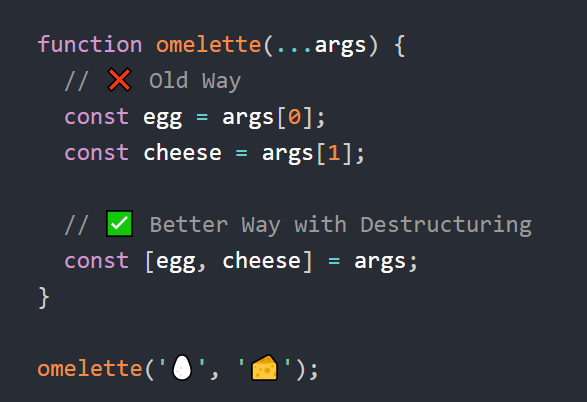

# ?Destructuring assignment

_Деструктуризация (destructuring assignment)_ – это особый синтаксис присваивания, который позволяет извлечь из массива, объекта или любого перебираемого объекта отдельные значения в переменные или константы.

__При деструктуризации массива__ переменные помещаются в квадратные скобки и последовательно получают значения элементов массива:

~~~
const users = ["Tom", "Sam", "Bob"];
const [a, b] = users;

console.log(a); // Tom
console.log(b); // Sam
~~~

Нежелательные элементы массива также могут быть отброшены с помощью дополнительной запятой:

~~~
const users = ["Tom", "Sam", "Bob"];
const [a, , c] = users;

console.log(a); // Tom
console.log(c); // Bob
~~~

Можно присваивоить чему угодно с левой стороны:

~~~
const user = {};
[user.name, user.age] = ['Tom', 29];

console.log(user.name); // Tom
console.log(user.age); // 29
~~~

С помощью rest-оператора `...` можно получить все оставшиеся элементы массива в виде другого массива:

~~~
const users = ["Tom", "Sam", "Bob"];
const [tom, ...rest] = users;
~~~

Если в массиве меньше значений, чем в присваивании, то ошибки не будет. Отсутствующие значения считаются undefined:

~~~
const [firstName, surname] = [];
console.log(firstName); // undefined
console.log(surname); // undefined
~~~

Если мы хотим, чтобы значение «по умолчанию» заменило отсутствующее, мы можем указать его с помощью `=`:

~~~
const [name = "Guest", surname = "Anonymous"] = ["Julius"];
console.log(name); // Julius (из массива)
console.log(surname); // Anonymous (значение по умолчанию)
~~~

Значения по умолчанию могут быть гораздо более сложными выражениями или даже функциями.

Благодаря деструктуризации очень просто стало проводить обмен значениями между двумя переменными:

~~~
let first = "Tom";
let second = "Bob";
[first, second] = [second, first];
console.log(first); // Bob
console.log(second); // Tom
~~~

Также можно поменять местами элементы в массиве:

~~~
const arr = [1, 2, 3, 4, 5];
[arr[1], arr[0]] = [arr[0], arr[1]];
console.log(arr); // [ 2, 1, 3, 4, 5 ]
~~~

Мы можем использовать __любой перебираемый объект__, не только массивы:

~~~
const user = "Tom";
const [firstLetter, , lastLetter] = user;

console.log(firstLetter); // T
console.log(lastLetter); // m
~~~

Мы можем использовать деструктуризацию для цикличного перебора ключей и значений `Map`:

~~~
const user = new Map([["name", "John"], ["age", 27]]);
for(let [key, value] of user) {
  console.log(key, value);
}
// name John
// age 27
~~~

__При деструктуризации объекта__ переменные помещаются в фигурные скобки и им присваивается объект. Сопоставление между свойствами объекта и переменными/константами идет по имени.

~~~
const user = {
  name: "Tom",
  age: 24,
  phone: "+367438787",
  email: "tom@gmail.com"
};

const { name, email } = user;
console.log(name); // Tom
console.log(email); // tom@gmail.com
~~~

Если мы хотим присвоить свойство объекта переменной с другим названием, то мы можем использовать двоеточие:

~~~
const user = {
  name: "Tom",
  email: "tom@gmail.com"
};
const {name, email: userEmail} = user;
console.log(name); // Tom
console.log(userEmail); // tom@gmail.com
~~~

Для потенциально отсутствующих свойств мы можем установить значения по умолчанию, используя `=`:

~~~
const user = {
  name: "Tom"
};

const { name, email: userEmail = "tom@gmail.com" } = user;
console.log(name); // Tom
console.log(userEmail); // tom@gmail.com
~~~

Как и в случае с массивами, значениями по умолчанию могут быть любые выражения или даже функции.

С помощью rest-оператора `...` можно получить все оставшиеся свойства объекта в виде другого объекта:

~~~
const user = {
  name: "Tom",
  age: 24,
  phone: "+367438787",
  email: "tom@gmail.com"
};

const { name, ...rest } = user;
console.log(name); // Tom
console.log(rest); // { age: 24, phone: '+367438787', email: 'tom@gmail.com' }
~~~

В примерах выше переменные были объявлены в присваивании: сonst {…} = {…}. Конечно, мы могли бы использовать существующие переменные и не указывать const, но тут есть подвох:

~~~
const user = {
  name: "Tom",
  age: 24
};

let name, age;
({ name, age } = user);
console.log(name, age); // Tom 24
~~~

Без круглых скобок JavaScript считает, что видит блок кода, и была бы ошибка. На самом-то деле у нас деструктуризация. Чтобы показать JavaScript, что это не блок кода, нам нужно заключить выражение в скобки (...).

Если объект или массив содержит другие вложенные объекты или массивы, то мы можем использовать более сложные шаблоны с левой стороны, чтобы извлечь более глубокие свойства:

~~~
const user = {
  name: "Tom",
  age: 24,
  account: {
    login: "tom555",
    password: "qwerty"
  }
};

const { account: { login } } = user;
console.log(login); // tom555
~~~

__Деструктуризация переменных и параметров функции__

~~~
let a, b;
[a, b] = [1, 2];
console.log(a); // 1
console.log(b); // 2
~~~

Если в функцию в качестве параметра передается массив или объект, то его также можно подобным образом разложить на отдельные значения:

~~~
function sum([a, b, c]) {
  console.log(a + b + c); // 15
}

const numbers = [1, 7, 7];
sum(numbers);
~~~

Деструктурирование подразумевает, что в функцию будет обязательно передан аргумент. Если нам нужны все значения по умолчанию, то нам следует передать пустой массив (можно как значение по умолчанию, а можно как аргумент):

~~~
function sum([a = 1, b = 7, c = 7] = []) {
  console.log(a + b + c); // 15
}

sum();
~~~

Мы можем передать параметры как объект, и функция немедленно деструктурирует его в переменные:

~~~
const user = {
  name: "Tom",
  age: 28
}

function showInfo({ name = 'Unknown', age = 30, country = 'Poland' }) {
  console.log(name, age, country);
}

showInfo(user); // Tom 28 Poland
~~~

Если нам нужны все значения по умолчанию, то нам следует передать пустой объект (можно как значение по умолчанию, а можно как аргумент).
