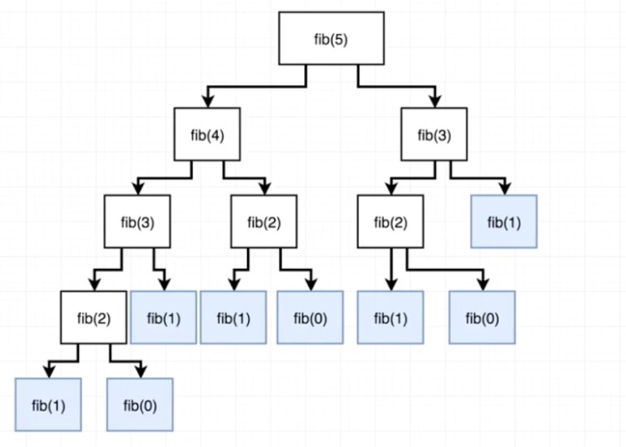
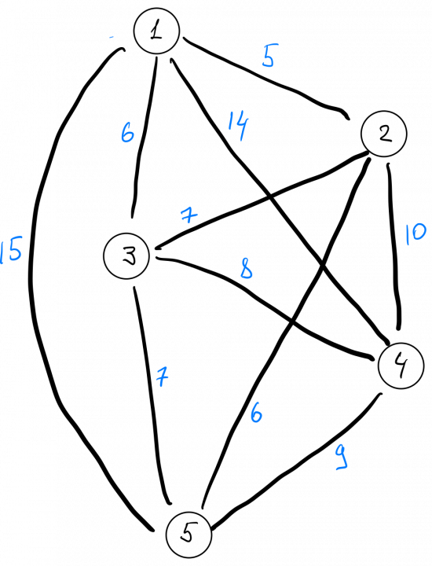
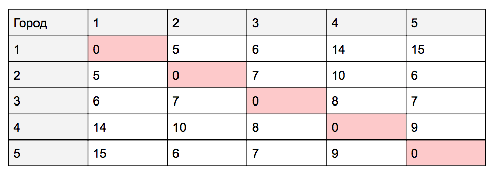

# ?Big O notation

_Big O_ – это мера эффективности «в худшем случае», верхняя граница того, сколько времени потребуется для выполнения задачи или сколько памяти для этого необходимо.

Желательно, чтобы сложность кода была как можно более низкой и прямой, в идеале избегая всего, что превышает `O(n)`.

### Алгоритм О(1) | (постоянная временная сложность)

Это идеал, независимо от того, сколько в массиве элементов, будь их один или миллион, количество времени на выполнение останется прежним. Большинство операций, выполняющих одну операцию, работают по алгоритму `O(1)`. Отправка в массив, получение элемента по определенному индексу, добавление дочернего элемента и т. д. займет одинаковое количество времени независимо от длины массива.

~~~
const smArr = [1];
const a1 = performance.now();
smArr.push(27);
const a2 = performance.now();
console.log(`Time: ${a2 - a1}`); // Less than 1 Millisecond

const bigArr = [1, 145, 678, 34, 89, 456, 0, 23, 58, 3, 8, 4567];
const b1 = performance.now();
bigArr.push(27);
const b2 = performance.now();
console.log(`Time: ${b2 - b1}`); // Less than 1 Millisecond
~~~

### Алгоритм O(log n) | (логарифмическая временная сложность)

_Логарифм_ - степень, в которую нужно возвести фиксированное число (основание), чтобы получить данное число.

Алгоритмы `O(log n)` никогда не рассматривают все элементы на входе. логарифмическая временная сложность обычно применяется к алгоритмам, которые исключают большое количество входных элементов на каждом шаге.

Примером алгоритма `O(log n)` может быть алгоритм бинарного поиска.

_Двоичный (бинарный) поиск_ (также известен как метод деления пополам) — классический алгоритм поиска элемента в отсортированном массиве, использующий дробление массива на половины.

~~~
const smArr = [1, 2, 3, 4, 5, 6, 7, 8, 9, 10];

const bigArr = [
  1, 2, 3, 4, 5, 6, 7, 8, 9, 10, 11, 12, 13, 14, 15, 16, 17, 18, 19, 20,
];

function binarySearch(arr, value) {
  let start = 0;
  let end = arr.length - 1;
  let count = 0;

  while (start <= end) {
    count++;
    let middle = Math.floor((start + end) / 2);
    if (arr[middle] === value) {
      console.log(count);
      return middle;
    } else if (arr[middle] < value) {
      start = middle + 1;
    } else {
      end = middle - 1;
    }
  }
  return -1;
}

const a1 = performance.now();
console.log(binarySearch(smArr, 7)); // понадобилось 4 попытки, так как длина массива = 10, и чтобы найти число из 10 нам нужно максимум 4 попытки. 2**3 = 8; 2**4 = 16; 10 между 8 и 16
const a2 = performance.now();
console.log(`Time: ${a2 - a1}`); // Time: 2.053600013256073

const b1 = performance.now();
console.log(binarySearch(bigArr, 9)); // понадобилось 5 попыток, так как длина массива = 20, и чтобы найти число из 20 нам нужно максимум 5 попыток. 2**4 = 16; 2**5 = 32; 20 между 16 и 32
const b2 = performance.now();
console.log(`Time: ${b2 - b1}`); // Time: 2.0642000436782837
~~~

### Алгоритм O(n) | (линейная временная сложность)

По умолчанию все циклы относятся к операциям линейного роста, поскольку между размером данных и временем выполнения существует взаимосвязь один к одному. Таким образом, массив с в 1000 раз большим количеством элементов займет ровно в 1000 раз больше времени.

~~~
const smArr = [1];
const a1 = performance.now();
smArr.forEach(item => console.log(item));
const a2 = performance.now();
console.log(`Time: ${a2 - a1}`); // Time: 0.10000002384185791

const bigArr = [1, 145, 678, 34, 89, 456, 0, 23, 58, 3, 8, 4567];
const b1 = performance.now();
bigArr.forEach(item => console.log(item));
const b2 = performance.now();
console.log(`Time: ${b2 - b1}`); // Time: 0.699999988079071
~~~

### Алгоритм O(n log n) | (линейно-арифмическая временная сложность)

_Линейно-арифметическое время_ — это просто комбинация линейного времени `(n)` и логарифмического времени `(log(n))`.

`O(n log n)` означает, что на каждом уровне применяется линейный поиск с `O(n)`, а на следующем уровне размер массива уменьшается вдвое, что означает, что на следующем уровне для поиска потребуется `O(log n)`. На каждом шаге линейный поиск и перед переходом к следующему шагу размер массива уменьшается наполовину, представляя `O(n log n)`.

Примером алгоритма `O(n log n)` может быть Merge Sort, Heap Sort и Quick Sort... 

~~~
const smArr = [3, 2, 1];

const bigArr = [
  22, 21, 20, 19, 18, 17, 16, 15, 14, 13, 12, 11, 10, 9, 8, 7, 6, 5, 4, 3, 2, 1,
];

function quickSort(arr) {
  if (arr.length <= 1) {
    return arr;
  }

  const pivot = arr[arr.length - 1];
  const arrLeft = [];
  const arrRight = [];

  for (let i = 0; i < arr.length - 1; i++) {
    if (arr[i] < pivot) {
      arrLeft.push(arr[i]);
    } else {
      arrRight.push(arr[i]);
    }
  }

  return [...quickSort(arrLeft), pivot, ...quickSort(arrRight)];
}

const a1 = performance.now();
console.log(quickSort(smArr));
const a2 = performance.now();
console.log(`Time: ${a2 - a1}`); // Time: 2.8673999905586243

const b1 = performance.now();
console.log(quickSort(bigArr));
const b2 = performance.now();
console.log(`Time: ${b2 - b1}`); // Time: 3.2339999675750732
~~~

### Алгоритм O(n^2) | (квадратичная временная сложность)

Количество шагов, требуемых квадратичными алгоритмами, равно квадратному корню из входного размера. Если размер входных данных равен 2, то необходимых шагов будет 4. Если размер входных данных равен 8, потребуется 64 и так далее. и мы помечаем это как `O (n²)`.

Вложение цикла внутрь другого цикла — отличный способ превратить массив из 1000 элементов в миллион операций поиска, которые заморозят ваш браузер.

Вот вызываемая функция `multiplyAll`, которая принимает два массива. Сначала он убеждается, что они имеют одинаковую длину; если они есть, то он продолжит вниз и умножит каждое число в первом массиве на каждое число во втором массиве и вернет сумму всех этих произведений.

~~~
function multiplyAll(arr1, arr2) {
  if (arr1.length !== arr2.length) return undefined;
  let total = 0;
  for (let i of arr1) {
    for (let j of arr2) {
      total += i * j;
    }
  }
  return total;
}

const a1 = performance.now();
console.log(multiplyAll([1, 2], [5, 6])); // понадобилось 4 итерации (2^2)
const a2 = performance.now();
console.log(`Time: ${a2 - a1}`); // Time: 2.2675000429153442

const b1 = performance.now();
console.log(multiplyAll([1, 2, 3, 4, 5], [5, 3, 1, 8, 9])); // понадобилось 25 итераций (5^2)
const b2 = performance.now();
console.log(`Time: ${b2 - b1}`); // Time: 3.4456000328063965
~~~

### Алгоритм O(2^n) | (экспоненциальная временная сложность)

Алгоритм с экспоненциальной временной сложностью — это алгоритм, в котором количество операций удваивается каждый раз, когда мы увеличиваем входные данные на единицу.

Примером функции `O(2^n)` является рекурсивный расчет чисел Фибоначчи.

Числа Фибоначчи – это ряд чисел, в котором каждое следующее число равно сумме двух предыдущих. 1, 1, 2, 3, 5, 8, 13...

~~~
function fibonacci(num) {
  if (num <= 1) {
    return num;
  }
  return fibonacci(num - 1) + fibonacci(num - 2);
}

const a1 = performance.now();
console.log(fibonacci(5)); // 5
const a2 = performance.now();
console.log(`Time: ${a2 - a1}`); // Time: 1.9556000232696533

const b1 = performance.now();
console.log(fibonacci(15)); // 610
const b2 = performance.now();
console.log(`Time: ${b2 - b1}`); // Time: 2.1473999619483948
~~~

В приведенном ниже дереве показаны все рекурсивные вызовы функций. На каждом шаге количество вычислений удваивается!

### Алгоритм O(n!) | (факторная временная сложность)

И, наконец, худший тип алгоритма, которого следует избегать любой ценой: факторный рост.

Факториал — это просто произведение каждого числа до этого числа. Итак, 5! («Факториал пяти») равен 1 х 2 х 3 х 4 х 5 = 120.

6! = 1 х 2 х 3 х 4 х 5 х 6 = 720.

Как видите, все может быстро выйти из-под контроля!

Функция вычисления факториала:

~~~
function factorial(n) {
  if (n === 1) return 1;
  return n * factorial(n - 1);
};

console.log(factorial(5)); // 120
~~~

Типичным примером алгоритма с факторным ростом является задача коммивояжёра: при наличии списка городов и расстояний между каждой парой городов, каков кратчайший возможный маршрут, который посещает каждый город ровно один раз? Метод грубой силы состоял бы в том, чтобы проверить все возможные конфигурации между каждым городом, что было бы факториалом, и быстро сойти с ума!

Скажем, у нас есть 3 города: A, B и C.

Сколько существует перестановок? Перестановки — это математический термин, означающий, сколькими способами мы можем упорядочить набор элементов.

А -> Б -> С
А -> С -> Б
Б -> А -> С
Б -> С -> А
С -> А -> Б
С -> Б -> А
С 3 городами у нас 3! перестановки. Это 1 х 2 х 3 = 6 перестановок.

Попробуем решить классическую задачу коммивояжёра самым простым способом — простым полным перебором.

Допустим, у нас есть 5 городов, каждый из которых соединён с другим. Из-за рельефа местности близкие города не всегда соединены по прямой, но для простоты мы нарисовали так. Проставим расстояние между городами:

Чтобы было удобно пользоваться расстояниями, сделаем табличку:

Нулевые ячейки означают, что здесь нет маршрута, потому что это путь из одного и того же города и обратно.

На языке JavaScript это будет выглядеть так:

~~~
const towns = [
  [0, 5, 6, 14, 15],
  [5, 0, 7, 10, 6],
  [6, 7, 0, 8, 7],
  [14, 10, 8, 0, 9],
  [15, 6, 7, 9, 0],
];

const path = []; // массив, где будут храниться все просчитанные маршруты

let counter = 0;

let minPath = 100000; // ставим заведомо большим, чтобы уменьшать его по мере работы алгоритма

let minCounter;

for (let i1 = 0; i1 <= 4; i1++) {
  for (let i2 = 0; i2 <= 4; i2++) {
    for (let i3 = 0; i3 <= 4; i3++) {
      for (let i4 = 0; i4 <= 4; i4++) {
        for (let i5 = 0; i5 <= 4; i5++) {
          // нельзя посещать один и тот же город больше одного раза
          if (
            i1 != i2 &&
            i1 != i3 &&
            i1 != i4 &&
            i1 != i5 &&
            i2 != i3 &&
            i2 != i4 &&
            i2 != i5 &&
            i3 != i4 &&
            i3 != i5 &&
            i4 != i5
          ) {
            path[counter] =
              i1 +
              1 +
              " → " +
              (i2 + 1) +
              " → " +
              (i3 + 1) +
              " → " +
              (i4 + 1) +
              " → " +
              (i5 + 1);

            console.log(path[counter]);

            if (
              towns[i1][i2] + towns[i2][i3] + towns[i3][i4] + towns[i4][i5] <
              minPath
            ) {
              minPath =
                towns[i1][i2] + towns[i2][i3] + towns[i3][i4] + towns[i4][i5];

              console.log(minPath);

              minCounter = counter;
            }
            counter += 1;
          }
        }
      }
    }
  }
  console.log(counter); // 120 перестановок
}

console.log(
  "Путь с самой короткой длиной маршрута: " +
    path[minCounter] +
    "(" +
    minPath +
    " км.)"
);
// Путь с самой короткой длиной маршрута: 4 → 3 → 1 → 2 → 5(25 км.)
~~~

С одной стороны, у нас получился простой и понятный алгоритм, который делает то, что нам нужно. С другой — у него есть серьёзные проблемы:

* Если у нас будет 15 городов, нам нужно будет делать 15 вложенных циклов и делать 120 проверок — это выглядит очень громоздко, легко ошибиться в таком коде.
* Чем больше будет городов, тем медленнее будет считаться результат. Уже на 10 городах мы получим 3,5 миллиона выполнений тела цикла, что займёт гораздо больше времени. На 13 городах таких выполнений будет уже 6 миллиардов, и компьютер может их считать неделю или даже больше. 
