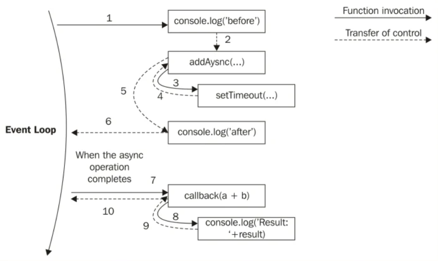

# ?Callback

_Колбэк-функция (или обратный вызов)_ - это функция, переданная в другую функцию в качестве аргумента, которая затем вызывается сразу или по завершению какого-либо действия. А функции, которые могут принимать другие функции в качестве аргументов или возвращать функции в качестве результата называются _функциями высшего порядка_.

Функция без колбэка:

~~~
function calculate(x, y, operation) {
  if (operation === "add") {
    return x + y;
  } else if (operation === "substract") {
    return x - y;
  }
}

console.log(calculate(10, 3, "substract")); // 7
~~~

Функция с колбэком (более понятная):

~~~
function add(x, y) {
  return x + y;
}

function substract(x, y) {
  return x - y;
}

function calculate(x, y, callback) {
  return callback(x, y);
}

console.log(calculate(10, 3, substract)); // 7
~~~

### Callback pattern

Обратные вызовы практически заменяют использование инструкции `return`, которая, как известно, всегда выполняется синхронно. И это именно то, что нам нужно при работе с асинхронными операциями. Кроме того, замыкания являются идеальной конструкцией для реализации обратных вызовов. С замыканиями мы фактически можем ссылаться на среду, в которой была создана функция, практически мы всегда можем поддерживать контекст, в котором была запрошена асинхронная операция, независимо от того, когда и где вызывается ее обратный вызов.

~~~
function addAsync(a, b, callback) {
  setTimeout(() => {
    callback(a + b);
  }, 100);
}

console.log('before');
addAsync(1, 2, function(result) {
  console.log('Result: ' + result);
});
console.log('after');
// before
// after
// Result: 3
~~~

Мы используем `setTimeout()` для имитации асинхронного вызова обратного вызова.

На следующем изображении показано, как это работает:

Рассмотрим еще один пример. Цепочка обратных вызовов как способ принудительного последовательного выполнения:

~~~
function fooBar(cb1) {
  setTimeout(function () {
    cb1(function cb2() {
      console.info("Second Line");
    });
  }, 1000);
}

fooBar(function cb1(cb2) {
  console.info("First Line");
  cb2();
});

// First Line
// Second Line
~~~

### Callback limitations (callback hell)

_"Callback Hell"_ не удобен для восприятия, из-за этого он и получил свое название. Чем больше уровней вложенности коллбеков, тем труднее понять что происходит. _"Callback Hell"_ — это, по сути, вложенные обратные вызовы, расположенные друг под другом, образующие структуру пирамиды. Каждый обратный вызов зависит от предыдущего обратного вызова, тем самым создавая пирамидальную структуру, которая влияет на удобочитаемость и удобство сопровождения кода. 

~~~
function getUserInfo(id, handler) {
  setTimeout(() => {
    const userData = {
      id: id,
      name: "test",
    };
    handler(userData);
  }, 100);
}

function getPermissions(userData, handler) {
  setTimeout(() => {
    const permissions = {
      write: "y",
      read: "y",
    };
    handler(permissions, userData);
  }, 50);
}

function makePost(permissions, userData) {
  if (permissions.write === "y") {
    console.log(`Пользователь ${userData.name} написал пост`);
  }
}

// реализация паттерна Callback Hell
getUserInfo(1, (userData) => {
  getPermissions(userData, (permissions, userData) => {
    makePost(permissions, userData); // будет выведено "Пользователь test написал пост"
  });
});
~~~
