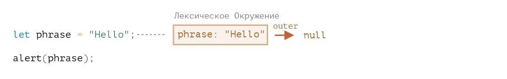
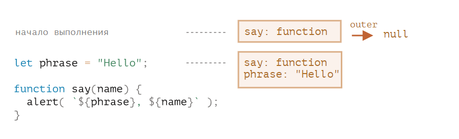
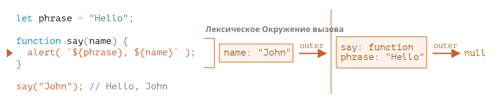
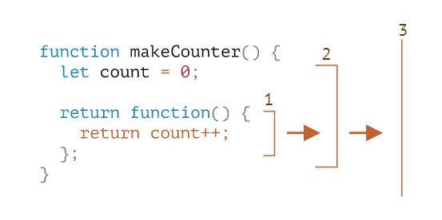
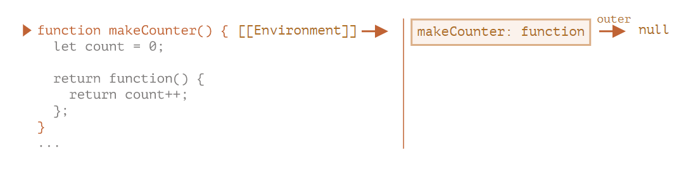
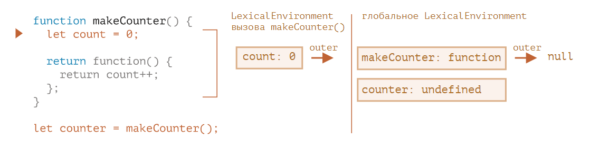
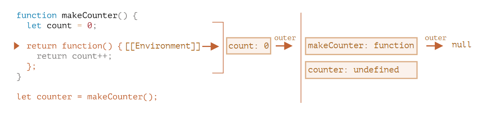
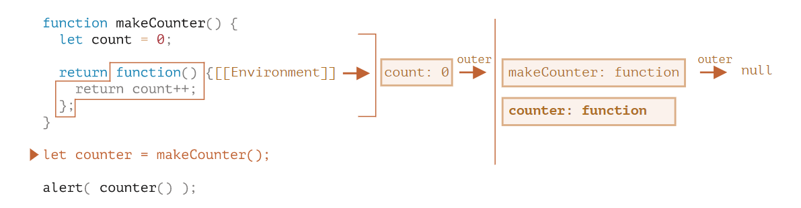
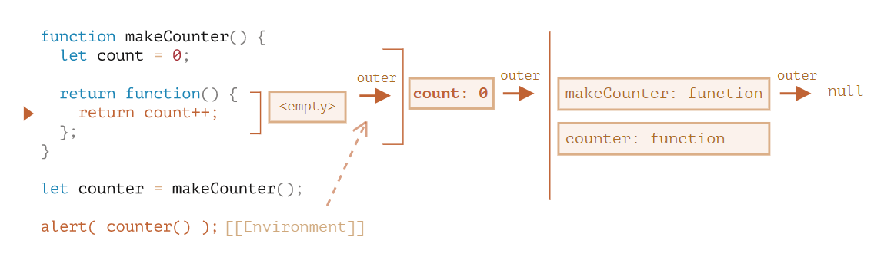
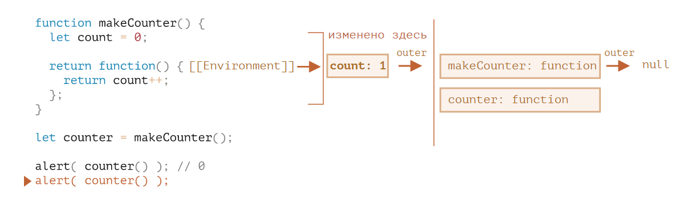

# ?Closures

_Замыкание_ — способность функции запоминать свою лексическую область видимости и обращаться к ней даже тогда, когда функция выполняется вне своей лексической области видимости. Замыкания создаются каждый раз при создании функции.

Все функции в JavaScript являются замыканиями.

### Лексическое окружение

В JavaScript у каждой выполняемой функции, блока кода и скрипта есть связанный с ними внутренний (скрытый) объект, называемый лексическим окружением `LexicalEnvironment`.

Объект лексического окружения состоит из двух частей:

1. `Environment Record` – объект, в котором как свойства хранятся все локальные переменные (а также некоторая другая информация, такая как значение `this`).
2. Ссылка на внешнее лексическое окружение – то есть то, которое соответствует коду снаружи (снаружи от текущих фигурных скобок).

"Переменная" – это просто свойство специального внутреннего объекта: `Environment Record`. «Получить или изменить переменную», означает, «получить или изменить свойство этого объекта».

Например, в этом простом коде только одна переменная в лексическом окружении:

Это, так называемое, глобальное лексическое окружение, связанное со всем скриптом.

У глобального лексического окружения нет внешнего окружения, так что она указывает на `null`.

### Function declaration

В отличие от переменных, объявленных с помощью `let` или `const`, они полностью инициализируются не тогда, когда выполнение доходит до них, а раньше, когда создаётся лексическое окружение.

Для верхнеуровневых функций это означает момент, когда скрипт начинает выполнение.

Вот почему мы можем вызвать функцию, объявленную через Function Declaration, до того, как она определена.

Следующий код демонстрирует, что уже с самого начала в лексическом окружении что-то есть. Там есть `say`, потому что это Function Declaration. И позже там появится `phrase`, объявленное через `const`:

### Внутреннее и внешнее лексическое окружение

Теперь давайте продолжим и посмотрим, что происходит, когда функция получает доступ к внешней переменной.

В течение вызова `say()` использует внешнюю переменную `phrase`. Давайте разберёмся подробно, что происходит.

При запуске функции для неё автоматически создаётся новое лексическое окружение, для хранения локальных переменных и параметров вызова.

Например, для `say("John")` это выглядит так (выполнение находится на строке, отмеченной стрелкой):

* Внутреннее лексическое окружение соответствует текущему выполнению `say`.

В нём находится одна переменная name, аргумент функции. Мы вызываем `say("John")`, так что значение переменной name равно `"John"`.

* Внешнее лексическое окружение – это глобальное лексическое окружение.

В нём находятся переменная `phrase` и сама функция.

У внутреннего лексического окружения есть ссылка `outer` на внешнее.

##### Когда код хочет получить доступ к переменной – сначала происходит поиск во внутреннем лексическом окружении, затем во внешнем, затем в следующем и так далее, до глобального.

> Если переменная не была найдена, это будет ошибкой в `strict mode`. Без `strict mode`, для обратной совместимости, присваивание несуществующей переменной создаёт новую глобальную переменную с таким именем.

Давайте посмотрим, как происходит поиск в нашем примере:

* Когда `console.log` внутри `say` хочет получить доступ к `name`, он немедленно находит переменную в лексическом окружении функции.
* Когда он хочет получить доступ к `phrase`, которой нет локально, он следует дальше по ссылке к внешнему лексическому окружению и находит переменную там.

##### Функция получает текущее значение внешних переменных, то есть их последнее значение.

Старые значения переменных нигде не сохраняются. Когда функция хочет получить доступ к переменной, она берёт её текущее значение из своего или внешнего лексического окружения.

~~~
let name = "John";

function sayHi() {
  console.log("Hi, " + name);
}

name = "Pete";

sayHi(); // Hi, Pete
~~~

Порядок выполнения кода, приведённого выше:

1. В глобальном лексическом окружении есть `name: "John"`.
2. Далее глобальная переменная изменяется, теперь `name: "Pete"`.
3. Когда функция `sayHi()` выполняется, она берёт переменную `name` из глобального лексического окружения, где переменная уже равна `"Pete"`.

##### Один вызов – одно лексическое окружение

Обратите внимание, что новое лексическое окружение функции создаётся каждый раз, когда функция выполняется.

И, если функция вызывается несколько раз, то для каждого вызова будет своё лексическое окружение, со своими, специфичными для этого вызова, локальными переменными и параметрами.

~~~
function makeCounter() {
  let count = 0;
  return count++;
}

console.log(makeCounter()); // 0
console.log(makeCounter()); // 0
console.log(makeCounter()); // 0
~~~

> «Лексическое окружение» – это специальный внутренний объект. Мы не можем получить его в нашем коде и изменять напрямую. Сам движок JavaScript может оптимизировать его, уничтожать неиспользуемые переменные для освобождения памяти и выполнять другие внутренние уловки, но видимое поведение объекта должно оставаться таким, как было описано.

### Вложенные функции

Функция называется «вложенной», когда она создаётся внутри другой функции.

Это очень легко сделать в JavaScript.

Мы можем использовать это для упорядочивания нашего кода, например, как здесь:

~~~
function sayHiBye(firstName, lastName) {
  // функция-помощник, которую мы используем ниже
  function getFullName() {
    return firstName + " " + lastName;
  }

  console.log("Hello, " + getFullName());
  console.log("Bye, " + getFullName());
}

sayHiBye("John", "Smith");
// Hello, John Smith
// Bye, John Smith
~~~

Здесь вложенная функция `getFullName()` создана для удобства. Она может получить доступ к внешним переменным и, значит, вывести полное имя. В JavaScript вложенные функции используются очень часто.

Что ещё интереснее, вложенная функция может быть возвращена: либо в качестве свойства нового объекта (если внешняя функция создаёт объект с методами), либо сама по себе. И затем может быть использована в любом месте. Не важно где, она всё так же будет иметь доступ к тем же внешним переменным.

Например, здесь, вложенная функция присваивается новому объекту в конструкторе:

~~~
// функция-конструктор возвращает новый объект
function User(name) {
  // методом объекта становится вложенная функция
  this.sayHi = function () {
    console.log(name);
  };
}

const user = new User("John");
user.sayHi(); // "John" (у кода метода "sayHi" есть доступ к внешней переменной "name")
~~~

А здесь мы просто создаём и возвращаем функцию `counter`:

~~~
function makeCounter() {
  let count = 0;

  return function () {
    return count++; // есть доступ к внешней переменной "count"
  };
}

const counter = makeCounter();

console.log(counter()); // 0
console.log(counter()); // 1
console.log(counter()); // 2
~~~

Давайте продолжим с примером `makeCounter`. Он создаёт функцию `counter`, которая возвращает следующее число при каждом вызове. Несмотря на простоту, немного модифицированные варианты этого кода применяются на практике, например, в генераторе псевдослучайных чисел и во многих других случаях.

Как же это работает изнутри?

Когда внутренняя функция начинает выполняться, начинается поиск переменной `count++` изнутри-наружу. Для примера выше порядок будет такой:

1. Локальные переменные вложенной функции…
2. Переменные внешней функции…
3. И так далее, пока не будут достигнуты глобальные переменные.

В этом примере `count` будет найден на шаге 2. Когда внешняя переменная модифицируется, она изменится там, где была найдена. Значит, `count++` найдёт внешнюю переменную и увеличит её значение в лексическом окружении, которому она принадлежит.

`count` – локальная переменная функции, мы не можем получить к ней доступ извне и не можем сбросить `count` из кода, который не принадлежит `makeCounter`.

Если мы вызываем `makeCounter` несколько раз, то для каждого вызова `makeCounter()` создаётся новое лексическое окружение функции, со своим собственным `count`. Так что получившиеся функции `counter` – независимы.

Вот пример:

~~~
function makeCounter() {
  let count = 0;
  return function () {
    return count++;
  };
}

const counter1 = makeCounter();
const counter2 = makeCounter();

console.log(counter1()); // 0
console.log(counter1()); // 1

console.log(counter2()); // 0 (независимо)
console.log(counter2()); // 1
~~~

### Окружение в деталях

Вот что происходит в примере с `makeCounter` шаг за шагом.

Обратите внимание на дополнительное свойство `[[Environment]]`, про которое здесь рассказано. Мы не упоминали о нём раньше для простоты.

1. Когда скрипт только начинает выполняться, есть только глобальное лексическое окружение:

В этот начальный момент есть только функция `makeCounter`, потому что это Function Declaration. Она ещё не выполняется.

##### Все функции «при рождении» получают скрытое свойство `[[Environment]]`, которое ссылается на лексическое окружение места, где они были созданы.

Мы ещё не говорили об этом, это то, каким образом функции знают, где они были созданы.

В данном случае, `makeCounter` создан в глобальном лексическом окружении, так что `[[Environment]]` содержит ссылку на него.

Другими словами, функция навсегда запоминает ссылку на лексическое окружение, где она была создана. И `[[Environment]]` – скрытое свойство функции, которое содержит эту ссылку.

2. Код продолжает выполняться, объявляется новая глобальная переменная `counter`, которой присваивается результат вызова `makeCounter`. Вот снимок момента, когда интерпретатор находится на первой строке внутри `makeCounter()`:

##### В момент вызова `makeCounter()` создаётся лексическое окружение, для хранения его переменных и аргументов.

Как и все лексические окружения, оно содержит две вещи:

1. Environment Record с локальными переменными. В нашем случае `count` – единственная локальная переменная (появляющаяся, когда выполняется строчка с let count).
2. Ссылка на внешнее окружение, которая устанавливается в значение `[[Environment]]` функции. В данном случае, `[[Environment]]` функции `makeCounter` ссылается на глобальное лексическое окружение.

Итак, теперь у нас есть два лексических окружения: первое – глобальное, второе – для текущего вызова `makeCounter`, с внешней ссылкой на глобальный объект.

3. В процессе выполнения `makeCounter()` создаётся небольшая вложенная функция.

Не имеет значения, какой способ объявления функции используется: Function Declaration или Function Expression. Все функции получают свойство `[[Environment]]`, которое ссылается на лексическое окружение, в котором они были созданы. То же самое происходит и с нашей новой маленькой функцией.

Для нашей новой вложенной функции значением `[[Environment]]` будет текущее лексическое окружение `makeCounter()` (где она была создана):

Обратите внимание, что на этом шаге внутренняя функция была создана, но ещё не вызвана. Код внутри `function() { return count++ }` не выполняется.

4. Выполнение продолжается, вызов `makeCounter()` завершается, и результат (небольшая вложенная функция) присваивается глобальной переменной `counter`:

В этой функции есть только одна строчка: `return count++`, которая будет выполнена, когда мы вызовем функцию.

5. При вызове `counter()` для этого вызова создаётся новое лексическое окружение. Оно пустое, так как в самом `counter` локальных переменных нет. Но `[[Environment]]` counter используется, как ссылка на внешнее лексическое окружение `outer`, которое даёт доступ к переменным предшествующего вызова `makeCounter`, где `counter` был создан.

Теперь, когда вызов ищет переменную `count`, он сначала ищет в собственном лексическом окружении (пустое), а затем в лексическом окружении предшествующего вызова `makeCounter()`, где и находит её.

Пожалуйста, обратите внимание, как здесь работает управление памятью. Хотя `makeCounter()` закончил выполнение некоторое время назад, его лексическое окружение остаётся в памяти, потому что есть вложенная функция с `[[Environment]]`, который ссылается на него.

В большинстве случаев, объект лексического окружения существует до того момента, пока есть функция, которая может его использовать. И только тогда, когда таких не остаётся, окружение уничтожается.

6. Вызов `counter()` не только возвращает значение `count`, но также увеличивает его. Обратите внимание, что модификация происходит «на месте». Значение `count` изменяется конкретно в том окружении, где оно было найдено.

7. Следующие вызовы counter() сделают то же самое.

Еще один пример:

~~~
function makeWorker() {
  const name = "Pete";
  return function() {
    console.log(name);
  };
}

const name = "John";
const work = makeWorker();
work(); // Pete
~~~

Функция `work()` в коде ниже получает `name` из того места, где была создана, через ссылку на внешнее лексическое окружение. Так что результатом будет `"Pete"`.

Но, если бы в `makeWorker()` не было `const name`, тогда бы поиск продолжился дальше и была бы взята глобальная переменная, как мы видим из приведённой выше цепочки. В таком случае, результатом было бы `"John"`.

### Блоки кода и циклы, IIFE

Предыдущие примеры сосредоточены на функциях. Но лексическое окружение существует для любых блоков кода `{...}`.

Лексическое окружение создаётся при выполнении блока кода и содержит локальные переменные для этого блока. Вот пара примеров.

#### If
В следующем примере переменная `user` существует только в блоке `if`:

~~~
const phrase = "Hello";
if (true) {
  const user = "John";
  console.log(`${phrase}, ${user}`); // Hello, John
}

console.log(user); // ReferenceError: user is not defined
~~~

Когда выполнение попадает в блок `if`, для этого блока создаётся новое лексическое окружение.

У него есть ссылка на внешнее окружение, так что `phrase` может быть найдена. Но все переменные, Function Expression, а так же Function Declaration в строгом режиме, объявленные внутри `if`, остаются в его лексическом окружении и не видны снаружи.

Например, после завершения `if` следующий `console.log` не увидит `user`, что вызовет ошибку.

#### For, while

Для цикла у каждой итерации своё отдельное лексическое окружение. Если переменная объявлена в `for(let ...)`, то она также в нём:

~~~
for (let i = 0; i < 10; i++) {
  // У каждой итерации цикла своё собственное лексическое окружение
  // { i: value }
}

console.log(i); // ReferenceError: i is not defined
~~~

Обратите внимание: `let i` визуально находится снаружи `{...}`. Но конструкция `for` – особенная в этом смысле, у каждой итерации цикла своё собственное лексическое окружение с текущим `i` в нём.

И так же, как и в `if`, ниже цикла `i` невидима.

Следующий код выводит в консоль `End 3 3 3`:

~~~
for (var i = 0; i < 3; i++) {
  setTimeout(function callbackFunc() {
    console.log(i);
  }, 5000);
}

console.log("End");
~~~

В приведенном выше коде `setTimeout` использует переменную `i` , объявленную вне себя. Переменная `i` объявлена ​​в цикле `for` , и внутренняя функция обращается к ней. Поэтому, когда цикл `for` завершен, каждая из внутренних функций ссылается на одну и ту же переменную `i` , которая в конце цикла равна `3`. 

Один из вариантов решить проблему - это заменить `var` на `let`.

Следующий код создаёт массив функций:

~~~
function makeArmy() {
  const shooters = [];
  for (var i = 0; i < 10; i++) {
    shooters.push(() => {
      console.log(i);
    });
  }
  return shooters;
}

const army = makeArmy();
army[0](); // 10
army[5](); // 10
~~~

Почему все функции `shooters` показывают одно и то же?

Можно представить цикл следующим образом:

~~~
function makeArmy() {
  const shooters = [];
  {
    var i = 0;
    shooters.push(() => {
      console.log(i);
    });
  }
  {
    var i = 1;
    shooters.push(() => {
      console.log(i);
    });
  }
  ...
  return shooters;
}
~~~

Так как `i` был объявлен с использованием ключевого слова `var`, областью видимости `i` является функция `makeArmy()`, но не блок `{...}`, в котором он находится.

Функция `makeArmy` делает следующее:

1. Создаёт пустой массив `shooters`.
2. В цикле заполняет массив элементами через `shooters.push`. При этом каждый элемент массива – это функция, так что в итоге после цикла массив будет таким:

~~~
const shooters = [
  () => { console.log(i); },
  () => { console.log(i); },
  () => { console.log(i); },
  () => { console.log(i); },
  () => { console.log(i); },
  () => { console.log(i); },
  () => { console.log(i); },
  () => { console.log(i); },
  () => { console.log(i); },
  () => { console.log(i); }
];
~~~

Этот массив возвращается из функции.

3. Вызов функций `shooters` – это получение элемента массива, и тут же – её запуск.

Разберемся, почему все стрелки выводят одно и то же значение.

* В функциях `shooters` отсутствует переменная `i`. Когда такая функция вызывается, то `i` она берет из внешнего LexicalEnvironment.
* Когда `army[0]()` вызывается, она находит значение `i` в лексическом окружении `makeArmy()`, но не в лексическом окружении, которое соответствует текущей итерации цикла, так как `i` объявлена с использованием ключевого слова `var`. К моменту вызова `army[0]()`, функция `makeArmy` уже закончила работу. Цикл завершился, последнее значение было `i = 10`.
* В результате все функции `shooter` получают из внешнего лексического окружения это, одно и то же, последнее, значение `i = 10`.

Мы можем исправить эту ситуацию сменив `var` на `let`. Каждый раз, когда выполняется блок кода `for (let i = 0...) {...}`, для него создаётся новое лексическое окружение с соответствующей переменной `i`. То есть, поскольку область видимости `let` это блок, то мы найдем `let i` в лексическом окружении, которое соответствует текущей итерации цикла.

#### Блоки кода

Мы также можем использовать «простые» блоки кода `{...}`, чтобы изолировать переменные в «локальной области видимости».

Например, в браузере все скрипты (кроме `type="module"`) разделяют одну общую глобальную область. Так что, если мы создадим глобальную переменную в одном скрипте, она станет доступна и в других. Но это становится источником конфликтов, если два скрипта используют одно и то же имя переменной и перезаписывают друг друга.

Это может произойти, если название переменной – широко распространённое слово, а авторы скрипта не знают друг о друге.

Если мы хотим этого избежать, мы можем использовать блок кода для изоляции всего скрипта или какой-то его части:

~~~
{
  // сделать какую-нибудь работу с локальными переменными, которые не должны быть видны снаружи
  const message = "Hello";
  console.log(message); // Hello
}

console.log(message); // ReferenceError: message is not defined
~~~

Из-за того, что у блока есть собственное лексическое окружение, код снаружи него (или в другом скрипте) не видит переменные этого блока.

#### IIFE

В прошлом в JavaScript не было лексического окружения на уровне блоков кода.

Так что программистам пришлось что-то придумать. И то, что они сделали, называется _«immediately-invoked function expressions»_ (аббревиатура IIFE), что означает функцию, запускаемую сразу после объявления.

Это не то, что мы должны использовать сегодня, но, так как вы можете встретить это в старых скриптах, полезно понимать принцип работы.

IIFE выглядит так:

~~~
(function () {
  const message = "Hello";
  console.log(message); // Hello
})();

console.log(message); // ReferenceError: message is not defined
~~~

Здесь создаётся и немедленно вызывается Function Expression. Так что код выполняется сразу же и у него есть свои локальные переменные.

Function Expression обёрнуто в скобки `(function ...)`, потому что, когда JavaScript встречает "function" в основном потоке кода, он воспринимает это как начало Function Declaration. Но у Function Declaration должно быть имя, так что такой код вызовет ошибку:

~~~
// Попробуйте объявить и сразу же вызвать функцию
function() { // <-- Error
  const message = "Hello";
  console.log(message); // Hello
}();
~~~

Даже если мы скажем: «хорошо, давайте добавим имя», – это не сработает, потому что JavaScript не позволяет вызывать Function Declaration немедленно.

~~~
// ошибка синтаксиса из-за скобок ниже
function go() {
// ...
}(); // <-- не можете вызывать Function Declaration немедленно
~~~

Так что скобки вокруг функции – это трюк, который позволяет показать JavaScript, что функция была создана в контексте другого выражения, и, таким образом, это функциональное выражение: ей не нужно имя и её можно вызвать немедленно.

Кроме скобок, существуют и другие пути показать JavaScript, что мы имеем в виду Function Expression:

~~~
// Пути создания IIFE

(function() {
  console.log("Скобки вокруг функции");
})();

(function() {
  console.log("Скобки вокруг всего");
}());

!function() {
  console.log("Выражение начинается с логического оператора NOT");
}();

+function() {
  console.log("Выражение начинается с унарного плюса");
}();
~~~

Во всех перечисленных случаях мы объявляем Function Expression и немедленно выполняем его. Ещё раз заметим, что в настоящий момент нет необходимости писать подобный код.

### Сборка мусора

Обычно лексическое окружение очищается и удаляется после того, как функция выполнилась. Например:

~~~
function f() {
  const value1 = 123;
  const value2 = 456;
}

f();
~~~

Здесь два значения, которые технически являются свойствами лексического окружения. Но после того, как `f()` завершится, это лексическое окружение станет недоступно, поэтому оно удалится из памяти.

…Но, если есть вложенная функция, которая всё ещё доступна после выполнения `f`, то у неё есть свойство `[[Environment]]`, которое ссылается на внешнее лексическое окружение, тем самым оставляя его достижимым, «живым»:

~~~
function f() {
  const value = 123;

  function g() {
    console.log(value);
  }

  return g;
}

const g = f(); // g доступно и продолжает держать внешнее лексическое окружение в памяти
~~~

Обратите внимание, если `f()` вызывается несколько раз и возвращаемые функции сохраняются, тогда все соответствующие объекты лексического окружения продолжат держаться в памяти. Вот три такие функции в коде ниже:

~~~
function f() {
  const value = Math.random();

  return function () {
    console.log(value);
  };
}

// три функции в массиве, каждая из них ссылается на лексическое окружение
// из соответствующего вызова f()
const arr = [f(), f(), f()];
~~~

Объект лексического окружения умирает, когда становится недоступным (как и любой другой объект). Другими словами, он существует только до того момента, пока есть хотя бы одна вложенная функция, которая ссылается на него.

В следующем коде, после того как `g` станет недоступным, лексическое окружение функции (и, соответственно, `value`) будет удалено из памяти:

~~~
function f() {
  const value = 123;

  function g() {
    console.log(value);
  }

  return g;
}

let g = f(); // пока g существует,
// соответствующее лексическое окружение существует

g = null; // ...а теперь память очищается
~~~

### Оптимизация на практике

На практике движки JavaScript анализируют использование переменных и, если легко по коду понять, что внешняя переменная не используется – она удаляется.

Одним из важных побочных эффектов в V8 (Chrome, Opera) является то, что такая переменная становится недоступной при отладке.

Попробуйте запустить следующий пример в Chrome с открытой Developer Tools.

Когда код будет поставлен на паузу, напишите в консоли console.log(value).

~~~
function f() {
  const value = Math.random();

  function g() {
    debugger; // в консоли: напишите console.log(value); Такой переменной нет!
  }

  return g;
}

const g = f();
g();
~~~

### Лексическое окружение и область видимости

_Область видимости_ определяет, в каких местах кода доступна конкретная переменная или функция.
_Лексическое окружение_ определяет, какие переменные и функции доступны в конкретном месте кода.
