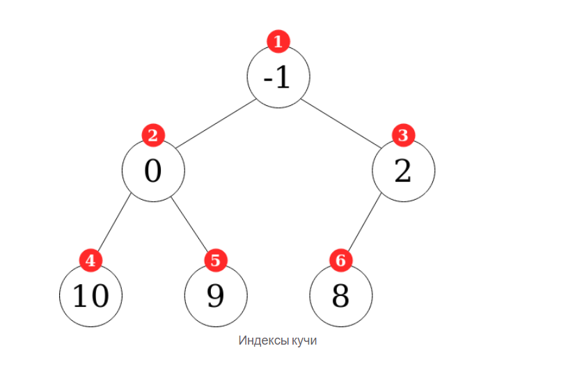
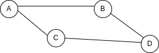

# ?Basic data structures and their organization (array, list, stack, queue, tree, hash table, etc.)

_Структура данных_ — это способ организации, управления и хранения данных, чтобы мы могли оптимизировать наш код. 

JavaScript имеет встроенные и не встроенные структуры данных.

_Встроенные структуры_ данных по умолчанию поставляются с языком программирования, и вы можете реализовать их из коробки (например, массивы и объекты). _Не встроенные структуры_ данных не входят в стандартную комплектацию, и вам придется кодировать их, если вы хотите их использовать. Вероятно, вы сможете решать большинство задач программирования со встроенными структурами данных, но для некоторых очень специфических задач может пригодиться не встроенная структура данных.

### Array

_Массив_ — это набор элементов, хранящихся в смежных ячейках памяти. Доступ к каждому элементу можно получить по его индексу (позиции). Массивы всегда начинаются с индекса 0. Свойство длины массива определяется как количество содержащихся в нем элементов. В JavaScript мы можем хранить значения любого типа в одном и том же массиве, а его длина может быть динамической (может увеличиваться или уменьшаться по мере необходимости). Массив, внутри которого есть другие массивы, называется многомерным массивом. 

В JavaScript, в отличие от некоторых языков программирования, массивы имеют множество встроенных свойств и методов.

Когда мы добавляем/удаляем новый элемент в начале или в середине массива, необходимо изменить индексы всех элементов, которые идут после добавленного/удаленного элемента. Это, конечно, связано с вычислительными затратами и является одним из недостатков этой структуры данных. Массивы полезны, когда нам нужно хранить отдельные значения и добавлять/удалять значения с конца структуры данных. Но когда нам нужно добавить/удалить из какой-либо его части, есть другие структуры данных, которые работают более эффективно.

__Big О методов массива заключается в следующем:__

Вставка - О(1) или O(n)
Удаление - О(1) или O(n)
Поиск - O(n)
Доступ - О(1)

### Linked lists

_Связанные списки_ — это тип структуры данных, в которой значения хранятся в виде списка. Внутри списка каждое значение считается узлом, и каждый узел связан со следующим значением в списке (или нулевым, если элемент является последним в списке).

Существует два типа связанных списков: _односвязные списки_ и _двусвязные списки_. Оба работают очень похоже, но разница заключается в том, что в односвязных списках каждый узел имеет один указатель, указывающий на следующий узел в списке. В двусвязных списках каждый узел имеет два указателя, один указывает на следующий узел, а другой указывает на предыдущий узел.
Первый элемент списка считается `head`, а последний элемент считается `tail`. Как и в случае с массивами, свойство длины определяется как количество элементов, содержащихся в списке.

Основные отличия от массивов следующие:

* Списки не имеют индексов. Каждое значение «знает» только значения, с которыми оно связано через указатели.
* Поскольку у списков нет индексов, мы не можем получить доступ к значениям случайным образом. Когда мы хотим получить доступ к значению, нам всегда приходится искать его, перебирая список, начиная с его головы или хвоста.
* Преимущество отсутствия индексов в том, что вставка/удаление в любой части списка более эффективна , чем с массивами. Нам остается только перенаправить указатели «соседних» значений, а в массивах значения нужно переиндексировать.

Полная реализация _односвязного списка_ может выглядеть так:

~~~
class Node {
  constructor(value) {
    this.value = value;
    this.next = null;
  }
}

class SinglyLinkedList {
  constructor() {
    this.head = null;
    this.tail = null;
    this.length = 0;
  }
  push(value) {
    const newNode = new Node(value);
    if (!this.head) {
      this.head = newNode;
      this.tail = this.head;
    } else {
      this.tail.next = newNode;
      this.tail = newNode;
    }
    this.length++;
    return this;
  }
  pop() {
    if (!this.head) return undefined;
    let current = this.head;
    let newTail = current;
    while (current.next) {
      newTail = current;
      current = current.next;
    }
    this.tail = newTail;
    this.tail.next = null;
    this.length--;
    if (this.length === 0) {
      this.head = null;
      this.tail = null;
    }
    return current;
  }
  shift() {
    if (!this.head) return undefined;
    const currentHead = this.head;
    this.head = currentHead.next;
    this.length--;
    if (this.length === 0) {
      this.tail = null;
    }
    return currentHead;
  }
  unshift(value) {
    const newNode = new Node(value);
    if (!this.head) {
      this.head = newNode;
      this.tail = this.head;
    }
    newNode.next = this.head;
    this.head = newNode;
    this.length++;
    return this;
  }
  get(index) {
    if (index < 0 || index >= this.length) return null;
    let counter = 0;
    let current = this.head;
    while (counter !== index) {
      current = current.next;
      counter++;
    }
    return current;
  }
  set(index, value) {
    const foundNode = this.get(index);
    if (foundNode) {
      foundNode.value = value;
      return true;
    }
    return false;
  }
  insert(index, value) {
    if (index < 0 || index > this.length) return false;
    if (index === this.length) return !!this.push(value);
    if (index === 0) return !!this.unshift(value);

    const newNode = new Node(value);
    const prev = this.get(index - 1);
    const temp = prev.next;
    prev.next = newNode;
    newNode.next = temp;
    this.length++;
    return true;
  }
  remove(index) {
    if (index < 0 || index >= this.length) return undefined;
    if (index === 0) return this.shift();
    if (index === this.length - 1) return this.pop();
    const previousNode = this.get(index - 1);
    const removed = previousNode.next;
    previousNode.next = removed.next;
    this.length--;
    return removed;
  }
  reverse() {
    let node = this.head;
    this.head = this.tail;
    this.tail = node;
    let next;
    let prev = null;
    for (let i = 0; i < this.length; i++) {
      next = node.next;
      node.next = prev;
      prev = node;
      node = next;
    }
    return this;
  }
}
const list = new SinglyLinkedList();
list.push('value1');
list.push('value2');
list.push('value3');
list.push('value4');
console.log(list.reverse());
~~~

Как и в любой структуре данных, для работы с данными реализованы различные методы. Наиболее распространенные из них включают в себя: push, pop, unshift, shift, get, set, insert, remove и reverse.

__Методы односвязных списков имеют следующие сложности:__

Вставка - О(1)
Удаление - O(n)
Поиск - O(n)
Доступ - O(n)

_Двусвязные списки_ работают лучше с некоторыми методами по сравнению с односвязными списками, но за счет потребления большего количества памяти (с двусвязными списками нам нужно хранить два указателя вместо одного). 

Полная реализация _двусвязного списка_ может выглядеть примерно так:

~~~
class Node {
  constructor(value) {
    this.value = value;
    this.next = null;
    this.prev = null;
  }
}

class DoublyLinkedList {
  constructor() {
    this.head = null;
    this.tail = null;
    this.length = 0;
  }
  push(value) {
    const newNode = new Node(value);
    if (this.length === 0) {
      this.head = newNode;
      this.tail = newNode;
    } else {
      this.tail.next = newNode;
      newNode.prev = this.tail;
      this.tail = newNode;
    }
    this.length++;
    return this;
  }
  pop() {
    if (!this.head) return undefined;
    const poppedNode = this.tail;
    if (this.length === 1) {
      this.head = null;
      this.tail = null;
    } else {
      this.tail = poppedNode.prev;
      this.tail.next = null;
      poppedNode.prev = null;
    }
    this.length--;
    return poppedNode;
  }
  shift() {
    if (this.length === 0) return undefined;
    const oldHead = this.head;
    if (this.length === 1) {
      this.head = null;
      this.tail = null;
    } else {
      this.head = oldHead.next;
      this.head.prev = null;
      oldHead.next = null;
    }
    this.length--;
    return oldHead;
  }
  unshift(value) {
    const newNode = new Node(value);
    if (this.length === 0) {
      this.head = newNode;
      this.tail = newNode;
    } else {
      this.head.prev = newNode;
      newNode.next = this.head;
      this.head = newNode;
    }
    this.length++;
    return this;
  }
  get(index) {
    if (index < 0 || index >= this.length) return null;
    let count, current;
    if (index <= this.length / 2) {
      count = 0;
      current = this.head;
      while (count !== index) {
        current = current.next;
        count++;
      }
    } else {
      count = this.length - 1;
      current = this.tail;
      while (count !== index) {
        current = current.prev;
        count--;
      }
    }
    return current;
  }
  set(index, value) {
    const foundNode = this.get(index);
    if (foundNode != null) {
      foundNode.value = value;
      return true;
    }
    return false;
  }
  insert(index, value) {
    if (index < 0 || index > this.length) return false;
    if (index === 0) return !!this.unshift(value);
    if (index === this.length) return !!this.push(value);

    const newNode = new Node(value);
    const beforeNode = this.get(index - 1);
    const afterNode = beforeNode.next;

    beforeNode.next = newNode;
    newNode.prev = beforeNode;
    newNode.next = afterNode;
    afterNode.prev = newNode;
    this.length++;
    return true;
  }
  remove(index) {
    if (index < 0 || index >= this.length) return undefined;
    if (index === 0) return this.shift();
    if (index === this.length - 1) return this.pop();
    const beforeNode = this.get(index - 1);
    const removed = beforeNode.next;
    const afterNode = removed.next;
    beforeNode.next = afterNode;
    afterNode.prev = beforeNode;
    this.length--;
    return removed;
  }
  reverse() {
    let node = this.head;
    this.head = this.tail;
    this.tail = node;
    let next;
    let prev = null;
    for (let i = 0; i < this.length; i++) {
      next = node.next;
      node.next = prev;
      node.prev = next;
      prev = node;
      node = next;
    }
    return this;
  }
}
const list = new DoublyLinkedList();
list.push("value1");
list.push("value2");
list.push("value3");
list.push("value4");
console.log(list.reverse());
~~~

__Big O методов двусвязных списков заключается в следующем:__

Вставка - О(1)
Удаление - О(1)
Поиск- O(n)
Доступ - О(n)

### Stack

_Стеки_ — это структуры данных, которые хранят информацию в виде списка. Они позволяют добавлять и удалять элементы только по шаблону LIFO (последний пришел, первый ушел). В стеках элементы нельзя добавлять или удалять не по порядку, они всегда должны следовать шаблону LIFO. 
Стеки полезны, когда нам нужно убедиться, что элементы следуют шаблону LIFO. Некоторые примеры использования стека:

* Стек вызовов JavaScript.
* Функциональность отмены/возврата, предлагаемая многими программами.

Существует несколько способов реализации стека, но, вероятно, самым простым является использование массива с его методами `push` и `pop`. Если мы будем использовать `pop` и `push` только для добавления и удаления элементов, мы всегда будем следовать шаблону LIFO и работать с ним как со стеком.

Другой способ — реализовать его как список, который может выглядеть так:

~~~
class Node {
  constructor(value) {
    this.value = value;
    this.next = null;
  }
}

class Stack {
  constructor() {
    this.first = null;
    this.last = null;
    this.size = 0;
  }
  push(value) {
    const newNode = new Node(value);
    if (!this.first) {
      this.first = newNode;
      this.last = newNode;
    } else {
      const temp = this.first;
      this.first = newNode;
      this.first.next = temp;
    }
    return ++this.size;
  }
  pop() {
    if (!this.first) return null;
    const temp = this.first;
    if (this.first === this.last) {
      this.last = null;
    }
    this.first = this.first.next;
    this.size--;
    return temp.value;
  }
}

const stack = new Stack();

stack.push("value1");
stack.push("value2");
stack.push("value3");

console.log(stack.first); /*
Node {
  value: 'value3',
  next: Node { value: 'value2', next: Node { value: 'value1', next: null } }
}
*/

console.log(stack.last); // Node { value: 'value1', next: null }
console.log(stack.size); // 3

stack.push("value4");
console.log(stack.pop()); // value4
~~~

__Big О методов стека заключается в следующем:__

Вставка - О(1)
Удаление - О(1)
Поиск - O(n)
Доступ - О(n)

### Queue

_Очереди_ работают очень похоже на стеки, но элементы добавляются и удаляются по другому шаблону. Очереди допускают только шаблон FIFO (первым пришел, первым обслужен). В очередях элементы нельзя добавлять или удалять не по порядку, они всегда должны следовать шаблону FIFO.
Как и в случае со стеками, существует несколько способов реализации очереди. Но, вероятно, самым простым является использование массива с его методами `push` и `shift`.

Другой способ — реализовать его как список, который может выглядеть так:

~~~
class Node {
  constructor(value) {
    this.value = value;
    this.next = null;
  }
}

class Queue {
  constructor() {
    this.first = null;
    this.last = null;
    this.size = 0;
  }
  enqueue(value) {
    const newNode = new Node(value);
    if (!this.first) {
      this.first = newNode;
      this.last = newNode;
    } else {
      this.last.next = newNode;
      this.last = newNode;
    }
    return ++this.size;
  }
  dequeue() {
    if (!this.first) return null;

    const temp = this.first;
    if (this.first === this.last) {
      this.last = null;
    }
    this.first = this.first.next;
    this.size--;
    return temp.value;
  }
}

const quickQueue = new Queue();

quickQueue.enqueue("value1");
quickQueue.enqueue("value2");
quickQueue.enqueue("value3");

console.log(quickQueue.first); /*
Node {
  value: 'value1',
  next: Node { value: 'value2', next: Node { value: 'value3', next: null } }
}
*/
console.log(quickQueue.last); // Node { value: 'value3, next: null }
console.log(quickQueue.size); // 3

quickQueue.enqueue("value4");
console.log(quickQueue.dequeue()); // value1
~~~

__Big О методов очереди заключается в следующем:__

Вставка - О(1)
Удаление - О(1)
Поиск - O(n)
Доступ - О(n)

### Tree

_Деревья_ — это структуры данных, которые связывают узлы в родительско-дочерних отношениях, в том смысле, что есть узлы, которые зависят от других узлов или выходят из них.
Деревья формируются корневым узлом (первым узлом в дереве), и все узлы, исходящие из этого корня, называются дочерними . Узлы в нижней части дерева, не имеющие «потомков», называются листьями. И высота дерева определяется количеством связей родитель/потомок, которые у него есть.

В отличие от связанных списков или массивов, деревья нелинейны в том смысле, что при повторении дерева поток программы может двигаться в разных направлениях внутри структуры данных. Находясь в связанных списках или массивах, программа может перебирать структуру данных только от одной крайности к другой, всегда следуя одному и тому же пути.
Важным требованием для формирования дерева является то, что единственная допустимая связь между узлами — от родителя к дочернему. Соединения между братьями и сестрами или от дочернего элемента к родителю не допускаются в деревьях (эти типы соединений образуют графы, другой тип структуры данных). Другое важное требование состоит в том, что деревья должны иметь только один корень.

Некоторые примеры использования дерева в программировании:

* Модель ДОМ.
* Анализ ситуации в искусственном интеллекте.
* Папки с файлами в операционных системах.

Есть много разных видов деревьев. В каждом типе дерева значения могут быть организованы в соответствии с различными шаблонами, что делает эту структуру данных более подходящей для использования при столкновении с различными видами проблем. Наиболее часто используемыми типами деревьев являются бинарные деревья и кучи.

#### Binary tree

_Бинарные (двоичные) деревья_ — это тип дерева, в котором каждый узел имеет не более двух дочерних элементов.
Одна из ключевых ситуаций, в которой бинарные деревья действительно полезны, — это поиск. А для поиска используется определенный тип бинарных деревьев, называемых бинарными деревьями поиска (BST) .

BST похожи на бинарные деревья, но информация в них упорядочена таким образом, что делает их подходящей структурой данных для поиска.

В BST значения упорядочены таким образом, что каждый узел, который спускается слева от своего родителя, должен иметь значение меньше, чем его родитель, а каждый узел, который спускается справа от своего родителя, должен иметь значение больше, чем его родитель.

Такой порядок значений делает эту структуру данных подходящей для поиска, поскольку на каждом уровне дерева мы можем определить, больше или меньше искомое значение, чем родительский узел, и от этого сравнения постепенно отбрасывать примерно половину данных до тех пор, пока мы достигаем нашего значения.

При вставке или удалении значений алгоритм будет выполнять следующие шаги:

* Проверьте, есть ли корневой узел.
* Если есть, проверьте, больше или меньше значение, которое нужно добавить/удалить, чем узел.
* Если он меньше, проверьте, есть ли узел левее, и повторите предыдущую операцию. Если нет, добавьте/удалите узел в этой позиции.
* Если оно больше, проверьте, есть ли узел справа, и повторите предыдущую операцию. Если нет, добавьте/удалите узел в этой позиции.

Поиск в BST очень похож, только вместо добавления/удаления значений мы проверяем узлы на равенство с искомым значением.

~~~
class Node {
  constructor(value) {
    this.value = value;
    this.left = null;
    this.right = null;
  }
}

class BinarySearchTree {
  constructor() {
    this.root = null;
  }

  insert(value) {
    const newNode = new Node(value);
    if (this.root === null) {
      this.root = newNode;
      return this;
    }
    let current = this.root;
    while (true) {
      if (value === current.value) return undefined;
      if (value < current.value) {
        if (current.left === null) {
          current.left = newNode;
          return this;
        }
        current = current.left;
      } else {
        if (current.right === null) {
          current.right = newNode;
          return this;
        }
        current = current.right;
      }
    }
  }

  find(value) {
    if (this.root === null) return false;
    let current = this.root;
    while (current) {
      if (value < current.value) {
        current = current.left;
      } else if (value > current.value) {
        current = current.right;
      } else {
        return current;
      }
    }
    return undefined;
  }

  contains(value) {
    if (this.root === null) return false;
    let current = this.root;
    while (current) {
      if (value < current.value) {
        current = current.left;
      } else if (value > current.value) {
        current = current.right;
      } else {
        return true;
      }
    }
    return false;
  }
}

const binarySearchTree = new BinarySearchTree();
binarySearchTree.insert(3);
binarySearchTree.insert(5);
binarySearchTree.insert(2);
console.log(binarySearchTree.find(2));
~~~

Обычно бинарное дерево поиска (также известное как BST) — это дерево без дубликатов.

В противном случае, если есть дубликаты, вам нужно запустить одну и ту же функцию удаления дважды или более!

#### Heaps

_Кучи_ — это еще один тип дерева, для которого действуют определенные правила. Существует два основных типа куч: `MaxHeaps` и `MinHeaps`. В `MaxHeaps` родительские узлы всегда больше дочерних, а в `MinHeaps` родительские узлы всегда меньше дочерних. Нет порядка между дочерними узлами на одном уровне. 

Кучи максимально компактны, то есть каждый уровень содержит все узлы, которые он может содержать, без пустых пространств, а новые дочерние элементы сначала помещаются в левые пространства дерева.

Кучи допускают две дополнительные операции: удаление корневого узла (которое всегда является минимальным значением) и добавление любого нового значения. Обе операции выполняются за логарифмическое время `O(log n)`.

Мы могли бы реализовать кучу, используя объекты Node. Однако проще и эффективнее просто использовать массив. Складываем элементы кучи, сверху вниз, слева направо. Чтобы упростить индексы узлов кучи в массиве, мы добавляем фиктивное значение в начало массива. Можно использовать значение -1, но null любое другое значение тоже подойдет.

Подсчет узлов, начиная с 1, дает следующий результат:

Обратите внимание, что с этим соглашением мы можем получить родительский, левый и правый узлы для любого узла в индексе `i` следующим образом:

* Родительский индекс = Math.floor(i / 2)
* Левый индекс = 2 * i
* Правый индекс = 2 * i + 1

Реализация `MinHeap` может выглядеть так:

~~~
class MinHeap {
  constructor() {
    this.list = [-1];
  }
  add(value) {
    const length = this.list.length;
    this.list.push(value);
    if (length == 1) {
      return value;
    }    
    this.heapifyUp();
    return this.list[1];
  }
  remove() {
    if (this.list.length == 1) return null;
    if (this.list.length == 2) return this.list.pop();
    const prevRoot = this.list[1];
    this.list[1] = this.list.pop();
    this.heapifyDown();
    return prevRoot;
  }
  heapifyUp() {
    let i = this.list.length - 1;
    const value = this.list[i];
    while (!this.isRoot(i) && this.getParentNode(i) > value) {
      [this.list[this.getParentIndex(i)], this.list[i]] = [
        value,
        this.getParentNode(i),
      ];
      i = this.getParentIndex(i);
    }
  }
  heapifyDown() {
    if (this.list.length < 3) return;
    let i = 1;
    const currentVal = this.list[1];
    let leftVal = this.getLeftNode(i);
    let rightVal = this.getRightNode(i);
    while (
      leftVal !== undefined &&
      (currentVal > leftVal || currentVal > rightVal)
    ) {
      if (
        currentVal > leftVal &&
        (rightVal === undefined || leftVal < rightVal)
      ) {
        [this.list[this.getLeftIndex(i)], this.list[i]] = [currentVal, leftVal];
        i = this.getLeftIndex(i);
      } else {
        [this.list[this.getRightIndex(i)], this.list[i]] = [
          currentVal,
          rightVal,
        ];
        i = this.getRightIndex(i);
      }
      leftVal = this.getLeftNode(i);
      rightVal = this.getRightNode(i);
    }
  }
  isRoot(index) {
    return index == 1;
  }
  getLeftIndex(index) {
    return 2 * index;
  }
  getLeftNode(index) {
    return this.list[this.getLeftIndex(index)];
  }
  getRightIndex(index) {
    return 2 * index + 1;
  }
  getRightNode(index) {
    return this.list[this.getRightIndex(index)];
  }
  getParentIndex(index) {
    return Math.floor(index / 2);
  }
  getParentNode(index) {
    return this.list[this.getParentIndex(index)];
  }
}

const heap = new MinHeap();
heap.add(-1);
heap.add(0);
heap.add(2);
heap.add(10);
heap.add(9);
heap.add(8);
heap.remove();
~~~

### Hash table

_Хеш-таблицa_ - это структура данных для хранения пар ключ-значение. Хеш-таблицы эффективны в операциях поиска, вставки и удаления. Ключ отправляется в хеш-функцию, которая выполняет над ним арифметические операции. Результат (называемый хеш-значением или хешем) — это индекс пары «ключ-значение». 

_Хеширование_ — операция, которая преобразует любые входные данные в строку (реже число) фиксированной длины. Хеш-таблицы обычно реализуются с использованием массивов, поскольку они обеспечивают доступ к элементам в постоянное время.

~~~
class LinkedList {
  constructor(node) {
    this.head = node;
    this.size = 0;
  }
}

class Node {
  constructor(key, value) {
    this[key] = value;
    this.next = null;
  }
}

class HashTable {
  constructor() {
    this.values = new Array(97);
    this.size = 0;
  }

  hash(key, size) {
    let hash = 0;
    for (let i = 0; i < key.length; i++) {
      hash += key.charCodeAt(i);
    }
    return hash % size;
  }

  set(key, value) {
    const index = this.hash(key, this.values.length);
    const node = new Node(key, value);
    if (!this.values[index]) {
      this.values[index] = new LinkedList(node);
    } else {
      let current = this.values[index].head;
      while (current.next) {
        current = current.next;
      }
      current.next = node;
    }
    this.values[index].size++;
    this.size++;
  }

  get(key) {
    const index = this.hash(key, this.values.length);
    const value = this.values[index];
    if (value) {
      let current = value.head;
      if (current.hasOwnProperty(key)) {
        return current[key];
      }
      while (current.next) {
        if (current.next.hasOwnProperty(key)) {
          return current.next[key];
        }
        current = current.next; // Переопределение никак не повлияет на value.head, потому что мы создали новый объект
      }
    }
    return undefined;
  }

  remove(key) {
    const index = this.hash(key, this.values.length);
    const value = this.values[index];
    if (value) {
      let current = value.head;
      if (current.hasOwnProperty(key)) {
        value.head = current.next;
        value.size--;
        this.size--;
        return true;
      }
      while (current.next) {
        if (current.next.hasOwnProperty(key)) {
          current.next = current.next.next;
          value.size--;
          this.size--;
          return true;
        }
        current = current.next; // Переопределение никак не повлияет на value.head, потому что мы создали новый объект
      }
    }
    return false;
  }
}

const table = new HashTable();

table.set("firstName", "John");
table.set("firstName", "Andrew");

console.log(table.get("firstName")); // John

console.log(table.remove("lastName")); // false
~~~

Хеш всегда одинаковый для одних и тех же данных! С хешированием мы встречаемся в разработке часто. Например, идентификатор коммита в git 0481e0692e2501192d67d7da506c6e70ba41e913 не что иное, как хеш, полученный в результате хеширования данных коммита.

Не для всех входных данных найдётся уникальный хеш. Есть несколько способов разрешения коллизий (открытая адресация, метод цепочек). В примере выше реализован метод цепочек.

__Открытая адресация__

Предположим, что мы передали хеш-функции какой-то ключ ассоциативного массива (key1) и получили от нее 2 – индекс обычного массива, который соответствует этому ключу. 
`[ undefined, undefined, [key1, value1], undefined, undefined, undefined, undefined ]`
Затем мы передаем ей другой ключ – key2 – и вновь получаем 2 – произошла коллизия. Мы не можем записать новые данные под тем же индексом, поэтому мы просто начинаем искать первое свободное место в массиве. Следующий после 2 индекс – 3 – свободен, записываем новые данные в него:
`[ undefined, undefined, [key1, value1], [key2, value2], undefined, undefined, undefined ]`
Для третьего ключа key3 хеш-функция возвращает индекс 3 – но он уже занят ключом key2, поэтому нам приходится снова искать свободное место.
`[ undefined, undefined,  [key1, value1], [key2, value2], [key3,value3], undefined, undefined ]`
С записью понятно, но как в такой хеш-таблице найти нужный ключ, например, key3? Точно так же, сначала прогоняем его через хеш-функцию и получаем 3. Проверяем элемент массива под этим индексом и видим, что это не тот ключ, который мы ищем. Потому мы и храним исходный ключ в хеш-таблице, чтобы можно было убедиться, что найденный элемент именно тот, который нам нужен. Мы просто начинаем двигаться дальше по массиву, перебирая каждый элемент и сравнивая его с искомым ключом.

__Метод цепочек__

В этом подходе значения, соответствующие одному индексу, хранятся в виде связного списка. Каждому индексу массива соответствует не один элемент, а целый список элементов, для которых хеш-функция вычислила один индекс. При возникновении коллизии новый элемент просто добавляется в конец списка.

При поиске элемента с конкретным ключом в такой хеш-таблице мы сначала вычисляем его хеш, определяем нужный индекс массива, а затем просматриваем весь список, пока не найдем искомый ключ.

Такая реализация позволяет с легкостью удалять элементы из таблицы, ведь в связном списке операция удаления занимает константное время.

### Graphs

_Графы_ представляют собой структуру данных, образованную группой узлов и определенными связями между этими узлами. В отличие от деревьев графы не имеют корневых и листовых узлов, а также «head» или «tail». Различные узлы связаны друг с другом, и между ними нет неявной родительско-дочерней связи.

Графы — это структуры данных, часто используемые для:

* Социальные сети
* Геолокализация
* Системы рекомендаций

Графы можно разделить на разные типы в зависимости от характеристик связей между узлами:

* Неориентированные и ориентированные графы
Мы говорим, что граф неориентирован, если в связях между узлами нет неявного направления. Ненаправленный означает, что соединения между узлами могут использоваться в обоих направлениях. Ориентированные графы — полная противоположность. Например, вы можете пройти от узла A к узлу B, но вы не можете перейти от узла B к узлу A. 

* Взвешенные и невзвешенные графики
Чтобы понять, что такое взвешенные графики, представьте, что вы хотите представить карту с множеством разных местоположений и дать пользователю информацию о том, сколько времени им может понадобиться, чтобы перейти из одного места в другое.

Для этого идеально подойдет взвешенный граф, так как вы можете использовать каждый узел для сохранения информации о местоположении, связи могут представлять доступные дороги между каждым местом, а веса будут представлять физическое расстояние от одного места до другого.

И, как вы, возможно, уже догадались, невзвешенные графы — это графы, в которых связи между узлами не имеют назначенных весов. Таким образом, нет конкретной информации о связях между узлами, только о самих узлах.

__Как представлять графы?__

При кодировании графов мы можем использовать два основных метода: _матрицу смежности_ и _список смежности_.

_Матрица смежности_ — это двумерная структура , которая представляет узлы нашего графа и связи между ними.

Если мы используем этот пример...

Это можно представить как таблицу, где столбцы и строки представляют узлы на нашем графике, а значения ячеек представляют связи между узлами. Если ячейка равна 1, между строкой и столбцом есть связь, а если 0 — нет.

Это можно реплицировать с помощью двумерного массива:

~~~
[
  [0, 1, 1, 0] // Первый элемент A имеет связь с вторым B и третьим C
  [1, 0, 0, 1] // Второй элемент B имеет связь с первым A и четвертым D
  [1, 0, 0, 1] // Третий элемент C имеет связь с первым A и четвертым D
  [0, 1, 1, 0] // Четвертый элемент D имеет связь с вторым B и третьим C
]
~~~

С другой стороны, _список смежности_ можно рассматривать как структуру пары ключ-значение, где ключи представляют каждый узел на нашем графе, а значения — это связи, которые имеет этот конкретный узел.

~~~
{
    A: ["B", "C"],
    B: ["A", "D"],
    C: ["A", "D"],
    D: ["B", "C"],
}
~~~

Так в чем же разница между матрицами смежности и списками? Ну, списки, как правило, более эффективны, когда речь идет о добавлении или удалении узлов, в то время как матрицы более эффективны при запросе конкретных соединений между узлами.

Полная реализация графа с использованием списка смежности может выглядеть так. Для простоты мы представим неориентированный невзвешенный граф.

~~~
class Graph {
  constructor() {
    this.adjacencyList = {};
  }
  addNode(node) {
    if (!this.adjacencyList[node]) this.adjacencyList[node] = [];
  }
  addConnection(node1, node2) {
    this.adjacencyList[node1].push(node2);
    this.adjacencyList[node2].push(node1);
  }
  removeConnection(node1, node2) {
    this.adjacencyList[node1] = this.adjacencyList[node1].filter(
      (value) => value !== node2
    );
    this.adjacencyList[node2] = this.adjacencyList[node2].filter(
      (value) => value !== node1
    );
  }
  removeNode(node) {
    while (this.adjacencyList[node].length) {
      const adjacentNode = this.adjacencyList[node].pop();
      this.removeConnection(node, adjacentNode);
    }
    delete this.adjacencyList[node];
  }
}

const Argentina = new Graph();
Argentina.addNode("Buenos Aires");
Argentina.addNode("Santa fe");
Argentina.addNode("Córdoba");
Argentina.addNode("Mendoza");
Argentina.addConnection("Buenos Aires", "Córdoba");
Argentina.addConnection("Buenos Aires", "Mendoza");
Argentina.addConnection("Santa fe", "Córdoba");

console.log(Argentina);
// Graph {
//     adjacencyList: {
//         'Buenos Aires': [ 'Córdoba', 'Mendoza' ],
//         'Santa fe': [ 'Córdoba' ],
//         'Córdoba': [ 'Buenos Aires', 'Santa fe' ],
//         Mendoza: [ 'Buenos Aires' ]
//     }
// }
~~~
