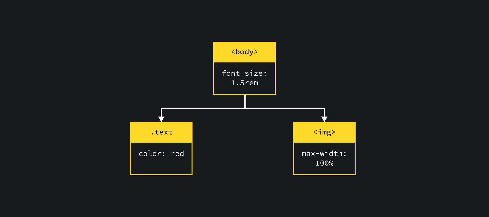

# ?Page lifecycle

Чтобы нарисовать на экране результат работы нашего кода, браузеру нужно выполнить несколько этапов:

* Сперва ему нужно скачать исходники.
* Затем их нужно прочитать и распарсить.
* После этого браузер приступает к рендерингу — отрисовке.

### Получение ресурсов, Fetching

Ресурсы браузер получает с помощью запросов к серверу. В ответ он может получить как, например, данные в виде JSON, так и картинки, видео, файлы стилей и скриптов.

Самый первый запрос к серверу — обычно запрос на получение HTML-страницы (чаще всего `index.html`).

### Парсинг, Parsing

По мере того как скачивается HTML-страница, браузер пытается её «прочитать» — распарсить.

##### DOM

Браузер работает не с текстом разметки, а с абстракциями над ним. Одна из таких абстракций, результат парсинга HTML-кода, называется _DOM_.

_DOM (Document Object Model)_ — абстрактное представление HTML-документа, с помощью которого браузер может получать доступ к его элементам, изменять его структуру и оформление.

_DOM_ — это дерево. Корень этого дерева — это элемент HTML, все остальные элементы — это дочерние узлы.

Пока браузер парсит документ и строит DOM, он натыкается на элементы типа ``, `<link>`, `
  
</body>
~~~

Также существует атрибут `async`: script выполняется асинхронно с остальной частью страницы (script будет выполняться, пока страница продолжает парсинг).

> Обратите внимание: скрипты с `type="module"` загружаются отложено по умолчанию.

##### CSSOM

Когда браузер находит элемент `<link>`, который указывает на файл стилей, браузер скачивает и парсит его. Результат парсинга CSS-кода — _CSSOM_.

_CSSOM (CSS Object Model)_ — по аналогии с DOM, представление стилевых правил в виде дерева.

Чтение стилей приостанавливает чтение кода страницы. Поэтому рекомендуется в самом начале отдавать только критичные стили — которые есть на всех страницах и конкретно на этой. Так мы уменьшаем время ожидания, пока «страница загрузится». Благодаря оптимизациям (например, сканеру предзагрузки) стили могут не блокировать чтение HTML, но они точно блокируют выполнение JavaScript, потому что в JS могут использоваться CSS-селекторы для выборки элементов.

> В каждом браузере есть основной парсер HTML, который токенизирует разметку и преобразует ее в объектную модель. Разбор разметки продолжается до тех пор, пока парсер не встретит блокирующий ресурс, такой как стили, загружаемые через элемент `link`, или скрипт, загружаемый через элемент `script` без атрибута `async` или `defer`. В случае с файлами CSS парсинг и рендеринг блокируются во избежание вспышки нестилизованного контента (flash of unstyled content, FOUC), когда на мгновение появляется нестилизованная версия страницы перед применением к ней соответствующих стилей.

> Блокировка парсинга и рендеринга является нежелательной, поскольку может помешать обнаружению других важных ресурсов. К счастью, кроме основного, в браузере также имеется дополнительный парсер, который называется _сканером предварительной загрузки (preload scanner)_. Например, основной парсер блокируется обработкой CSS и не "видит" изображение в `body`. Однако сканер продолжает свою работу, обнаруживает изображение и загружает его, не дожидаясь разблокировки парсера. Роль сканера — исследование разметки с целью обнаружения ресурсов для предварительной загрузки, т.е. до обнаружения этих ресурсов парсером.

##### Render Tree

После того как браузер составил DOM и CSSOM, он объединяет их в общее дерево рендеринга — _Render Tree_.

_Render Tree_ — это термин, который используется движком WebKit, в других движках он может отличаться. Например, Gecko использует термин Frame Tree.

Обратите внимание, что в Render tree попадают только видимые элементы. Если бы у нас был элемент, спрятанный через `display: none`, он бы в это дерево не попал.

Общая схема парсинга выглядит вот так:

### Рендеринг, Rendering

Этапы рендеринга включают в себя компоновку (layout), отрисовку (paint) и, в некоторых случаях, композицию (composition).

##### Вычисление позиции и размеров, Layout / Reflow

Итак, после того как у браузера появилось дерево рендеринга (Render Tree) и стили для каждой ноды, начинается _Layout_. _Layout_ называется компоновка для первой операции, а все дальнейшие повторные операции, будет правильнее называть _Reflow_. Иногда этот процесс называется просто _Layout_, во всех случаях.

Браузер рассчитывает размеры и положение каждого элемента, начиная от корневого элемента дерева рендеринга.

> В HTML используется поточная модель компоновки (flow based layout), другими словами геометрические размеры элементов в некоторых случаях можно рассчитать за один проход (если элементы, встречающиеся в потоке позже, не влияют на позицию и размеры уже пройденных элементов).

Для элементов у которых `display: none`, вычисления не будут производиться, тем не менее элементы с `visibility: hidden` будут участвовать в _Layout_/_Reflow_, так же как и псевдоэлементы, у которых имеется заполненное свойство `content` (`div::before{content:”Hello”}`), хотя их нет в DOM. Определение размеров и местоположений элементов происходит не за один проход по дереву, проход может происходить несколько раз, если элементы встречающиеся позже, влияют на предыдущие элементы. В целом это очень сложная процедура, требующая значительных вычислительных ресурсов. 

Каждый раз когда вы меняете свойство стиля, которое отвечает за положение и размеры элемента, происходит повторный процесс расчета размеров и положений у всех элементов, на которые могут повлиять эти изменения, происходит _Reflow_. _Reflow_ могут быть подвергнуты как отдельные ветки Рендер дерева (Render Tree), так и все дерево целиком. Чем глубже вложенность элемента, тем больше элементов будут затронуты при _Reflow_, поэтому необходимо сохранять структуру вашего документа как можно более плоской. Так же для уменьшения количества _Reflow_ операций, следует уменьшить количество CSS правил и избавиться от правил которые вы не используете.

Если мы как-то поменяли блок, то браузер перерисует его и его детей, потому что их положение и размеры могут зависеть от родителя:

Ниже список наиболее популярных свойств, изменение которых вызывает _Reflow_:
* width
* height
* padding
* margin
* display
* border-width
* border
* position
* font-size
* overflow
* font-family
* font-weight
* white-space
и т.д.

Так же _Reflow_ срабатывает когда вы пытаетесь получить метрики элемента с помощью JS (`elem.getBoundingClientRect()`, `elem.offsetLeft`, `elem.clientLeft` и т.д.). Ниже еще причины:

* Манипуляции с DOM (добавление, удаление, изменение, перестановка элементов);
* Изменение содержимого, в т.ч. текста в полях форм;
* Расчёт или изменение CSS-свойств;
* Добавление, удаление таблиц стилей;
* Манипуляции с атрибутом «class»;
* Манипуляции с окном браузера — изменения размеров, прокрутка;
* Активация псевдо-классов (например, :hover).

Дальше браузер приступает к, собственно, отрисовке.

### Непосредственно отрисовка, Paint / Repaint

Следующий этап после _Layout_/_Reflow_ называется _Paint_ или _Repaint_ для последующих повторных операций.

На этом этапе браузер наполняет пиксели на экране нужными цветами в зависимости от того, что в конкретном месте должно быть нарисовано: текст, изображение, цвет фона, тени, рамки и т. д.

Отрисовка — это самый дорогой процесс из всех, что мы уже перечислили.

В общих чертах, отрисовка начинается с заднего плана и постепенно переходит к переднему:

* background-color;
* background-image;
* border;
* children;
* outline.

Вызвать _Repaint_ могут изменения свойств `color`, `background`, `visibility` и подобных, в общем свойств которые не изменяют размеров и положения элемента.

Также необходимо помнить, что каждый раз когда вызывается _Reflow_, за ним вероятнее всего последует _Repaint_ элемента. То есть если вы измените элементу свойство `width`, произойдет _Reflow_, а затем и _Repaint_ затронутых элементов.

##### Композиция, Compositing

_Compositing_ — это разделение содержимого страницы на «слои», которые браузер будет перерисовывать. Эти слои друг от друга не зависят, из-за чего изменение элемента в одном слое не затрагивает элементы из других слоёв, и перерисовывать их становится не нужно.

Именно из-за разнесения элементов по разным композиционным слоям свойство `transform` не так сильно нагружает браузер. Поэтому чтобы анимации не тормозили, их рекомендуется делать с применением `transform` и `opacity`.

Применение таких свойств, как, например, `transform`, «выносит» элемент на отдельный композитный слой, где положение элемента не зависит от других и не влияет на них.

***

### Critical Rendering Path, CRP

_Критический путь рендеринга (CRP)_ — это процесс, через который проходит ваш браузер, чтобы преобразовать код в отображаемые пиксели на экране.

Оптимизация критического пути рендеринга относится к установлению приоритета отображения контента, связанного с текущим действием пользователя.

Существует несколько рекомендаций, которым веб-разработчики могут следовать, чтобы улучшить критические пути отрисовки для максимальной производительности загрузки страниц:

* Минимизируйте содержимое HEAD. Все в HEAD должно быть обработано до создания DOM и, следовательно, блокирует рендеринг. В идеале полный HTML и компоненты, указанные в HEAD, должны занимать менее 14 КБ.

> Чтобы сообщить браузеру, что определенные файлы CSS не требуются, мы можем установить, например, атрибуты `media` для стилей. При таком подходе браузер будет обрабатывать только те ресурсы, которые соответствуют текущим `media` (тип устройства, размер экрана) по мере необходимости, при этом понижая приоритет всех остальных таблиц стилей (они все равно будут обрабатываться, но не как часть критического пути рендеринга).

* Рендеринг выполняется быстрее и эффективнее, когда CSS предшествует JavaScript.
* JavaScript должен обслуживаться асинхронно, насколько это возможно, особенно скрипты, которые не изменяют DOM или CSSOM. Если не асинхронно, его следует отложить, но асинхронно лучше всего.
* Уменьшите все файлы CSS и JS, конечно.

> Прежде всего, удалите все неиспользуемые части, такие как недостижимые функции в JavaScript, стили с селекторами, которые никогда не соответствуют ни одному элементу, и теги HTML, которые навсегда скрыты с помощью CSS. Во-вторых, удалите все дубликаты.

* Загружайте только те ресурсы, которые вам нужны для этой страницы.
