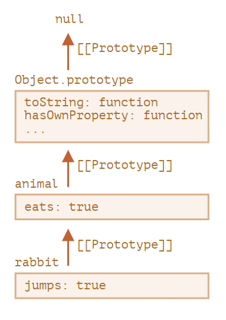
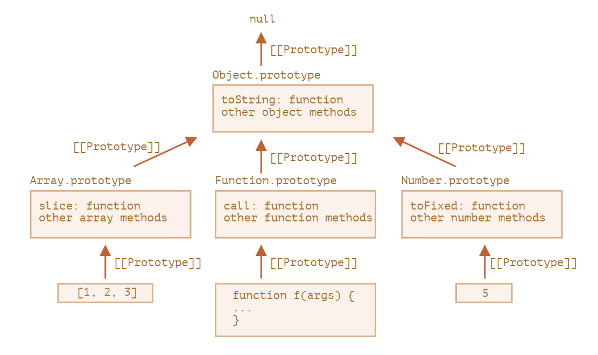

# ?Prototypal inheritance

В программировании мы часто хотим взять что-то и расширить.

Например, у нас есть объект `user` со своими свойствами и методами, и мы хотим создать объекты `admin` и `guest` как его слегка изменённые варианты. Мы хотели бы повторно использовать то, что есть у объекта `user`, не копировать/переопределять его методы, а просто создать новый объект на его основе.

_Прототипное наследование_ — это возможность языка, которая помогает в этом.

### `[[Prototype]]`

В JavaScript объекты имеют специальное скрытое свойство `[[Prototype]]` (так оно названо в спецификации), которое либо равно `null`, либо ссылается на другой объект. Этот объект называется «прототип».

Прототип даёт нам немного «магии». Когда мы хотим прочитать свойство из `object`, а оно отсутствует, JavaScript автоматически берёт его из прототипа. В программировании такой механизм называется «прототипным наследованием». Многие интересные возможности языка и техники программирования основываются на нём.

Свойство `[[Prototype]]` является внутренним и скрытым, но есть много способов задать его.

Одним из них является использование `__proto__`, например так:

~~~
const animal = {
  eats: true,
};

const rabbit = {
  jumps: true,
};

rabbit.__proto__ = animal;

console.log(rabbit.eats); // true
console.log(rabbit.jumps); // true
~~~

Если мы ищем свойство в `rabbit`, а оно отсутствует, JavaScript автоматически берёт его из `animal`.

Здесь мы можем сказать, что "`animal` является прототипом `rabbit`" или "`rabbit` прототипно наследует от `animal`".

Так что если у `animal` много полезных свойств и методов, то они автоматически становятся доступными у `rabbit`. Такие свойства называются «унаследованными».

Если у нас есть метод в `animal`, он может быть вызван на `rabbit`:

~~~
const animal = {
  eats: true,
  walk() {
    console.log("Animal walk");
  },
};

const rabbit = {
  jumps: true,
  __proto__: animal,
};

// walk взят из прототипа
rabbit.walk(); // Animal walk
~~~

Метод автоматически берётся из прототипа.

Цепочка прототипов может быть длиннее:

~~~
const animal = {
  eats: true,
  walk() {
    console.log("Animal walk");
  },
};

const rabbit = {
  jumps: true,
  __proto__: animal,
};

const longEar = {
  earLength: 10,
  __proto__: rabbit,
};

// walk взят из цепочки прототипов
longEar.walk(); // Animal walk
console.log(longEar.jumps); // true (из rabbit)
~~~

Теперь, если мы прочтём что-нибудь из `longEar`, и оно будет отсутствовать, JavaScript будет искать его в `rabbit`, а затем в `animal`.

Есть только два ограничения:

1. Ссылки не могут идти по кругу. JavaScript выдаст ошибку, если мы попытаемся назначить `__proto__` по кругу.
2. Значение `__proto__` может быть объектом или `null`. Другие типы игнорируются.

Это вполне очевидно, но всё же: может быть только один `[[Prototype]]`. Объект не может наследоваться от двух других объектов.

__Свойство `__proto__` — исторически обусловленный геттер/сеттер для `[[Prototype]]`__

Обратите внимание, что `__proto__` — не то же самое, что внутреннее свойство `[[Prototype]]`. Это геттер/сеттер для `[[Prototype]]`.

`__proto__` - это свойство объекта, указывающее на объект (который является прототипом), с помощью которого данный объект был создан. Есть у всех объектов, массивов, чисел, строк, логического типа, функций, классов. Значение `__proto__` - это объект.

Чтобы понимать, что за `__proto__`, нужно точно знать с помощью чего создан данный объект. За кадром или явно.

> Свойство `__proto__` немного устарело, оно существует по историческим причинам. Современный JavaScript предполагает, что мы должны использовать функции `Object.getPrototypeOf`/`Object.setPrototypeOf` вместо того, чтобы получать/устанавливать прототип.

* `Object.getPrototypeOf(obj)` – возвращает свойство `[[Prototype]]` объекта `obj` (то же самое, что и геттер `__proto__`).
* `Object.setPrototypeOf(obj, prototype)` – устанавливает свойство `[[Prototype]]` объекта `obj` как `prototype` (то же самое, что и сеттер `__proto__`).

~~~
// new Object
const animal = {};
const rabbit = {};
// Object.getPrototypeOf(obj)
console.log(Object.getPrototypeOf(animal) === Object.getPrototypeOf(rabbit)); // true
// или
console.log(animal.__proto__ === rabbit.__proto__); // true

// new Array
const user = [];
const cars = [];
console.log(Object.getPrototypeOf(user) === Object.getPrototypeOf(cars)); // true

// new Number
const age = 19;
const level = 100;
console.log(Object.getPrototypeOf(age) === Object.getPrototypeOf(level)); // true

// new String
const name = "John";
const surname = "Smith";
console.log(Object.getPrototypeOf(name) === Object.getPrototypeOf(surname)); // true

// new Function
class User {}
function getAge() {}
const getFullName = function () {};
const getAddress = () => {};
console.log(Object.getPrototypeOf(User) === Object.getPrototypeOf(getAddress)); // true
~~~

Эти `__proto__` равны, так как созданы при помощи одной и той же функции-конструктора (класса). Например, `animal` и `rabbit` созданы при помощи `new Object()`.

По спецификации `__proto__` должен поддерживаться только браузерами, но по факту все среды, включая серверную, поддерживают его.

Пример с использованием `Object.setPrototypeOf`:

~~~
const animal = {
  eats: true,
  walk() {
    console.log("Animal walk");
  },
};

const rabbit = {
  jumps: true,
};

const longEar = {
  earLength: 10,
};

// Object.setPrototypeOf(obj, prototype);
Object.setPrototypeOf(rabbit, animal);
Object.setPrototypeOf(longEar, rabbit);

// walk взят из цепочки прототипов
longEar.walk(); // Animal walk
console.log(longEar.jumps); // true (из rabbit)
~~~

##### Не меняйте `[[Prototype]]` существующих объектов, если важна скорость

Технически мы можем установить/получить `[[Prototype]]` в любое время. Но обычно мы устанавливаем прототип только раз во время создания объекта, а после не меняем: `rabbit` наследует от `animal`, и это не изменится.

И JavaScript движки хорошо оптимизированы для этого. Изменение прототипа «на лету» с помощью `Object.setPrototypeOf` или `obj.__proto__=` – очень медленная операция, которая ломает внутренние оптимизации для операций доступа к свойствам объекта. Так что лучше избегайте этого кроме тех случаев, когда вы знаете, что делаете, или же когда скорость JavaScript для вас не имеет никакого значения.

### Операция записи не использует прототип

Прототип используется только для чтения свойств.

Операции записи/удаления работают напрямую с объектом.

В приведённом ниже примере мы присваиваем `rabbit` собственный метод `walk`:

~~~
const animal = {
  walk() {
    console.log("Animal walk");
  },
};

const rabbit = {
  jumps: true,
};

Object.setPrototypeOf(rabbit, animal);

rabbit.walk = function() {
  console.log("Rabbit! Bounce-bounce!");
};

animal.walk(); // Animal walk
rabbit.walk(); // Rabbit! Bounce-bounce!
~~~

Теперь вызов `rabbit.walk()` находит метод непосредственно в объекте и выполняет его, не используя прототип.

### Значение `this`

Рассмотрим свойства-аксессоры:

~~~
const user = {
  name: "John",
  surname: "Smith",

  set fullName(value) {
    [this.name, this.surname] = value.split(" ");
  },

  get fullName() {
    return `${this.name} ${this.surname}`;
  },
};

const admin = {
  isAdmin: true,
};

Object.setPrototypeOf(admin, user);

console.log(admin.fullName); // John Smith

// срабатывает сеттер!
admin.fullName = "Alice Cooper";
console.log(admin.fullName); // Alice Cooper
console.log(user.fullName); // John Smith
~~~

__Неважно, где находится метод: в объекте или его прототипе. При вызове метода `this` — всегда объект перед точкой.__

Таким образом, вызов сеттера `admin.fullName =` в качестве `this` использует `admin`, а не user.

Это на самом деле очень важная деталь, потому что у нас может быть большой объект со множеством методов, от которого можно наследовать. Затем наследующие объекты могут вызывать его методы, но они будут изменять своё состояние, а не состояние объекта-родителя.

Например, здесь `animal` представляет собой «хранилище методов», и `rabbit` использует его.

Вызов `rabbit.sleep()` устанавливает `this.isSleeping` для объекта `rabbit`:

~~~
const animal = {
  walk() {
    if (!this.isSleeping) {
      alert(`I walk`);
    }
  },
  sleep() {
    this.isSleeping = true;
  },
};

const rabbit = {
  name: "White Rabbit",
};

Object.setPrototypeOf(rabbit, animal);

// модифицирует rabbit.isSleeping
rabbit.sleep();

console.log(rabbit.isSleeping); // true
console.log(animal.isSleeping); // undefined (нет такого свойства в прототипе)
~~~

Если бы у нас были другие объекты, такие как `bird`, `snake` и т.д., унаследованные от `animal`, они также получили бы доступ к методам `animal`. Но `this` при вызове каждого метода будет соответствовать объекту (перед точкой), на котором происходит вызов, а не `animal`. Поэтому, когда мы записываем данные в `this`, они сохраняются в этих объектах.

В результате методы являются общими, а состояние объекта — нет.

### Цикл `for…in`

Цикл `for..in` проходит не только по собственным, но и по унаследованным свойствам объекта.

Например:

~~~
const animal = {
  eats: true,
};

const rabbit = {
  jumps: true,
};

Object.setPrototypeOf(rabbit, animal);

// Object.keys возвращает только собственные ключи
console.log(Object.keys(rabbit)); // ['jumps']

// for..in проходит и по своим, и по унаследованным ключам
for (const prop in rabbit) {
  console.log(prop); // jumps eats
}
~~~

Если унаследованные свойства нам не нужны, то мы можем отфильтровать их при помощи встроенного метода `obj.hasOwnProperty(key)`: он возвращает `true`, если у `obj` есть собственное, не унаследованное, свойство с именем `key`.

Пример такой фильтрации:

~~~
const animal = {
  eats: true,
};

const rabbit = {
  jumps: true,
};

Object.setPrototypeOf(rabbit, animal);

for (const prop in rabbit) {
  if (rabbit.hasOwnProperty(prop)) {
    console.log(`Our: ${prop}`); // Our: jumps
  } else {
    console.log(`Inherited: ${prop}`); // Inherited: eats
  }
}
~~~

В этом примере цепочка наследования выглядит так: `rabbit` наследует от `animal`, который наследует от `Object.prototype` (так как `animal` – литеральный объект `{...}`, то это по умолчанию), а затем `null` на самом верху.

Заметим ещё одну деталь. Откуда взялся метод `rabbit.hasOwnProperty`? Мы его явно не определяли. Если посмотреть на цепочку прототипов, то видно, что он берётся из `Object.prototype.hasOwnProperty`. То есть он унаследован.

…Но почему `hasOwnProperty` не появляется в цикле `for..in` в отличие от `eats` и `jumps`? Он ведь перечисляет все унаследованные свойства.

Ответ простой: оно не перечислимо. То есть у него внутренний флаг `enumerable` стоит `false`, как и у других свойств `Object.prototype`. Поэтому оно и не появляется в цикле.

##### Почти все остальные методы получения ключей/значений игнорируют унаследованные свойства

Почти все остальные методы, получающие ключи/значения, такие как `Object.keys`, `Object.values` и другие – игнорируют унаследованные свойства.

Они учитывают только свойства самого объекта, не его прототипа.

### `F.prototype`

Каждая функция или класс имеет `prototype`.

Как мы помним, новые объекты могут быть созданы с помощью функции-конструктора `new F()`.

Если в `F.prototype` содержится объект, оператор `new` устанавливает его в качестве `[[Prototype]]` для нового объекта.

> Раньше, в старые времена, прямого доступа к прототипу объекта не было. Надёжно работало только свойство `prototype` функции-конструктора. Поэтому оно используется во многих скриптах.

Обратите внимание, что `F.prototype` означает обычное свойство с именем `prototype` для `F`. Это ещё не «прототип объекта», а обычное свойство `F` с таким именем.

~~~
const animal = {
  eats: true,
};

const anotherAnimal = {
  eats: false,
};

function Rabbit(name) {
  this.name = name;
}

Rabbit.prototype = animal;

const whiteRabbit = new Rabbit("White Rabbit");

Rabbit.prototype = anotherAnimal;

const blackRabbit = new Rabbit("Black Rabbit");

console.log(whiteRabbit.eats); // true
console.log(Object.getPrototypeOf(whiteRabbit) === animal); // true
console.log(whiteRabbit.prototype); // undefined
console.log(blackRabbit.eats); // false
~~~

Установка `Rabbit.prototype = animal` буквально говорит интерпретатору следующее: "При создании объекта через `new Rabbit()` запиши ему `animal` в `[[Prototype]]`".

##### `F.prototype` используется только в момент вызова `new F()`

`F.prototype` используется только при вызове `new F()` и присваивается в качестве свойства `[[Prototype]]` нового объекта. После этого `F.prototype` и новый объект ничего не связывает. Следует понимать это как «единоразовый подарок» объекту.

После создания `F.prototype` может измениться, и новые объекты, созданные с помощью `new F()`, будут иметь другой объект в качестве `[[Prototype]]`, но уже существующие объекты сохранят старый.

### `F.prototype` по умолчанию, свойство `constructor`

У каждой функции или класса по умолчанию уже есть свойство `prototype`.

По умолчанию `prototype` – объект с единственным свойством `constructor`, которое ссылается на функцию-конструктор.

~~~
function Rabbit() {}
// по умолчанию:
// Rabbit.prototype = { constructor: Rabbit }

console.log(Rabbit.prototype.constructor == Rabbit); // true
~~~

Соответственно, если мы ничего не меняем, то свойство `constructor` будет доступно всем кроликам через `[[Prototype]]`:

~~~
function Rabbit() {}
// по умолчанию:
// Rabbit.prototype = { constructor: Rabbit }

const whiteRabbit = new Rabbit(); // наследует от {constructor: Rabbit}
const blackRabbit = new Rabbit(); // наследует от {constructor: Rabbit}

console.log(whiteRabbit.constructor == Rabbit); // true (свойство получено из прототипа)
console.log(blackRabbit.constructor == Rabbit); // true (свойство получено из прототипа)
~~~

Мы можем использовать свойство `constructor` существующего объекта для создания нового.

~~~
function Rabbit(name) {
  this.name = name;
  console.log(name);
}

const whiteRabbit = new Rabbit("White Rabbit");

const blackRabbit = new whiteRabbit.constructor("Black Rabbit");
// White Rabbit
// Black Rabbit
~~~

Это удобно, когда у нас есть объект, но мы не знаем, какой конструктор использовался для его создания (например, он мог быть взят из сторонней библиотеки), а нам необходимо создать ещё один такой объект.

Но, пожалуй, самое важное о свойстве `constructor` это то, что JavaScript сам по себе не гарантирует правильное значение свойства `constructor`.

Да, оно является свойством по умолчанию в `prototype` у функций, но что случится с ним позже – зависит только от нас.

В частности, если мы заменим прототип по умолчанию на другой объект, то свойства `constructor` в нём не будет.

~~~
function Rabbit() {}

Rabbit.prototype = {
  jumps: true,
};

const rabbit = new Rabbit();
console.log(rabbit.constructor === Rabbit); // false
~~~

Таким образом, чтобы сохранить верное свойство `constructor`, мы должны добавлять/удалять/изменять свойства у прототипа по умолчанию вместо того, чтобы перезаписывать его целиком:

~~~
function Rabbit() {}

// Не перезаписываем Rabbit.prototype полностью,
// а добавляем к нему свойство
Rabbit.prototype.jumps = true

const rabbit = new Rabbit();
console.log(rabbit.constructor === Rabbit); // true
// Прототип по умолчанию сохраняется, и мы всё ещё имеем доступ к Rabbit.prototype.constructor
~~~

Или мы можем заново создать свойство `constructor`:

~~~
function Rabbit() {}

Rabbit.prototype = {
  jumps: true,
  constructor: Rabbit
};

const rabbit = new Rabbit();
console.log(rabbit.constructor === Rabbit); // true

// теперь свойство constructor снова корректное, так как мы добавили его
~~~

Каждый `prototype` это независимый объект с определенным набором свойств и методов.

~~~
function getAge() {}
function getName() {}

console.log(Object.getPrototypeOf(getAge) === Object.getPrototypeOf(getName)); // true
console.log(getAge.prototype === getName.prototype); // false
~~~

### Встроенные прототипы

Свойство `prototype` широко используется внутри самого языка JavaScript. Все встроенные функции-конструкторы используют его.

Сначала мы рассмотрим детали, а затем используем `prototype` для добавления встроенным объектам новой функциональности.

Давайте выведем пустой объект:

~~~
const obj = {};
alert(obj); // "[object Object]" ?
~~~

Где код, который генерирует строку `"[object Object]"`? Это встроенный метод `toString`, но где он? `obj` ведь пуст!

…Но краткая нотация `obj = {}` – это то же самое, что и `obj = new Object()`, где `Object` – встроенная функция-конструктор для объектов с собственным свойством `prototype`, которое ссылается на огромный объект с методом `toString` и другими.

Когда вызывается `new Object()` (или создаётся объект с помощью литерала `{...}`), свойство `[[Prototype]]` этого объекта устанавливается на `Object.prototype`.

Таким образом, когда вызывается `obj.toString()`, метод берётся из `Object.prototype`.

Мы можем проверить это так:

~~~
const obj = {};

console.log(obj.__proto__.toString === Object.prototype.toString); // true
// obj.toString === obj.__proto__.toString === Object.prototype.toString
~~~

Обратите внимание, что по цепочке прототипов выше `Object.prototype` больше нет свойства `[[Prototype]]`:

~~~
console.log(Object.prototype.__proto__); // null
~~~

Другие встроенные объекты, такие как `Array`, `Date`, `Function` и другие, также хранят свои методы в прототипах.

Например, при создании массива `[1, 2, 3]` внутренне используется конструктор массива `Array`. Поэтому прототипом массива становится `Array.prototype`, предоставляя ему свои методы. Это позволяет эффективно использовать память.

Согласно спецификации, наверху иерархии встроенных прототипов находится `Object.prototype`. Поэтому иногда говорят, что «всё наследует от объектов».

Вот более полная картина (для трёх встроенных объектов):

Давайте проверим прототипы:

~~~
const arr = [1, 2, 3];

// наследует ли от Array.prototype?
console.log(arr.__proto__ === Array.prototype); // true

// затем наследует ли от Object.prototype?
console.log(arr.__proto__.__proto__ === Object.prototype); // true

// и null на вершине иерархии
console.log(arr.__proto__.__proto__.__proto__); // null
~~~

Некоторые методы в прототипах могут пересекаться, например, у `Array.prototype` есть свой метод `toString`.

У `Object.prototype` есть свой метод `toString`, но так как `Array.prototype` ближе в цепочке прототипов, то берётся именно вариант для массивов.

В браузерных инструментах, таких как консоль разработчика, можно посмотреть цепочку наследования (возможно, потребуется использовать `console.dir` для встроенных объектов):

~~~
console.dir([1, 2, 3]);
~~~

Другие встроенные объекты устроены аналогично. Даже функции – они объекты встроенного конструктора `Function`, и все их методы (`call`/`apply` и другие) берутся из `Function.prototype`. Также у функций есть свой метод `toString`.

~~~
function f() {}

console.log(f.__proto__ == Function.prototype); // true
console.log(f.__proto__.__proto__ == Object.prototype); // true, наследует от Object
~~~

Самое сложное происходит со строками, числами и булевыми значениями.

Как мы помним, они не объекты. Но если мы попытаемся получить доступ к их свойствам, то тогда будет создан временный объект-обёртка с использованием встроенных конструкторов `String`, `Number` и `Boolean`, который предоставит методы и после этого исчезнет.

Эти объекты создаются невидимо для нас, и большая часть движков оптимизирует этот процесс, но спецификация описывает это именно таким образом. Методы этих объектов также находятся в прототипах, доступных как `String.prototype`, `Number.prototype` и `Boolean.prototype`.

~~~
const promise = new Promise(() => {});
console.log(promise.__proto__ === Promise.prototype); // true

const man = {};
console.log(man.__proto__ === Object.prototype); // true

const users = [];
console.log(users.__proto__ === Array.prototype); // true

const age = 20;
console.log(age.__proto__ === Number.prototype); // true

const city = "Minsk";
console.log(city.__proto__ === String.prototype); // true

const auth = true;
console.log(auth.__proto__ === Boolean.prototype); // true

class User {}
const user = new User();
console.log(user.__proto__ === User.prototype); // true

function getAge() {}
console.log(getAge.__proto__ === Function.prototype); // true

const getFullName = function () {};
console.log(getFullName.__proto__ === Function.prototype); // true

const getAddress = () => {};
console.log(getAddress.__proto__ === Function.prototype); // true
~~~

##### Значения `null` и `undefined` не имеют объектов-обёрток

Специальные значения `null` и `undefined` стоят особняком. У них нет объектов-обёрток, так что методы и свойства им недоступны. Также у них нет соответствующих прототипов.

Встроенные прототипы можно изменять. Например, если добавить метод к `String.prototype`, метод становится доступен для всех строк:

~~~
String.prototype.show = function () {
  console.log("BOOM!");
};

"string".show(); // BOOM!
~~~

В общем, изменение встроенных прототипов считается плохой идеей.

В современном программировании есть только один случай, в котором одобряется изменение встроенных прототипов. Это создание полифилов.

_Полифил_ – это термин, который означает эмуляцию метода, который существует в спецификации JavaScript, но ещё не поддерживается текущим движком JavaScript.

Тогда мы можем реализовать его сами и добавить во встроенный прототип.

~~~
if (!String.prototype.repeat) {
  String.prototype.repeat = function (n) {
    // на самом деле код должен быть немного более сложным
    // (полный алгоритм можно найти в спецификации)
    // но даже неполный полифил зачастую достаточно хорош для использования
    return new Array(n + 1).join(this);
  };
}

console.log("La".repeat(3)); // LaLaLa
~~~

Некоторые методы встроенных прототипов часто одалживают.

Например, если мы создаём объект, похожий на массив (псевдомассив), мы можем скопировать некоторые методы из `Array` в этот объект.

~~~
const obj = {
  0: "Hello",
  1: "world!",
  length: 2,
};

obj.join = Array.prototype.join;

console.log(obj.join(", ")); // Hello, world!
~~~

Это работает, потому что для внутреннего алгоритма встроенного метода `join` важны только корректность индексов и свойство `length`, он не проверяет, является ли объект на самом деле массивом. И многие встроенные методы работают так же.

Альтернативная возможность – мы можем унаследовать от массива, установив `obj.__proto__` как `Array.prototype`, таким образом все методы `Array` станут автоматически доступны в `obj`.

~~~
const obj = {
  0: "Hello",
  1: "world!",
  length: 2,
};

obj.__proto__ = Array.prototype;

console.log(obj.join(", ")); // Hello, world!
~~~

Но это будет невозможно, если `obj` уже наследует от другого объекта. Помните, мы можем наследовать только от одного объекта одновременно.

Заимствование методов – гибкий способ, позволяющий смешивать функциональность разных объектов по необходимости.

### `Object.create`

`Object.create(prototype, [descriptors])` – создает и возвращает новый объект с заданным прототипом и свойствами.

У `Object.create` есть необязательный второй аргумент: дескрипторы свойств. Мы можем добавить дополнительное свойство новому объекту таким образом:

~~~
const animal = {
  eats: true,
};

const rabbit = Object.create(animal, {
  jumps: {
    value: true,
  },
});

console.log(rabbit.jumps); // true
console.log(rabbit.eats); // true
~~~

Мы также можем использовать `Object.create` для «продвинутого» клонирования объекта, более мощного, чем копирование свойств в цикле `for..in`:

~~~
const triangle = { a: 1, b: 2, c: 3 };

function ColoredTriangle() {
  this.color = "red";
}

ColoredTriangle.prototype = triangle;
const obj = new ColoredTriangle();

Object.defineProperty(obj, "d", {
  value: 4,
  enumerable: false,
  configurable: true,
  writable: true,
});

const clone = Object.create(
  Object.getPrototypeOf(obj),
  Object.getOwnPropertyDescriptors(obj)
);

console.log(clone);
~~~

Такой вызов создаёт точную копию объекта `obj`, включая все свойства: перечисляемые и неперечисляемые, геттеры/сеттеры для свойств – и всё это с правильным свойством `[[Prototype]]`.

### "Простейший" объект

Как мы знаем, объекты можно использовать как ассоциативные массивы для хранения пар ключ/значение.

…Но если мы попробуем хранить созданные пользователями ключи (например, словари с пользовательским вводом), мы можем заметить интересный сбой: все ключи работают как ожидается, за исключением `"__proto__"`.

Посмотрите на пример:

~~~
const obj = {};

const key = prompt("What's the key?", "__proto__");
obj[key] = "some value";

alert(obj[key]); // [object Object], не "some value"!
~~~

Если пользователь введёт `__proto__`, присвоение проигнорируется!

И это не должно удивлять нас. Свойство `__proto__` особенное: оно должно быть либо объектом, либо `null`, а строка не может стать прототипом.

Но мы не намеревались реализовывать такое поведение, не так ли? Мы хотим хранить пары ключ/значение, и ключ с именем `"__proto__"` не был сохранён надлежащим образом. Так что это ошибка!

Конкретно в этом примере последствия не так ужасны, но если мы присваиваем объектные значения, то прототип и в самом деле может быть изменён. В результате дальнейшее выполнение пойдёт совершенно непредсказуемым образом.

Неожиданные вещи могут случаться также при присвоении свойства `toString`, которое по умолчанию функция, и других свойств, которые тоже на самом деле являются встроенными методами.

Как же избежать проблемы?

Во-первых, мы можем переключиться на использование коллекции `Map`, и тогда всё будет в порядке.

Но и `Object` может также хорошо подойти, потому что создатели языка уже давно продумали решение проблемы.

Свойство `__proto__` – не обычное, а аксессор, заданный в `Object.prototype`.

Так что при чтении или установке `obj.__proto__` вызывается соответствующий геттер/сеттер из прототипа `obj`, и именно он устанавливает/получает свойство `[[Prototype]]`.

Как было сказано в начале этой секции учебника, `__proto__` – это способ доступа к свойству `[[Prototype]]`, это не само свойство `[[Prototype]]`.

Теперь, если мы хотим использовать объект как ассоциативный массив, мы можем сделать это с помощью небольшого трюка:

~~~
const obj = Object.create(null);

const key = prompt("What's the key?", "__proto__");
obj[key] = "some value";

alert(obj[key]); // "some value"
~~~

`Object.create(null)` создаёт пустой объект без прототипа (`[[Prototype]]` будет `null`).

Таким образом не будет унаследованного геттера/сеттера для `__proto__`. Теперь это свойство обрабатывается как обычное свойство, и приведённый выше пример работает правильно.

Мы можем назвать такой объект «простейшим» или «чистым словарным объектом», потому что он ещё проще, чем обычные объекты `{...}`.

Недостаток в том, что у таких объектов не будет встроенных методов объекта, таких как `toString`:

~~~
const obj = Object.create(null);
console.log(obj.toString()); // TypeError: obj.toString is not a function
~~~

…Но обычно это нормально для ассоциативных массивов.

Обратите внимание, что большая часть методов, связанных с объектами, имеют вид `Object.something(...)`. К примеру, `Object.keys(obj)`. Подобные методы не находятся в прототипе, так что они продолжат работать для таких объектов:

~~~
const chineseDictionary = Object.create(null);
chineseDictionary.hello = "你好";
chineseDictionary.bye = "再见";

console.log(Object.keys(chineseDictionary)); // ['hello', 'bye']
~~~
