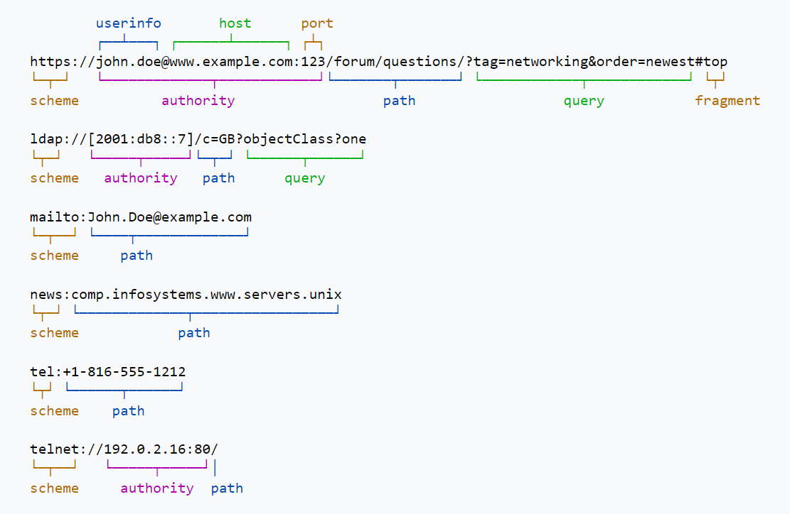

# ?URI, URL, URN

Мы все используем много URL-адресов ежедневно. Иногда мы их набираем, иногда мы просто переходим на один URL из другого.

Для начала давайте расшифруем аббревиатуры:

* URI - Uniform Resource Identifier (унифицированный идентификатор ресурса).
* URL - Uniform Resource Locator (унифицированный определитель местонахождения ресурса).
* URN - Unifrorm Resource Name (унифицированное имя ресурса).

Многие считают, что `http://google.com` или `http://yandex.ru` - это просто URL-адреса, но, однако мы можем говорить о них как о URI.

Фактически, URI представляет собой расширенный набор URL-адресов и нечто, называемое URN.

Таким образом, мы можем с уверенностью заключить, что все URL являются URI. Однако обратное неверно.

### Как это работает?

Твое имя, скажем, "Джон Доу" - это URN.

Место, в котором вы живете, например, "Улица Вязов, 13" – это уже URL.

Вы можете быть идентифицированы как уникальное лицо с вашим именем или вашим адресом. Эта уникальная личность – это уже URI. 

И хотя ваше имя может быть вашим уникальным идентификатором (URI), оно не может быть URL-адресом, поскольку ваше имя не помогает найти ваше местоположение. Другими словами, URI (которые являются URN) не являются URL-адресами.

Вернемся в интернет:

* URI – имя и адрес ресурса в сети, включает в себя URL и URN.
* URL – адрес ресурса в сети, определяет местонахождение и способ обращения к нему.
* URN – имя ресурса в сети, определяет только название ресурса, но не говорит как к нему подключиться.

Рассмотрим примеры:

* URI – https://wiki.merionet.ru/images/vse-chto-vam-nuzhno-znat-pro-devops/1.png
* URL - https://wiki.merionet.ru
* URN - images/vse-chto-vam-nuzhno-znat-pro-devops/1.png

Как вы видите – первые две строчки - ссылки и по ним можно перейти, однако по третьей строчке нельзя, потому что непонятно как и куда.

### URI

URI обозначает Uniform Resource Identifier и по сути является последовательностью символов, которая идентифицирует какой-то ресурс. URI может содержать URL и URN.

URI содержит в себе следующие части:

* `scheme` - показывает на то, как обращаться к ресурсу, чаще всего это сетевой протокол (`http`, `ftp`, `ldap`)
* `authority`
  * Необязательный подкомпонент `userinfo`, который может состоять из имени пользователя и необязательного пароля.
  * Подкомпонент `host`, состоящий либо из зарегистрированного имени (включая, помимо прочего, имя хоста), либо из IP-адреса.
  * Необязательный подкомпонент `port`, состоящий из десятичных цифр.
* `path` - состоит из последовательности сегментов пути, разделенных косой чертой.
* `query` - необязательные дополнительные данные ресурса (например, поисковой запрос).
* `fragment` – необязательный компонент для идентификации вторичного ресурса ресурса (например, место на странице).

Общий синтаксис URI выглядит так:

`scheme:[//authority]path[?query][#fragment], где authority = [userinfo@]host[:port]`

На следующем рисунке показаны примеры URI и их составные части:

### URL

Всегда помните - URI может содержать URL, но URL указывает только адрес ресурса.

URL содержит следующую информацию:

* `protocol` - протокол, который используется для доступа к ресурсу – `http`, `https`, `ftp`.
* `domain_name` - расположение сервера с использованием IP-адреса или имени домена - например, `wiki.merionet.ru` - это имя домена. `https://192.168.1.17` - здесь ресурс расположен по указанному IP-адресу.
* `port` - номер порта на сервере. Например, `http://localhost: 8080`, где `8080` - это порт.
* `path` - точное местоположение в структуре каталогов сервера. Например - `https://wiki.merionet.ru/ip-telephoniya/` - это точное местоположение, если пользователь хочет перейти в раздел про телефонию на сайте.
* `query` - необязательные дополнительные данные ресурса (например, поисковой запрос).
* `fragment` - необязательный идентификатор фрагмента. Например, `https://www.google.com/search?ei=qw3eqwe12e1w&q=URL`, где `q=URL` - это строка запроса, введенная пользователем.

Синтаксис:

`[protocol]://www.[domain_name]:[port 80]/[path or exaction resource location]?[query]#[fragment]`

### URI vs URL

| URI | URL |
|---|---|
| Идентификатор ресурса | Определитель местонахождения |
| Синтаксис: `scheme:[//authority]path[?query][#fragment], где authority = [userinfo@]host[:port]`	| Синтаксис: `[protocol]://www.[domain_name]:[port 80]/[path or exaction resource location]?[query]#[fragment]` |
| Схема может быть любой - протокол, имя или спецификация и так далее	| Схема всегда является протоколом, таким как `http`, `https`, `ftp`, `LDAP` и так далее |
| Основная цель URI - идентифицировать ресурс и отличить его от других ресурсов, используя местоположение или имя. | Основная цель - получить адрес или местоположение ресурса. |
| Пример: `contact: +1 883-345-1111` | Пример: `https://wiki.merionet.ru/servernye-resheniya/36/vse-chto-vam-nuzhno-znat-pro-devops/?f=0` |
| Используется в файлах HTML, XML и библиотек тегов, таких как XSLT и jstl, для идентификации ресурсов и двоичных файлов.	|  URL используется для поиска только веб-страниц |