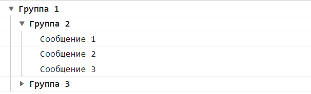
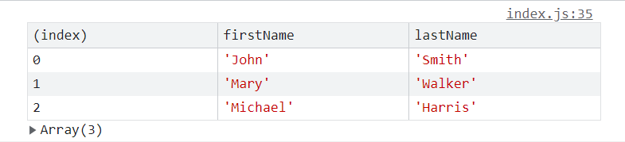

# ?Errors

Программа может работать правильно, только если код написан корректно и не содержит ошибок.

JavaScript умеет обрабатывать некорректный код и сообщать об ошибке в коде.

Существует семь встроенных видов ошибок, также можно создать свои собственные.

Встроенные ошибки генерируются самим движком JavaScript при выполнении программы, а пользовательские — создаются с помощью конструктора `Error`.

Оба типа ошибок можно ловить в конструкции `try...catch`.

### Класс `Error`

Синтаксис:

~~~
new Error(message, options)
~~~

* `message` (необязательный) - человекочитаемое описание ошибки.
* `options` (необязательный) - объект, обладающий следующими свойствами:
  * `cause` (необязательный) - значение, указывающее конкретную причину ошибки, отраженную в cause свойстве. При перехвате и повторной генерации ошибки с более конкретным или полезным сообщением об ошибке это свойство можно использовать для передачи исходной ошибки.

~~~
const commonError = Error("Общая ошибка. Проверьте код", {
  cause: "Common error",
});

console.log(commonError.message);
// 'Общая ошибка. Проверьте код'

console.log(commonError.name);
// 'Error'

console.log(commonError.cause);
// Common error
~~~

Вызов конструктора возвращает объект ошибки со следующими свойствами:

* `message` представляет человекопонятное описание ошибки для встроенных типов (`SyntaxError`, `TypeError` и так далее) и переданное в конструктор значение для общего типа `Error`.
* `name` — имя типа (класса) ошибки.

Стоит отметить, что отдельные браузеры поддерживают еще ряд свойств, но их поведение в зависимости от браузера может отличаться:

* `fileName` - название файла с кодом JavaScript, где произошла ошибка.
* `lineNumber` - строка в файле, где произошла ошибка.
* `columnNumber` - столбец в строке, где произошла ошибка.
* `stack` - стек ошибки. Показывает трассировку того, какие функции были вызваны, в каком порядке, из какой строки и файла и с какими аргументами. Строка стека идет от самых последних вызовов к более ранним, возвращаясь к исходному вызову глобальной области видимости.

> `Error()` может вызываться как с , так и без `new`. Оба создают новый `Error` экземпляр.

### Встроенные ошибки

1. `SyntaxError`

Чаще всего встречаются опечатки — неправильные названия методов, лишние или отсутствующие точки с запятой или скобочки и так далее. Такой тип ошибок называется «синтаксическим», `SyntaxError`:

~~~
console.log(;);
// SyntaxError: Unexpected token ';'
~~~

2. `ReferenceError`

Если попытаться обратиться к несуществующей переменной, произойдёт ошибка `ReferenceError`:

~~~
console.log(name);
// ReferenceError: name is not defined
~~~

3. `TypeError`

Если попытаться обратиться к несуществующему свойству, произойдёт ошибка `TypeError`:

~~~
console.log(null.length);
// TypeError: Cannot read properties of null (reading 'length')
~~~

4. `RangeError`

Ошибка для значений, которые выходят за диапазон допустимого.

~~~
new Array(10000000000);
// RangeError: Invalid array length
~~~

5. `URIError`

Ошибка генерируется при передаче функциям `encodeURI()`, `decodeURI()`, `encodeURIComponent()` и `decodeURIComponent()` некорректных значений:

~~~
decodeURIComponent('%');
// URIError: URI malformed
~~~

Например, если мы используем для URL-адресов обычные строки, то с этими функциями мы можем позаботиться о кодировании специальных символов.

6. `EvalError`

`EvalError` представляет ошибку, возникающую в глобальной функции `eval()`.

~~~
eval("console.log(null.length)");
~~~

> Эта ошибка в настоящее время не используется и остаётся для совместимости с предыдущими версиями JavaScript.

7. `InternalError` (не стандарт)

Ошибка внутри движка JavaScript. Не является стандартом и почти не используется. Например:

~~~
"InternalError: инициализатор массива слишком большой".
~~~

### try...catch...finally

Для обработки ошибок JavaScript предоставляет конструкцию `try...catch...finally`.

~~~
try {
  // ...
} catch {
  // ...
} finally {
  // ...
}
~~~

После оператора `try` определяется блок кода. В этот блок помещаются инструкции, при выполнении которых может возникнуть потенциальная ошибка.

Затем идет оператор `catch`. После этого оператора в круглых скобках указывается название объекта, который будет содержать информацию об ошибке. И далее идет блок `catch`. Этот блок выполняется только при возникновении ошибки в блоке `try`.

После блока `catch` идет оператор `finally` со своим блоком инструкций. Этот блок выполняется в конце после блока `try` и `catch` вне зависимости, возникла ошибка или нет.

Стоит отметить, что только блок `try` является обязательным. А один из остальных блоков - `catch` или `finally` мы можем опустить. Однако один из этих блоков (не важно `catch` или `finally`) обязательно должен присуствовать. То есть мы можем использовать следующие варианты этой конструкции:

* `try...catch`
* `try...finally`
* `try...catch...finally`

Например:

~~~
try {
  callSomeFunc();
  console.log("Конец блока try");
} catch {
  console.log("Возникла ошибка!");
} finally {
  console.log("Блок finally");
}

// Возникла ошибка!
// Блок finally
~~~

Итак, сначала выполняется блок `try`.

Однако при выполнении первой же инструкции - вызова функции `callSomeFunc()` возникает ошибка.

Это приведет к тому, что все последующие инструкции в блоке `try` не будут выполняться. А управление перейдет к блоку `catch`. В этом блоке выводится сообщение, что возникла ошибка.

После выполнения блока `catch` выполняются остальные инструкции программы. Таким образом, программа не прерывает свою работу при возникновении ошибки и продолжает свою работу.

В качестве параметра в блок `catch` может передаваться объект с информацией об ошибке:

~~~
try {
  callSomeFunc();
  console.log("Конец блока try");
} catch (error) {
  console.log("Возникла ошибка!");
  console.log(error);
} finally {
  console.log("Блок finally");
}

// Возникла ошибка!
// ReferenceError: callSomeFunc is not defined ...
// Блок finally
~~~

Блок `finally` можно использовать для того, чтобы скрипт безопасно завершил работу в случае ошибки. Например, если необходимо освободить память и ресурсы которые использовал скрипт.

~~~
function f() {
  try {
    console.log("Начало");
    throw new Error("Ошибка");
  } catch (e) {
    // ...
    if ("не могу обработать ошибку") {
      throw e;
    }
  } finally {
    console.log("Очистка!");
  }
}

f();

// Начало
// Очистка!
// Uncaught Error Error: Ошибка
~~~

Именно `finally` гарантирует очистку. Если мы просто поместим код в конце `f`, то он не выполнится в описанных ситуациях.

Блок `finally` срабатывает при любом выходе из `try..catch`, в том числе и `return`.

> `try..catch` не сработает, если код синтаксически неверен, например, содержит несовпадающее количество фигурных скобок в блоке `try`. JavaScript-движок сначала читает код, а затем исполняет его. Ошибки, которые возникают во время фазы чтения, называются ошибками парсинга.

##### `try..catch` работает синхронно.

Исключение, которое произойдёт в коде, запланированном «на будущее», например в `setTimeout`, `try..catch` не поймает:

~~~
try {
  setTimeout(function () {
    noSuchVariable; // скрипт упадёт тут
  }, 1000);
} catch (e) {
  console.log("не сработает");
}
~~~

Это потому, что функция выполняется позже, когда движок уже покинул конструкцию `try..catch`.

Чтобы поймать исключение внутри запланированной функции, `try..catch` должен находиться внутри самой этой функции:

~~~
setTimeout(function () {
  try {
    noSuchVariable;
  } catch {
    console.log("Ошибка поймана!"); // Ошибка поймана!
  }
}, 1000);
~~~

### `throw`

Используйте инструкцию `throw`, чтобы выбросить исключение. При выбросе исключения нужно указать выражение, содержащее значение, которое будет выброшено:

~~~
throw "Error2";                                              // string
throw 42;                                                    // number
throw true;                                                  // boolean
throw { toString: function() { return "I'm an object!"; } }; // object
~~~

Вы можете выбросить любое выражение, а не только выражения определённого типа.

Сгенерируем исключение при передаче в конструктор `Person` отрицательного значения для свойства `age`:

~~~
class Person {
  constructor(name, age) {
    if (age < 0) {
      throw new Error("Возраст должен быть положительным");
    }
    this.name = name;
    this.age = age;
  }
  print() {
    console.log(`Name: ${this.name}  Age: ${this.age}`);
  }
}

try {
  const tom = new Person("Tom", -123);
  tom.print();
} catch (error) {
  console.log("Произошла ошибка"); // Произошла ошибка
  console.log(error.message); // Возраст должен быть положительным
}
~~~

Инструкция `throw` используется, чтобы выбросить исключение, а инструкция `try...catch`, чтобы его обработать.

В JavaScript есть множество встроенных конструкторов для стандартных ошибок: `Error`, `SyntaxError`, `ReferenceError`, `TypeError` и другие. Можно использовать и их для создания объектов ошибки.

~~~
const json = '{ "age": 30 }'; // данные неполны

try {
  const user = JSON.parse(json); // <-- выполнится без ошибок

  if (!user.name) {
    throw new SyntaxError("Данные неполны: нет имени"); // (*)
  }

  console.log(user.name);
} catch (e) {
  console.log(`${e.name}: ${e.message}`); // SyntaxError: Данные неполны: нет имени
}
~~~

### Обработка ошибок

Бывает так, что в блоке `try {...}` возникнет другая неожиданная ошибка.

Например, программная (неопределённая переменная) или какая-то ещё, а не ошибка, связанная с некорректными данными.

~~~
"use strict";

const json = '{ "age": 30 }'; // данные неполны

try {
  user = JSON.parse(json); // <-- забыл добавить "let" перед user

  // ...
} catch (err) {
  console.log(err.name); // ReferenceError
  console.log("JSON Error: " + err); // JSON Error: ReferenceError: user is not defined
  // (не JSON ошибка на самом деле)
}
~~~

К счастью, мы можем выяснить, какую ошибку мы получили, например, по её свойству `name`.

Есть простое правило:

##### Блок `catch` должен обрабатывать только те ошибки, которые ему известны, и «пробрасывать» все остальные.

Техника «проброс исключения» выглядит так:

1. Блок `catch` получает все ошибки.
2. В блоке `catch(err) {...}` мы анализируем объект ошибки `err`.
3. Если мы не знаем как её обработать, тогда делаем `throw err`.

~~~
"use strict";

function readData() {
  const json = '{ "age": 30 }';

  try {
    user = JSON.parse(json); // <-- забыл добавить "let" перед user
  } catch (e) {
    if (e.name === "SyntaxError") {
      console.log("JSON Error: " + e.message);
    } else {
      throw e; // проброс
    }
  }
}

try {
  readData();
} catch (e) {
  console.log("Внешний catch поймал: " + e); // Внешний catch поймал: ReferenceError: user is not defined
  // ...
}
~~~

Здесь `readData` знает только, как обработать `SyntaxError`, тогда как внешний блок `try..catch` знает, как обработать всё.

### Глобальный `catch`

Давайте представим, что произошла фатальная ошибка (программная или что-то ещё ужасное) снаружи `try..catch`, и скрипт упал.

Существует ли способ отреагировать на такие ситуации? Мы можем захотеть залогировать ошибку, показать что-то пользователю (обычно они не видят сообщение об ошибке) и т.д.

В браузере мы можем присвоить функцию специальному свойству `window.onerror`, которая будет вызвана в случае необработанной ошибки.

~~~
"use strict";

window.onerror = function (message, url, line, col, error) {
  console.log(message); // Script error.
  console.log(url); // ""
  console.log(line); // 0
  console.log(col); // 0
  console.log(error); // null
};

function readData() {
  const json = '{ "age": 30 }';

  try {
    user = JSON.parse(json); // <-- забыл добавить "let" перед user
  } catch (e) {
    if (e.name === "SyntaxError") {
      console.log("JSON Error: " + e.message);
    } else {
      throw e; // проброс
    }
  }
}

readData();
~~~

Роль глобального обработчика `window.onerror` обычно заключается не в восстановлении выполнения скрипта – это скорее всего невозможно в случае программной ошибки, а в отправке сообщения об ошибке разработчикам.

### Логирование ошибок

Существуют веб-сервисы, которые предоставляют логирование ошибок, такие как https://errorception.com или http://www.muscula.com.

Они работают так:

1. Мы регистрируемся в сервисе и получаем небольшой JS-скрипт (или URL скрипта) от них для вставки на страницы.
2. Этот JS-скрипт ставит свою функцию `window.onerror`.
3. Когда возникает ошибка, она выполняется и отправляет сетевой запрос с информацией о ней в сервис.
4. Мы можем войти в веб-интерфейс сервиса и увидеть ошибки.

Также можно использовать console logging для просмотра предупреждений, ошибок и трассировки стека:

* `console.log()`: базовая операция регистрации, которая выводит сообщение как есть, без какого-либо дополнительного форматирования.
* `console.debug()`: почти то же самое, что и `console.log()`. Единственное отличие состоит в том, что `debug` сообщения по умолчанию скрыты в последних версиях Chrome (вы должны установить уровень Verbose в верхней панели Devtools, находясь в консоли, чтобы видеть debug сообщения; `log` сообщения видны по умолчанию).
* `console.error()`: выводит сообщения об ошибках, например, когда происходит сбой кода или части вашего приложения.
* `console.warn()`: выводит предупреждающие сообщения, когда ваш код может быть неэффективным или может возникнуть ошибка.
* `console.info()`: выводит информационные сообщения о ходе выполнения приложения, времени выполнения и т. д.
* `console.trace()`: выводит информацию о вложенности внутри функций относительно момента, когда произошел выброс исключения.

Чтобы лучше понять, рассмотрим пример:

~~~
const func1 = () => {
  throw Error("func1 error!");
};

const func2 = () => {
  func1();
};

const func3 = () => {
  func2();
};

try {
  func3();
} catch (e) {
  console.trace(e);
}

//  Error: func1 error!
//    at func1 (index.js:2:9)
//    at func2 (index.js:6:3)
//    at func3 (index.js:10:3)
//    at index.js:14:3
~~~

Текст ошибки содержит не только то значение, переданное в `Error()`, но и имена функций, номера строк и позиций в строках, в которых была выброшена ошибка. Это и есть трассировка стека. Также ее можно увидеть и при вызове вышеуказанных методов `console`.

* `console.assert()`: записывает сообщение об ошибке в консоль в случае, если утверждение (первый аргумент) ложно.

~~~
const func1 = () => {
  throw Error("Error!!!");
};

try {
  func1();
} catch (e) {
  console.assert(false, e); // Assertion failed: Error: Error!!!
}
~~~

Остальные методы `console`:

* `console.dir()`: выводит элемент в консоль в виде объекта.

~~~
console.dir(elem);
~~~

* `console.time()`: выводит время выполняемого фрагмента кода.

Особенностью этого метода является то, что обязательно в конце фрагмента кода для которого измеряем время выполнения должен быть вызов `timeEnd()`, а аргументом и для `time`, и для `timeEnd` должно быть передано название измеряющего таймера. Так определяется начало и конец куска кода для которого установлен таймер замера.

~~~
console.time("Таймер 1"); // Таймер 1: 0.909912109375 ms
for (let i = 0; i <= 100000; i++) {
  let a = i / i;
}
console.timeEnd("Таймер 1"); // Таймер 1: 1.131ms
~~~

* `console.group()`: cоздает новую группу сообщений в веб-консоли. После вызова последующие сообщения, выводимые в консоль, будут иметь дополнительный уровень отступа, до тех пор пока не будет вызван метод `console.groupEnd()`. `console.groupCollapsed()` - то же самое, что и `console.group()`, только вывод происходит в свёрнутую группу, требующую раскрыть её вручную по кнопке.

~~~
console.group("Группа 1");

console.group("Группа 2");
console.log("Сообщение 1");
console.log("Сообщение 2");
console.log("Сообщение 3");
console.groupEnd();

console.groupCollapsed("Группа 3");
console.log("Сообщение 1");
console.log("Сообщение 2");
console.log("Сообщение 3");
console.groupEnd();

console.groupEnd();
~~~

* `console.table()`: позволяет вывести данные в консоль в виде таблицы.

При выводе данных в консоль в виде таблицы, у таблицы всегда будет первым столбиком индексовая колонка.

~~~
function Person(firstName, lastName) {
  this.firstName = firstName;
  this.lastName = lastName;
}

const john = new Person("John", "Smith");
const mary = new Person("Mary", "Walker");
const michael = new Person("Michael", "Harris");

console.table([john, mary, michael]);
~~~

* `console.clear()`: очищает консоль.

* `console.count()`: выводит количество вызовов метода с определённой меткой (передаётся в параметре метода).

* `console.countReset()`: обнуляет значение счётчика с заданным значением.

~~~
let user = "";

function greet() {
  console.count(user);
  return "Hi " + user;
}

user = "bob";
greet();
user = "alice";
greet();
greet();
console.countReset("alice");
greet();

// bob: 1
// alice: 1
// alice: 2
// alice: 1
~~~

Также можно использовать маркер строковой интерполяции `%s`, их ещё называют подстановочные символы (маски).

~~~
const man = 17;
const woman = 21;

console.log('Мужчин - %s, а женщин - %s', man, woman); // Мужчин - 17, а женщин - 21
~~~

Мы можем установить другой цвет текста:

~~~
console.log("%c Sample Text", "color: green;");
~~~

### Пользовательские ошибки

Когда что-то разрабатываем, то нам часто необходимы собственные классы ошибок для разных вещей, которые могут пойти не так в наших задачах. Для ошибок при работе с сетью может понадобиться `HttpError`, для операций с базой данных `DbError`, для поиска – `NotFoundError` и т.д.

Наши ошибки должны поддерживать базовые свойства, такие как `message`, `name` и, желательно, `stack`. Но также они могут иметь свои собственные свойства. Например, объекты `HttpError` могут иметь свойство `statusCode` со значениями `404`, `403` или `500`.

JavaScript позволяет вызывать `throw` с любыми аргументами, то есть технически наши классы ошибок не нуждаются в наследовании от `Error`. Но если использовать наследование, то появляется возможность идентификации объектов ошибок посредством `obj instanceof Error`. Так что лучше применять наследование.

По мере роста приложения, наши собственные ошибки образуют иерархию, например, `HttpTimeoutError` может наследовать от `HttpError` и так далее.

#### Расширение `Error`

В качестве примера рассмотрим функцию `readUser(json)`, которая должна читать данные пользователя в формате JSON.

Пример того, как может выглядеть корректный `json`:

~~~
const json = `{ "name": "John", "age": 30 }`;
~~~

Внутри будем использовать `JSON.parse`. При получении некорректного `json` он будет генерировать ошибку `SyntaxError`. Но даже если `json` синтаксически верен, то это не значит, что это будет корректный пользователь. Могут быть пропущены необходимые данные. Например, могут отсутствовать свойства `name` и `age`, которые являются необходимыми для наших пользователей.

Наша функция `readUser(json)` будет не только читать JSON-данные, но и проверять их («валидировать»). Если необходимые поля отсутствуют или данные в неверном формате, то это будет ошибкой. Но не синтаксической ошибкой `SyntaxError`, потому что данные синтаксически корректны. Это будет другая ошибка.

Назовём её ошибкой валидации `ValidationError` и создадим для неё класс. Ошибка этого вида должна содержать информацию о поле, которое является источником ошибки.

Наш класс `ValidationError` должен наследовать от встроенного класса `Error`.

Класс `Error` встроенный, вот его примерный код, просто чтобы мы понимали, что расширяем:

~~~
// "Псевдокод" встроенного класса Error, определённого самим JavaScript
class Error {
  constructor(message) {
    this.message = message;
    this.name = "Error"; // (разные имена для разных встроенных классов ошибок)
    this.stack = <стек вызовов>; // нестандартное свойство, но обычно поддерживается
  }
}
~~~

Теперь давайте унаследуем от него `ValidationError` и попробуем новый класс в действии:

~~~
class ValidationError extends Error {
  constructor(message) {
    super(message); // (1)
    this.name = "ValidationError"; // (2)
  }
}

function test() {
  throw new ValidationError("Упс!");
}

try {
  test();
} catch (err) {
  console.log(err.message); // Упс!
  console.log(err.name); // ValidationError
  console.log(err.stack); // список вложенных вызовов с номерами строк для каждого
}
~~~

Обратите внимание: в строке `(1)` вызываем родительский конструктор. JavaScript требует от нас вызова `super` в дочернем конструкторе, так что это обязательно. Родительский конструктор устанавливает свойство `message`.

Родительский конструктор также устанавливает свойство `name` для `Error`, поэтому в строке `(2)` мы сбрасываем его на правильное значение.

Попробуем использовать его в `readUser(json)`:

~~~
class ValidationError extends Error {
  constructor(message) {
    super(message);
    this.name = "ValidationError";
  }
}

function readUser(json) {
  const user = JSON.parse(json);

  if (!user.age) {
    throw new ValidationError("Нет поля: age");
  }
  if (!user.name) {
    throw new ValidationError("Нет поля: name");
  }

  return user;
}

try {
  readUser('{ "age": 25 }');
} catch (err) {
  if (err instanceof ValidationError) {
    console.log("Некорректные данные: " + err.message); // Некорректные данные: Нет поля: name
  } else if (err instanceof SyntaxError) {
    console.log("JSON Ошибка Синтаксиса: " + err.message);
  } else {
    throw err; // неизвестная ошибка, пробросить исключение (**)
  }
}
~~~

Блок `try..catch` в коде выше обрабатывает и нашу `ValidationError`, и встроенную `SyntaxError` из `JSON.parse`.

Обратите внимание, как мы используем `instanceof` для проверки конкретного типа ошибки.

Мы можем также проверить тип, используя `err.name`: `(err.name == "SyntaxError")` вместо `(err instanceof SyntaxError)`.

Версия с `instanceof` гораздо лучше, потому что в будущем мы собираемся расширить `ValidationError`, сделав его подтипы, такие как `PropertyRequiredError`. И проверка `instanceof` продолжит работать для новых наследованных классов. Так что это на будущее.

Также важно, что если `catch` встречает неизвестную ошибку, то он пробрасывает её в строке `(**)`. Блок `catch` знает, только как обрабатывать ошибки валидации и синтаксические ошибки, а другие виды ошибок (из-за опечаток в коде и другие непонятные) он должен выпустить наружу.

#### Дальнейшее наследование

Класс `ValidationError` является слишком общим. Много что может пойти не так. Свойство может отсутствовать или иметь неверный формат (например, строка как значение возраста `age`). Поэтому для отсутствующих свойств сделаем более конкретный класс `PropertyRequiredError`. Он будет нести дополнительную информацию о свойстве, которое отсутствует.

~~~
class ValidationError extends Error {
  constructor(message) {
    super(message);
    this.name = "ValidationError";
  }
}

class PropertyRequiredError extends ValidationError {
  constructor(property) {
    super("Нет свойства: " + property);
    this.name = "PropertyRequiredError";
    this.property = property;
  }
}

function readUser(json) {
  const user = JSON.parse(json);

  if (!user.age) {
    throw new PropertyRequiredError("age");
  }
  if (!user.name) {
    throw new PropertyRequiredError("name");
  }

  return user;
}

try {
  readUser('{ "age": 25 }');
} catch (err) {
  if (err instanceof ValidationError) {
    console.log("Неверные данные: " + err.message); // Неверные данные: Нет свойства: name
    console.log(err.name); // PropertyRequiredError
    console.log(err.property); // name
  } else if (err instanceof SyntaxError) {
    console.log("Ошибка синтаксиса JSON: " + err.message);
  } else {
    throw err; // неизвестная ошибка
  }
}
~~~

Новый класс `PropertyRequiredError` очень просто использовать: необходимо указать только имя свойства `new PropertyRequiredError(property)`. Сообщение для пользователя `message` генерируется конструктором.

Обратите внимание, что свойство `this.name` в конструкторе `PropertyRequiredError` снова присвоено вручную. Правда, немного утомительно – присваивать `this.name = <class name>` в каждом классе пользовательской ошибки. Можно этого избежать, если сделать наш собственный «базовый» класс ошибки, который будет ставить `this.name = this.constructor.name`. И затем наследовать все ошибки уже от него.

Давайте назовём его `MyError`.

Вот упрощённый код с `MyError` и другими пользовательскими классами ошибок:

~~~
class MyError extends Error {
  constructor(message) {
    super(message);
    this.name = this.constructor.name;
  }
}

class ValidationError extends MyError {}

class PropertyRequiredError extends ValidationError {
  constructor(property) {
    super("Нет свойства: " + property);
    this.property = property;
  }
}

// name корректное
console.log(new PropertyRequiredError("field").name); // PropertyRequiredError
~~~

Теперь пользовательские ошибки стали намного короче, особенно `ValidationError`, так как мы избавились от строки `this.name = ...` в конструкторе.

#### Обёртывание исключений

Назначение функции `readUser` в приведённом выше коде – это «чтение данных пользователя». В процессе могут возникнуть различные виды ошибок. Сейчас у нас есть `SyntaxError` и `ValidationError`, но в будущем функция `readUser` может расшириться и, возможно, генерировать другие виды ошибок.

Код, который вызывает `readUser`, должен обрабатывать эти ошибки.

Сейчас в нём используются проверки `if` в блоке `catch`, которые проверяют класс и обрабатывают известные ошибки и пробрасывают дальше неизвестные. Но если функция `readUser` генерирует несколько видов ошибок, то мы должны спросить себя: действительно ли мы хотим проверять все типы ошибок поодиночке во всех местах в коде, где вызывается `readUser`?

Часто ответ «Нет»: внешний код хочет быть на один уровень выше всего этого. Он хочет иметь какую-то обобщённую ошибку чтения данных. Почему именно это произошло – часто не имеет значения (об этом говорится в сообщении об ошибке). Или даже лучше, если есть способ получить подробности об ошибке, но только если нам это нужно.

Итак, давайте создадим новый класс `ReadError` для представления таких ошибок. Если ошибка возникает внутри `readUser`, мы её перехватим и сгенерируем `ReadError`. Мы также сохраним ссылку на исходную ошибку в свойстве `cause`. Тогда внешний код должен будет только проверить наличие `ReadError`.

Этот код определяет ошибку `ReadError` и демонстрирует её использование в `readUser` и `try..catch`:

~~~
class ReadError extends Error {
  constructor(message, cause) {
    super(message);
    this.cause = cause;
    this.name = "ReadError";
  }
}

class ValidationError extends Error {
  /*...*/
}
class PropertyRequiredError extends ValidationError {
  /* ... */
}

function validateUser(user) {
  if (!user.age) {
    throw new PropertyRequiredError("age");
  }

  if (!user.name) {
    throw new PropertyRequiredError("name");
  }
}

function readUser(json) {
  let user;

  try {
    user = JSON.parse(json);
  } catch (err) {
    if (err instanceof SyntaxError) {
      throw new ReadError("Синтаксическая ошибка", err);
    } else {
      throw err;
    }
  }

  try {
    validateUser(user);
  } catch (err) {
    if (err instanceof ValidationError) {
      throw new ReadError("Ошибка валидации", err);
    } else {
      throw err;
    }
  }
}

try {
  readUser("{bad json}");
} catch (e) {
  if (e instanceof ReadError) {
    console.log(e); // ReadError: Синтаксическая ошибка ...
    console.log("Исходная ошибка: " + e.cause); // Исходная ошибка: SyntaxError:Unexpected token b in JSON at position 1
  } else {
    throw e;
  }
}
~~~

В приведённом выше коде `readUser` работает так, как описано – функция распознаёт синтаксические ошибки и ошибки валидации и выдаёт вместо них ошибки `ReadError` (неизвестные ошибки, как обычно, пробрасываются).

Внешний код проверяет только `instanceof ReadError`. Не нужно перечислять все возможные типы ошибок

Этот подход называется «обёртывание исключений», потому что мы берём «исключения низкого уровня» и «оборачиваем» их в `ReadError`, который является более абстрактным и более удобным для использования в вызывающем коде. Такой подход широко используется в объектно-ориентированном программировании.
