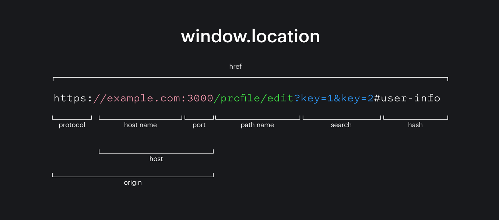

# ?Global object window

Глобальный объект предоставляет переменные и функции, доступные в любом месте программы. По умолчанию это те, что встроены в язык или среду исполнения.

В браузере он называется `window`, в Node.js — `global`, в другой среде исполнения может называться иначе.

Недавно `globalThis` был добавлен в язык как стандартизированное имя для глобального объекта, которое должно поддерживаться в любом окружении. Он поддерживается во всех основных браузерах.

Далее мы будем использовать `window`, полагая, что наша среда – браузер. Если скрипт может выполняться и в другом окружении, лучше будет `globalThis`.

Ко всем свойствам глобального объекта можно обращаться напрямую:

~~~
alert("Привет");
// это то же самое, что и
window.alert("Привет");
~~~

В браузере глобальные функции и переменные, объявленные с помощью `var` (не `let`/`const`!), становятся свойствами глобального объекта:

~~~
var gVar = 5;

alert(window.gVar); // 5 (становится свойством глобального объекта)
~~~

То же самое касается функций, объявленных с помощью синтаксиса Function Declaration (выражения с ключевым словом `function` в основном потоке кода, не Function Expression, только если с `var`).

Пожалуйста, не полагайтесь на это. Такое поведение поддерживается для совместимости. В современных проектах, использующих JavaScript-модули, такого не происходит.

Если бы мы объявили переменную при помощи `let`, то такого бы не произошло:

~~~
let gLet = 5;

alert(window.gLet); // undefined (не становится свойством глобального объекта)
~~~

Если свойство настолько важное, что вы хотите сделать его доступным для всей программы, запишите его в глобальный объект напрямую:

~~~
// сделать информацию о текущем пользователе глобальной, для предоставления доступа всем скриптам
window.currentUser = {
  name: "John",
};

// где угодно в коде
alert(currentUser.name); // John

// или, если у нас есть локальная переменная с именем "currentUser",
// получим её из window явно (безопасно!)
alert(window.currentUser.name); // John
~~~

При этом обычно не рекомендуется использовать глобальные переменные. Следует применять их как можно реже. Дизайн кода, при котором функция получает входные параметры и выдаёт определённый результат, чище, надёжнее и удобнее для тестирования, чем когда используются внешние, а тем более глобальные переменные.

### Использование для полифилов

Глобальный объект можно использовать, чтобы проверить поддержку современных возможностей языка.

Например, проверить наличие встроенного объекта `Promise` (такая поддержка отсутствует в очень старых браузерах).

Если нет, мы можем создать полифил: добавить функции, которые не поддерживаются окружением, но существуют в современном стандарте.

~~~
if (!window.Promise) {
  window.Promise = ... // собственная реализация современной возможности языка
}
~~~

### Location

`location` — это объект хранящийся в `window`, который позволяет получать информацию о текущем адресе страницы и менять его с помощью функций или обновления полей объекта.

Хотя `window.location` представляет собой объект только для чтения, вы можете присвоить ему `DOMString`. Это значит что в большинстве случаев вы можете работать с `location` как со строкой: `location = 'http://www.example.com'` это синоним для `location.href = 'http://www.example.com'`.

С помощью `location` мы можем получить текущий адрес:

~~~
console.log(window.location.href);
~~~

Обновление текущей страницы можно произвести с помощью `reload()`. Этот метод делает то же самое, что и кнопка «Обновить» в браузере:

~~~
window.location.reload();
~~~

С помощью `replace()` можно сделать клиентский редирект, это приведёт к мгновенному переходу по адресу, указанному при вызове метода:

~~~
window.location.replace('https://doka.guide/');
~~~

#### Свойства:

* `href` – полное представление адреса. Можно сказать, что это зеркало того, что находится в адресной строке браузера в данный момент. Если записать значение в это свойство, то произойдёт обновление адреса и редирект на новый адрес.

Остальные свойства — это кусочки `location.href`. Они нужны, чтобы удобно получать каждый из них отдельно, а не вытаскивать их руками из полной строки адреса.

~~~
console.log(window.location.href);
// отобразит текущий адрес
window.location.href = "https://example.com";
// сделает переход по указанному адресу
~~~

* `protocol` содержит текущий протокол по которому открыта страница. Чаще всего там будет `https` и `http`.

* `host` содержит значение хоста из ссылки. Хост включает в себя название текущего домена и порта.

* `hostname` — частичка с доменом из свойства `host`, не включает в себя порт.

* `port` — вторая составляющая значения `host`, содержит только номер порта. Если порт не указан в явном виде, то значением свойства будет пустая строка `''`.

* `origin` включает в себя путь, начиная с `protocol` и заканчивая `port`.

* `search` содержит параметры в формате ключ=значение разделённые `&`. Если параметров нет, то значением будет пустая строка.

* `hash` — якорная ссылка включая символ `#`. Она находится в самом конце пути и отвечает за навигацию между размеченными на странице элементами с помощью установки атрибута `id` на тегах. Эта часть URL не передаётся на сервер. Если параметров нет, то значением будет пустая строка.

~~~
window.location.hash = "about";
// проскролит страницу до элемента с `id="about"` если такой присутствует на странице
console.log(window.location.hash); // #about
// напечатает якорь
~~~

* `pathname` – репрезентация текущего пути на сайте. Если текущий `url` не содержит путь, то значением будет корневой путь `"/"`.

Например, значения `window.location.pathname` в зависимости от адреса:

~~~
https://doka.guide/js/window-location/ → /js/window-location/.
https://doka.guide → /.
~~~

#### Методы:

* `assign(новый путь)` вызывает переход на страницу, переданную в аргументах. После перехода на страницу пользователь может вернуться на страницу, с которой произошёл переход, с помощью браузерной кнопки назад.

* `replace(новый путь)` аналогичен методу `assign()`, но адрес страницы с которой был вызван этот метод не будет сохранён в истории браузера. При попытке вернуться назад пользователь будет отправлен на страницу предшествующую той, с которой произошёл переход.

* `reload()` перезагружает текущую страницу.

* `toString()` приводит адрес страницы к строке. Возвращает то же самое значение, что и `location.href`.

### History API

Свойство `window.history` можно использовать для доступа к информации о любых ранее посещенных страницах в текущем сеансе браузера. Важно не путать это с новым API истории HTML5. Он предоставляет полезные методы и свойства, которые позволяют переходить назад и вперёд по истории пользователя и манипулировать её содержимым.

Основные методы объекта `history`:

* `window.history.length`: показывает количество страниц, которые находятся в стеке истории

~~~
console.log(window.history.length); // 2
~~~

* `window.history.state`: возвращает текущий объект истории. Значение `null` до тех пор, пока не будет использован метод `pushState()` или `replaceState()`
* `window.history.go(n)`: позволяет перемещаться вперед и назад по истории на определенное число страниц. Если передан `0`, то будет обновлена текущая страница. Если индекс выходит за пределы истории, то ничего не произойдет.
* `window.history.back()`: метод, идентичный вызову `go(-1)`. Данный метод работает так, будто пользователь нажал на кнопку "Назад" на панели браузера
* `window.history.forward()`: метод, идентичный вызову `go(1)`, как если бы пользователь нажал на кнопку "Вперёд"

main.js
~~~
<body>
  <a href="about.html">To about page</a>
  
Forward

</body>
~~~

about.js
~~~
<body>
  
Back

</body>
~~~

* `window.history.pushState(state, title[, url])`: добавляет элемент истории

Параметры:

* `state`: объект состояния – это JavaScript-объект, связанный с новой записью в истории, созданной `pushState()`.
* `title`: заголовок - все браузеры, кроме Safari, на данный момент игнорируют этот параметр, но могут начать использовать в будущем. Ввиду будущих изменений метода, безопасным решением является передача пустой строки.
* `url` (необязательный): через этот параметр передаётся URL-адрес новой записи в истории.

Мы создадим простое приложение с тремя вкладками: React, Vue и Angular.

При нажатии на вкладку отображается содержимое выбранной вкладки. он также обновит URL-адрес, используя историю. `pushState()`метод:

index.html
~~~

  

    <ul>
      <li className="active" id="tab1">
        React
      </li>
      <li id="tab2">Vue</li>
      <li id="tab3">Angular</li>
    </ul>
    

      A JavaScript library for building user interfaces
    

  

~~~

index.js
~~~
const tabs = document.querySelector(".tabs");
const content = document.querySelector(".content");

const hashes = new Map([
  ["#react", "tab1"],
  ["#vue", "tab2"],
  ["#angular", "tab3"],
]);

const data = new Map([
  [
    "tab1",
    {
      url: "index.html#react",
      content:
        "React is a JavaScript library for building user interfaces.",
    },
  ],
  [
    "tab2",
    {
      url: "index.html#vue",
      content: "Vue is the Progressive JavaScript Framework.",
    },
  ],
  [
    "tab3",
    {
      url: "index.html#angular",
      content:
        "Angular is a platform for building mobile and desktop web applications.",
    },
  ],
]);

tabs.addEventListener("click", function (event) {
  if (!event.target.id) return;
  update(event.target.id);
});

const update = (tabId) => {
  const entry = data.get(tabId);

  if (entry) {
    window.history.pushState({ url: entry.url }, "", entry.url);
    console.log(window.history.state);
    console.log(window.history.length); // c pushState length при клике увеличивается, а с replaceState остается неизменной
    content.innerHTML = entry.content;
  }
};

(() => {
  // get tab id from the hash
  const tabId = hashes.get(window.location.hash);
  if (tabId) update(tabId);
})();
~~~

* `window.history.replaceState(state, title [, url])`: обновляет текущий элемент истории. `history.replaceState()` работает точно так же `history.pushState()`, за исключением того, что `replaceState()` изменяет текущую запись истории вместо создания новой.

~~~
console.log(window.history.state); // null
window.history.replaceState({ pageId: 1, userId: 5 }, "");
console.log(window.history.state); // {pageId: 1, userId: 5}
console.log(window.history.length); // 1
~~~

### `Navigator`

Объект `navigator` предназначен для предоставления подробной информации о браузере, который пользователь использует для доступа к сайту или веб-приложению. Кроме данных о браузере, в нём ещё содержится сведения о операционной системе, сетевом соединении и др.

Объект `navigator` – это свойство `window`:

~~~
const navigatorObj = window.navigator;
// или без указания window
// const navigatorObj = navigator;
~~~

Объект `navigator` имеет свойства и методы. Очень часто они используется для того чтобы узнать, какие функции поддерживаются браузером, а какие нет.

Свойства объекта `navigator`:

* `appCodeName` – кодовое имя браузера
* `appName` – имя браузера
* `appVersion` — версия браузера
* `cookieEnabled` - позволяет определить включены ли `cookie` в браузере
* `geolocation` - используется для определения местоположения пользователя
* `language` - язык браузера
* `online` - имеет значение `true` или `false` в зависимости от того находиться ли браузер в сети или нет
* `platform` - название платформы, для которой скомпилирован браузер
* `product` - имя движка браузера
* `userAgent` - возвращает заголовок `user agent`, который браузер посылает на сервер

Методы объекта `navigator`:

* `javaEnabled` – позволяет узнать, включён ли в браузере Java
* `sendBeacon` - предназначен для отправки небольшого количества информации на веб-сервер без ожидания ответа

#### Обнаружение браузера с помощью `userAgent`

`userAgent` - это строка, содержащая информацию о браузере, которую он посылает в составе заголовка запроса на сервер.

Пример содержания строки `userAgent` в браузере Google Chrome:

~~~
Mozilla/5.0 (Windows NT 10.0; Win64; x64) AppleWebKit/537.36 (KHTML, like Gecko) Chrome/113.0.0.0 Safari/537.36
~~~

Она содержит сведения об операционной системе, браузере, версиях, платформах и т.д.

Эти данные можно использовать, например, для обнаружения браузера. Для этого можно написать следующую функцию:

~~~
function detectBrowser() {
  let result = "Other";
  if (navigator.userAgent.indexOf("YaBrowser") !== -1) {
    result = "Yandex Browser";
  } else if (navigator.userAgent.indexOf("Firefox") !== -1) {
    result = "Mozilla Firefox";
  } else if (navigator.userAgent.indexOf("MSIE") !== -1) {
    result = "Internet Exploder";
  } else if (navigator.userAgent.indexOf("Edge") !== -1) {
    result = "Microsoft Edge";
  } else if (navigator.userAgent.indexOf("Safari") !== -1) {
    result = "Safari";
  } else if (navigator.userAgent.indexOf("Opera") !== -1) {
    result = "Opera";
  } else if (navigator.userAgent.indexOf("Chrome") !== -1) {
    result = "Google Chrome";
  }
  return result;
}

const browser = detectBrowser();
console.log(browser); // Safari
~~~

Зачем это нужно? Например, для того, чтобы запускать некоторые скрипты или функции только в определенном браузере.

Но при использовании `navigator.userAgent` следует иметь в виду, что эта информация не является 100% достоверной, поскольку она может быть изменена пользователем.

Лучше использовать парсер вроде [Platform.js](https://github.com/bestiejs/platform.js), который работает так:

~~~
const os = platform.os;
const browser = platform.name + " " + platform.version;
console.log(os); // {architecture: 64, family: 'Windows', version: '10', toString: ƒ}
console.log(browser); // Chrome 113.0.0.0
~~~

Или использовать [ua-parser-js](https://www.npmjs.com/package/ua-parser-js):

~~~
const parser = new UAParser();
const result = parser.getResult();

console.log(result.browser); // {name: 'Chrome', version: '113.0.0.0', major: '113'}
console.log(result.device); // {vendor: undefined, model: undefined, type: undefined}
console.log(result.os); // {name: 'Windows', version: '10'}
console.log(result.os.version); // 10
console.log(result.engine.name); // Blink
console.log(result.cpu.architecture); // amd64
~~~

#### Определение мобильного устройства посредством `userAgent`

Самый простой способ обнаружить мобильные устройства - это найти слово `mobile` в пользовательском агенте (`userAgent`):

~~~
const isMobile = navigator.userAgent.toLowerCase().match(/mobile/i);
const isTablet = navigator.userAgent.toLowerCase().match(/tablet/i);
const isAndroid = navigator.userAgent.toLowerCase().match(/android/i);
const isiPhone = navigator.userAgent.toLowerCase().match(/iphone/i);
const isiPad = navigator.userAgent.toLowerCase().match(/ipad/i);
~~~
