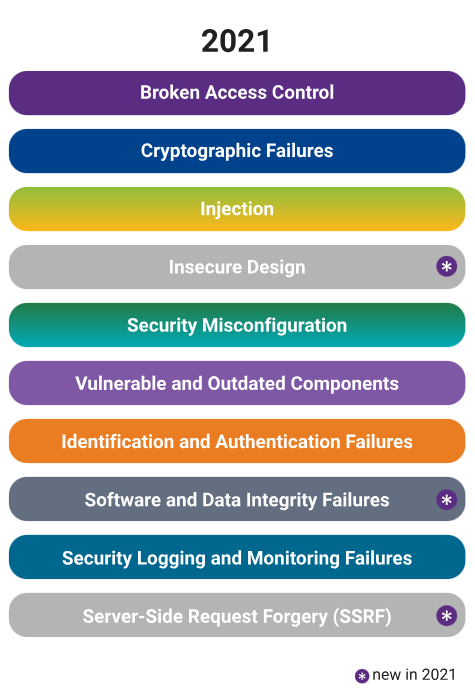

# ?OWASP Top 10

_OWASP_, или _Open Web Application Security Project_, — это некоммерческая организация, занимающаяся вопросами безопасности программного обеспечения.

Их проекты включают в себя, среди прочего, ряд программ и наборов инструментов для разработки программного обеспечения с открытым исходным кодом, местные отделения и конференции.

Одним из их проектов является ведение OWASP Top 10, списка 10 основных угроз безопасности, с которыми сталкиваются веб-приложения.

### Список на 2021 год

1. __Broken Access Control__ — Ошибки контроля доступа. К этой категории относятся ситуации, когда пользователь может выполнить действие, на которое у него не должно быть прав (например, получить или изменить критическую информацию). Злоумышленник в этом контексте может действовать как пользователь или как администратор в системе.

2. __Cryptographic Failures__ — Ошибки криптографической защиты. Сюда относится и отсутствие криптографии где нужно (например, при передаче важных данных), и слабые криптографические ключи, и устаревшие алгоритмы.

3. __Injection__ — Инъекции (XSS теперь считается частью этой категории). Возникают, когда пользовательский ввод без эскейпинга и фильтрации используется на одном уровне с данными или кодом системы (например, когда в поле логина можно передать управляющие символы SQL, изменив логику запроса).

4. __Insecure Design__ — Небезопасный дизайн. Эта категория связана с ошибками в изначальной логике работы приложения. Например, сеть кинотеатров, предоставляющая скидки при групповом бронировании, требует залог для групп более 15 человек. Злоумышленники моделируют этот поток, чтобы увидеть, смогут ли они забронировать сотни мест в различных кинотеатрах сети, что приведет к упущенной выгоде в тысячи долларов.

5. __Security Misconfiguration__ — Ошибки настроек безопасности. Современные приложения имеют большое количество настроек, связанных с информационной безопасностью. Отключение (или не включение) систем защиты и использование стандартных паролей относятся к ошибкам настроек.

6. __Vulnerable and Outdated Components__ — Устаревшие и уязвимые компоненты. Современные приложения часто построены на огромном количестве зависимостей, за версиями которых очень сложно уследить. Если приложение использует старые компоненты с известными уязвимостями, оно попадает в эту категорию.

7. __Identification and Authentication Failures__ — Ошибки идентификации и аутентификации. Эта категория ошибок присутствует в приложениях, которые позволяют использовать устаревшие сессии, брутить пароли или легко их восстанавливать. Другими словами, веб-приложение позволяет использовать слабые или легко угадываемые пароли.

8. __Software and Data Integrity Failures__ — Некорректная проверка целостности кода и данных. К примерам таких ошибок можно отнести использование сторонних непроверенных плагинов, отсутствие проверки целостности при автообновлении и небезопасную десериализацию.

9. __Security Logging and Monitoring Failures__ — Ошибки логирования и мониторинга. События, которые можно проверить, такие как входы в систему, неудачные попытки входа и другие важные действия, не логируются, что приводит к уязвимости приложения.

10. __Server-Side Request Forgery (SSRF)__ — Подделка межсерверных запросов. Если приложение позволяет отправлять HTTP запросы, не проверяя URL, то это может позволить делать запросы в локальную сеть сервера и стучаться на закрытые API от имени доверенного сервера.
