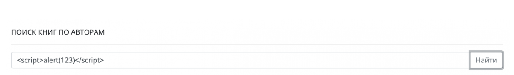
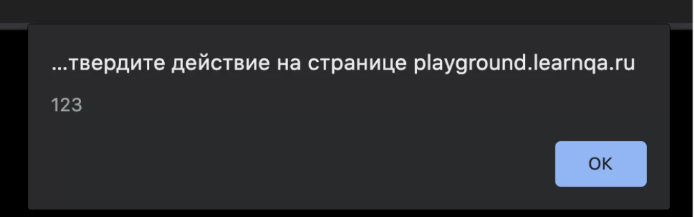

# ?XSS

_XSS_ (Cross-Site Scripting — межсайтовый скриптинг) — распространенный тип веб-атаки, заключающийся во внедрении на страницу сайта или приложения вредоносного кода. Когда пользователь открывает пораженную страницу, внедренный скрипт взаимодействует с удаленным сервером злоумышленника.

Для обозначения межсайтового скриптинга выбрано сокращение _XSS_ (X-Site Scripting) — это сделано для того, чтобы избежать путаницы с таблицами стилей, которые также имеют сокращение CSS.

На сегодняшний день XSS является третьим по значимости видом рисков для веб-приложений. Его основная опасность заключается в том, что на веб-страницах содержится много пользовательских или иных уязвимых данных. Злоумышленник может использовать их для доступа к платежным картам, компьютерам пользователей и т.д.

### Как работает межсайтовый скриптинг?

Один из механизмов обеспечения безопасности в интернете — правило ограничения домена. Оно означает, что скрипты на одном сайте могут без ограничений взаимодействовать друг с другом, но не со скриптами на другом веб-ресурсе. Иначе говоря, вредоносный код на одном сайте не сможет навредить другому сайту или его пользователям из-за ограничения доступа на другом домене.

Но это в идеале, а на практике у веб-приложений и сайтов есть множество уязвимостей. Воспользовавшись ими, злоумышленник может взломать ресурс и внедрить на него вредоносный скрипт. При этом он будет восприниматься как часть родного кода, написанного разработчиком, — то есть «зараженный» ресурс в глазах браузера пользователя остается заслуживающим доверия источником. Таким образом, ресурс, на котором размещается вредоносный скрипт, становится соучастником атаки.

Для самого сервера, на котором размещается «зараженный» ресурс, XSS опасности, как правило, не представляет. Основную угрозу он несет пользовательским данным, которые часто размещаются на страницах сайта или веб-приложения. Однако с помощью межсайтового скриптинга злоумышленник может получить доступ к данным администратора, дающим контроль над контентом и панелью управления.

### Виды XSS-уязвимостей

XSS-уязвимость — это брешь в защите сайта или веб-приложения, через которую злоумышленник может внедрить вредоносный код. Изначально основным языком, на котором создаются такие скрипты, был JavaScript. Однако теоретически для XSS-атаки можно использовать HTML и т.д. Главное, чтобы они исполнялись браузером жертвы.

Основная классификация XSS-уязвимостей выглядит следующим образом:

* __Хранимые (постоянные).__ Такие уязвимости возникают, когда злоумышленнику удается получить доступ к серверу и сохранить на нем вредоносный код. Такой сохраненный скрипт будет активироваться каждый раз, когда пользователь заходит на зараженную страницу.

Часто хранимые XSS-уязвимости можно найти на различных форумах, а также в соцсетях, имиджбордах, блогах и других представителях Веб 2.0. Для их внедрения на ресурс злоумышленники могут использовать обычный текст (например, в виде комментариев), рисунки, гифки и другой размещаемый контент.

* __Отраженные (непостоянные).__ Это наиболее распространенный сегодня тип XSS-атак. Их смысл в том, что злоумышленник прячет вредоносный код в заранее подготовленной ссылке, которую потом передает пользователям-жертвам в почтовой рассылке или размещает на веб-странице.

Когда пользователь переходит по зараженной ссылке, серверные скрипты исполняют ее код без обработки и возвращают его в виде ответа. Браузер пользователя исполняет зараженный скрипт, а злоумышленник получает `cookies` жертвы.

* __DOM-модель.__ Суть этой уязвимости — в использовании злоумышленником Document Object Model, объектной модели документа. Это программный интерфейс, дающий программам и сценариям доступ к контенту HTML-, XHTML- и XML-документов и возможность этим содержанием (а также структурой и оформлением) управлять.

XSS-уязвимости на основе DOM-модели могут быть как отраженными, так и хранимыми. Их главная особенность — сама страница сайта или веб-приложения не меняется, но меняется ее отображение в браузере пользователя из-за вредоносных модификаций DOM.

Также XSS-уязвимости различаются по степени активности:

* __Активные.__ Такие уязвимости действуют сами независимо от активности пользователя. То есть, как только пользователь-жертва попадает на зараженную страницу, вредоносный скрипт запускается автоматически. Например, такие уязвимости встраиваются в базы данных или исполняемые файлы на сервере, в формы ввода (с помощью автоматических обработчиков событий) и т.д.

* __Пассивные.__ В этом случае для активации вредоносного кода пользователь-жертва должен совершить какое-то действие: ввести запрос, кликнуть ссылку. Чтобы это произошло, злоумышленник должен как-то его заставить, спровоцировать или замотивировать. Здесь в ход идут методы социальной инженерии — например, фишинг.

> Фишинг — вид интернет-мошенничества, целью которого является получение доступа к конфиденциальным данным пользователей — логинам и паролям. Это достигается путём проведения массовых рассылок электронных писем от имени популярных брендов, а также личных сообщений внутри различных сервисов, например, от имени банков или внутри социальных сетей.

### Как злоумышленник внедряет вредоносный код?

Основной способ внедрения вредоносного кода на сайт или в веб-приложение — через интерактивные элементы сайта. Например, его можно разместить в строке поиска, форме обратной связи или авторизации, поле для публикации комментария. Это доступные и самые простые «точки входа» для злоумышленника, который по своей сути изначально является одним из посетителей ресурса.

Для внедрения вредоносного скрипта злоумышленник может использовать следующие каналы или векторы атаки, то есть точки проникновения в защиту сайта или веб-приложения:

* __Ошибки в браузере.__ Это уязвимости самих браузерных программ, которыми пользуются посетители сайтов. Типичный пример — выполнение сценариев на языке SVG, которое позволяет обойти правило ограниченного домена. Как правило, такие серьезные ошибки быстро устраняются разработчиками браузеров. Однако есть и более узкоспециализированные уязвимости, которые могут оставаться незамеченными годами. В таких случаях проще настроить защиту на самом сайте, чем ждать обновления браузерной программы.

* __Отсутствие экранирования.__ Одной из проблем современных браузеров является их неспособность отличить обычный текст от кода. То есть чтобы браузерная программа распознала и выполнила код HTML, он должен быть размечен тегами.

Но если браузер воспринимает размеченный соответствующим образом текст как код, то он начинает исполнять и аналогично оформленный текст, размещенный на сайте сторонними пользователями, среди которых может быть и злоумышленник. Типичной целью являются поля, в которых размещаются комментарии. Чтобы браузер воспринимал текст от пользователей как обычный текст (даже если он размечен как код), предварительно настраивается его экранирование — например, автоматическая замена спецсимволов, используемых в языках разметки и программирования, на «аналоги», которые не учитываются браузером.

К сожалению, экранирование присутствует на сайтах и в веб-приложениях не всегда, и причин может быть несколько:

1. Программист элементарно забывает настроить экранирование во всех интерактивных формах на сайте, особенно если ресурс большой.
2. Разные страницы и разделы сайта создаются разными специалистами и в разное время, что еще больше увеличивает вероятность ошибки.
3. Уязвимость допущена в коде библиотеки или фреймворка, который используется разработчиком при создании или доработке сайта.

* __Подмена кодировки в заголовке страницы.__ Современные браузеры определяют кодировку прямо по ходу обработки страницы. Кодировка отображается в теге `<meta>`, и если тег `<title>` расположен до него, то сначала браузерная программа прочитает и обработает заголовок, а уже потом определит, какая кодировка используется на сайте. Соответственно, у злоумышленника появляется возможность обойти фильтрацию служебных символов `<` и `“`, разместив в тайтле вредоносный код, закодированный в UTF-7.

* __SiXSS (межсайтовый скриптинг при наличии SQL-инъекции).__ Это комбинированный тип атаки, задействующий базу данных сайта. Работает это следующим образом. С помощью SQL-инъекции злоумышленник внедряет вредоносный код в одну из страниц БД. Если на сайте отсутствует экранирование при выводе содержимого базы данных, то при доступе к «отравленной» строке БД вредоносный скрипт попадает в браузер пользователя.

Перечисленные векторы атаки — самые распространенные. На практике способов, которыми злоумышленники могут внедрить код на сайт или в веб-приложение, гораздо больше. Какие-то из них работают на всех типах ресурсов, другие отличаются узкой специализацией. Такое разнообразие приводит к тому, что гарантированной и 100-процентной защиты от XSS-угроз не существует.

### Последствия XSS-атаки

Сами XSS-уязвимости опасности для самого ресурса или его пользователей не представляют. Угрозу несут именно атаки, для которых эти бреши в обороне являются «точками входа». С помощью XSS-атаки можно нанести ресурсу и его пользователям разнообразный вред.

* __Кража пользовательских данных.__ Сайты и приложения, на которых предусмотрена авторизация пользователей, отличают авторизованного посетителя от неавторизованного с помощью специального `cookie`-файла (сессионной `cookie`). Этот файл будет видеть только авторизованный посетитель, а еще — любой JavaScript-код, исполняемый его браузером (в том числе и помещенный на страницу злоумышленником). Прочитав сессионную `cookie` жертвы, вредоносный скрипт через AJAX-запрос передает данные авторизации на удаленный сервер, предварительно созданный злоумышленником. Там эта информация заносится в базу данных, и хакеру остается только вычленить ее из параметров URL. Это дает злоумышленнику следующие возможности:

1. Похитить конфиденциальные данные пользователя: историю посещений, информацию по платежным картам, личную переписку и т.д.
2. Использовать аккаунт пользователя-жертвы для рассылки спама, угроз и другого противоправного контента, публикации комментариев с противозаконным или компрометирующим содержанием.
3. Рассылать вредоносные программы другим пользователям, особенно тем, у кого пользователь-жертва пользовался доверием.
4. Получить бесплатный доступ к платному контенту: учебным курсам, мультимедийному контенту и т.д.

* __Доступ к управлению сайтом.__ Злоумышленник может завладеть не только данными авторизованных пользователей, но и правами администратора сайта/веб-приложения. В этом случае он получает доступ к панели управления ресурсом и может контролировать его содержание, структуру, оформление. Такие возможности позволяют злоумышленнику:

1. Получить авторизационные данные любого зарегистрированного на сайте пользователя.
2. Испортить функционал и/или оформление сайта с целью его дискредитации в глазах настоящих или потенциальных посетителей.
3. Разместить на ресурсе посторонний, противозаконный или компрометирующий контент, внести изменения в уже имеющееся содержание (пресс-релизы, статьи, описания товаров и т.д.).
4. Взломать корпоративную базу данных для получения конфиденциальной информации (секретных технологий, сведений о коммерческой деятельности и т.д.).

Опасность не ограничивается лишь потерей или кражей данных, репутационными издержками — последствия могут быть куда серьезнее. Например, если злоумышленник получает на сайте фармацевтической компании доступ к описанию лекарства, он может изменить информацию по дозировке сильнодействующего лекарства. Как результат — массовые интоксикации с тяжелыми последствиями вплоть до летальных исходов.

### Защита от XSS-атак

Чтобы защититься от межсайтового скриптинга, необходимо сначала выявить на сайте или в веб-приложении возможные уязвимости для атак этого типа. Сделать это можно двумя способами.

1. __Автоматически.__ Для поиска уязвимостей существуют специальные сервисы, с помощью которых анализируются все страницы, на которых присутствуют интерактивные элементы: формы обратной связи и оформления заказов, поисковая строка, поля для публикации комментариев и т.д. Пример такого ресурса — http://xss-scanner.com/.

Стоит учитывать, что возможности любого такого сервиса ограничены, поэтому для максимально объективной оценки уязвимостей лучше проверять сайт на нескольких ресурсах. Тем не менее автоматизированные сервисы серьезно упрощают работу, особенно если анализируемый сайт имеет сложную структуру или большое количество внутренних страниц.

2. __Вручную.__ Такой способ требует больших затрат времени и сил, зато более надежен (если проводится грамотным специалистом). Здесь алгоритм такой же: проверяется каждая страница сайта с интерактивными элементами, которые используются посетителями для ввода данных. Например, с помощью скрипта ``.

Если его ввести в интерактивное поле для размещения запроса или текста, то при отсутствии защиты появится такое уведомление:

Ручная проверка по понятным причинам не очень эффективна на крупных сайтах, зато вполне применима на небольших ресурсах или одностраничниках.

Когда уязвимости найдены, можно приступать непосредственно к защите от угроз. Для этого рекомендуется:

1. Настроить фильтрацию и экранизацию входных параметров, то есть информации, вводимой пользователем через интерактивные поля и формы.
2. Настроить автоматическую замену спецсимволов, чтобы четко отделить пользовательский текст от исполняемого кода.
3. На каждой странице сайта разместить кодировку перед какими-либо пользовательскими полями.
4. Установить ограничения домена и путей приема `cookie`-файлов с помощью SSL или параметра `HttpOnly`.
5. Регулярно проверять сайт или веб-приложение на уязвимости такими инструментами, как Nessus, Nikto Web Scanner и т.д.
6. Задать список желательных источников для загрузки контента с помощью заголовка Content Security Policy.
7. Регулярно обновлять браузер до актуальной версии и использовать расширения для проверки URL, скриптов, интерактивных форм и других потенциальных источников угроз.

Практика показывает, что на 100% от XSS-атак не защищен ни один ресурс или браузер. В ответ на появление новых средств защиты злоумышленники разрабатывают новые пути их обхода. Однако использование актуальных способов цифровой гигиены и обычная бдительность позволяют снизить риск межсайтового скриптинга до приемлемого минимума.
