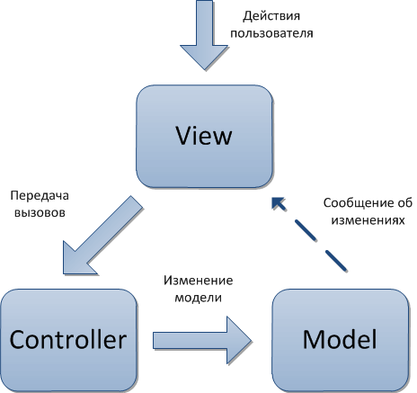

# ?MVC

Когда мы пишем сложные приложения, нам нужно выполнять различные операции, иногда совершенно друг на друга не похожие:

* Обновить данные на сервере
* Показать всплывающее окно после клика пользователя
* Валидировать данные из формы
* Загрузить дополнительные ресурсы, картинки, скрипты
* Вызвать стороннее API и обработать ответ

Считается хорошим тоном делить отличающийся код на модули, которые отвечают за свои конкретные задачи. Как именно разделить код на модули, по каким критериям и принципам — на эти вопросы старается ответить паттерн MVC.

_MVC_ (сокращение от Model—View—Controller) — это архитектурный паттерн, который делит модули на три группы:

* Модель (Model)
* Представление (View)
* Контроллер (Controller)

Модель содержит данные приложения, за которыми приходит пользователь. Например, список своих заказов в интернет-магазине.

Представление показывает эти данные в понятном для пользователя виде. Например, на свёрстанной странице сайта или в приложении на телефоне.

Контроллеры принимают пользовательские команды и преобразуют данные по этим командам. Например, если пользователь нажимает кнопку «Удалить заказ», то контроллер отмечает этот заказ в модели удалённым.

### Компоненты архитектуры

В архитектуре MVC пользователь взаимодействует только с представлением — чаще всего это UI.

> Есть приложения, где представлением может быть голосовой или жестовый интерфейс, но в веб-разработке чаще всего представление — это графический пользовательский интерфейс, GUI.

Пользователь подаёт команды программе. Контроллер получает эти команды и преобразует данные в модели. Модель обновляется и уведомляет представление о том, что нужно перерисовать интерфейс, чтобы отобразить изменения в данных.

Модель никогда не касается представления. Представление никогда не касается модели. Модель и представление не должны знать друг о друге. Контроллер их соединяет.

### Model

Модель содержит данные приложения. Это самый независимый компонент архитектуры, именно от модели зависит, что будет показывать представление, и как будет работать контроллер.

Модель не включает никаких событий или манипуляций с DOM. Это просто хранение и изменение данных.

### View

Ни контроллер, ни модель не должны ничего знать о DOM, HTML-элементах, CSS или обо всем этом. Все, что с этим связано, должно быть в представлении. Мы должны поместить прослушиватели событий в элементы DOM в представлении.

### Controller

Контроллер принимает команды от пользователя и преобразует данные в модели согласно этим командам.

Контроллер является связующим звеном между моделью (данными) и представлением (то, что видит пользователь). Контроллер будет обрабатывать события после их запуска.

### Пример

Пример простого приложения todo MVC на простом JavaScript можно посмотреть по ссылке https://github.com/taniarascia/mvc.

### Взаимодействие компонентов

В классическом MVC стандартом считается, когда данные:

1. От пользователя передаются представлению
2. От представления — контроллеру
3. Через контроллер обновляется модель
4. Модель уведомляет представление о том, что что-то изменилось

Это называется однонаправленным потоком данных.

Иногда допускается, что компоненты могут общаться напрямую с другими компонентами не по этой схеме, но рекомендуется не отходить от канона.

### Как много должен знать контроллер?

Контроллер, который умеет больше, называется толстым. Тот, который умеет меньше — тонким.

При тонком контроллере знание о том, как преобразовывать данные, находится в модели. Это не всегда полезно, потому что может замусорить код модели, но иногда оправданно. Например, если мы не хотим «размазывать» это знание по нескольким компонентам.

Такая проблема называется проблемой тонкого и толстого контроллера. Разные команды решают её по-своему, исходя из договорённостей и выгод и издержек каждого варианта для своего проекта.

### Похожие паттерны

#### Model—View—Viewmodel

В MVVM (сокращение от Model—View—Viewmodel) вместо контроллера используется Viewmodel. Это «надстройка» над представлением, которая связывает данные и представление так, что разработчикам больше не нужно писать самим логику обновления UI и обработки команд пользователя.

Для работы связывания нужен Binder (биндер) — фреймворк, библиотека или целый язык, который автоматически отображает изменения из модели в UI.

Svelte в какой-то степени можно называть биндером, так как он сам занимается связыванием модели и отображения.

#### Model-View-Presenter

В MVP (сокращение от Model-View-Presenter) место контроллера занимает презентер.

Главное отличие от MVC в том, как расположены компоненты и, соответственно, как передаются данные. Если в MVC данные передавались по кругу, то в MVP компоненты располагаются по линии. На концах находятся модель и представление, а между ними — презентер.

Презентер забирает на себя всю логику обработки данных, обновления представления и обработки пользовательских команд.

Представление в этом случае пассивно: оно не делает ничего, кроме отображения данных так, как ему скажет презентер. Если в MVC представление могло брать форматирование вывода на себя, то в MVP за это тоже будет отвечать презентер.

Плюс такого подхода в том, что не возникает вопросов, какой код к чему относится. Минус — в том, что презентер быстро становится большим и сложным. Приходится разбивать его на модули поменьше, вероятно, добавлять дополнительные «слои».
