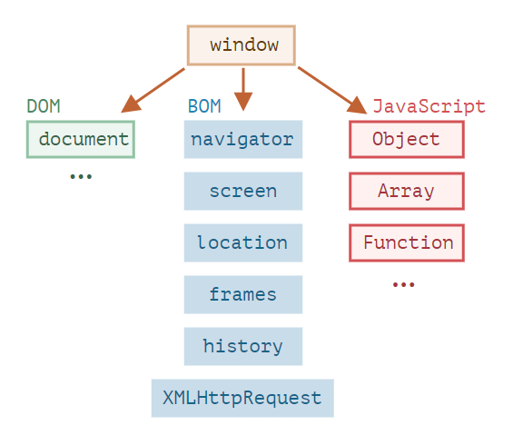

# ?Browser environment

На картинке ниже в общих чертах показано, что доступно для JavaScript в браузерном окружении:

Как мы видим, имеется корневой объект `window`, который выступает в 2 ролях:

* Во-первых, это глобальный объект для JavaScript-кода, об этом более подробно говорится в теме про глобальный объект `window`.
* Во-вторых, он также представляет собой окно браузера и располагает методами для управления им.

Например, здесь мы используем `window` как глобальный объект:

~~~
function sayHi() {
  console.log("Hello");
}

// глобальные функции доступны как методы глобального объекта:
window.sayHi();
~~~

А здесь мы используем `window` как объект окна браузера, чтобы узнать его высоту:

~~~
console.log(window.innerHeight); // внутренняя высота окна браузера
~~~

### DOM (Document Object Model)

_Document Object Model_, сокращённо _DOM_ – объектная модель документа, которая представляет все содержимое страницы в виде объектов, которые можно менять.

Объект document – основная «входная точка». С его помощью мы можем что-то создавать или менять на странице.

Например:

~~~
// заменим цвет фона на красный,
document.body.style.background = "red";

// а через секунду вернём как было
setTimeout(() => document.body.style.background = "", 1000);
~~~

CSSOM используется вместе с DOM при изменении стилей документа.

### BOM (Browser Object Model)

_Объектная модель браузера_ (_Browser Object Model_, _BOM_) – это дополнительные объекты, предоставляемые браузером (окружением), чтобы работать со всем, кроме документа.

Например:

* Объект `navigator` даёт информацию о самом браузере и операционной системе. Среди множества его свойств самыми известными являются: `navigator.userAgent` – информация о текущем браузере, и `navigator.platform` – информация о платформе (может помочь в понимании того, в какой ОС открыт браузер – Windows/Linux/Mac и так далее).
* Объект `location` позволяет получить текущий URL и перенаправить браузер по новому адресу.

Функции `alert`/`confirm`/`prompt` тоже являются частью BOM: они не относятся непосредственно к странице, но представляют собой методы объекта окна браузера для коммуникации с пользователем.

> `alert` выводит сообщение. `prompt` выводит сообщение и ждёт, пока пользователь введёт текст, а затем возвращает введённое значение или `null` , если ввод отменён (CANCEL/ Esc ). `confirm` выводит сообщение и ждёт, пока пользователь нажмёт «OK» или «CANCEL» и возвращает `true`/`false` .
