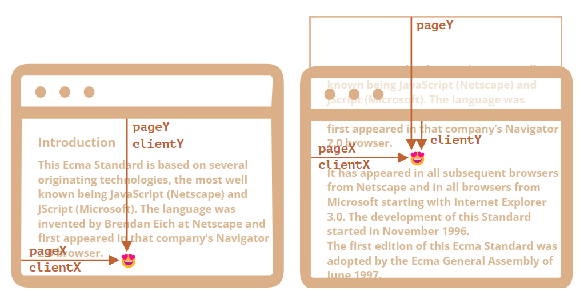
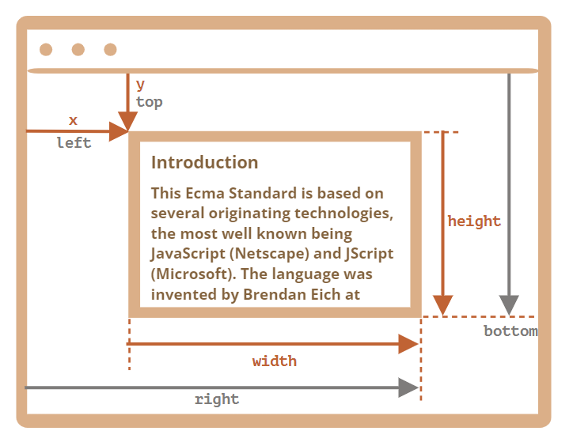
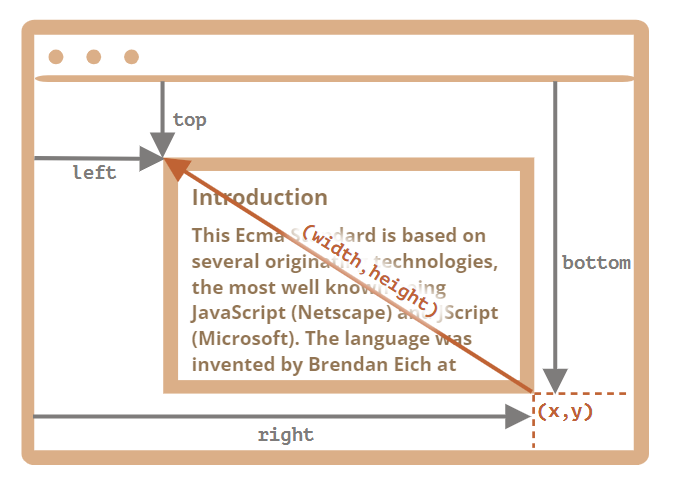

# ?Coordinates

Большинство соответствующих методов JavaScript работают в одной из двух указанных ниже систем координат:

1. Относительно окна браузера – как `position: fixed`, отсчёт идёт от верхнего левого угла окна.
* мы будем обозначать эти координаты как `clientX`/`clientY`, причина выбора таких имён будет ясна позже, когда мы изучим свойства событий.
2. Относительно документа – как `position: absolute` на уровне документа, отсчёт идёт от верхнего левого угла документа.
* мы будем обозначать эти координаты как `pageX`/`pageY`.

Когда страница полностью прокручена в самое начало, то верхний левый угол окна совпадает с левым верхним углом документа, при этом обе этих системы координат тоже совпадают. Но если происходит прокрутка, то координаты элементов в контексте окна меняются, так как они двигаются, но в то же время их координаты относительно документа остаются такими же.

На приведённой картинке взята точка в документе и показаны её координаты до прокрутки (слева) и после (справа):

При прокрутке документа:

* `pageY` – координата точки относительно документа осталась без изменений, так как отсчёт по-прежнему ведётся от верхней границы документа (сейчас она прокручена наверх).
* `clientY` – координата точки относительно окна изменилась (стрелка на рисунке стала короче), так как точка стала ближе к верхней границе окна.

### Координаты относительно окна: `getBoundingClientRect`

Метод `elem.getBoundingClientRect()` возвращает координаты в контексте окна для минимального по размеру прямоугольника, который заключает в себе элемент `elem`, в виде объекта встроенного класса `DOMRect`.

Основные свойства объекта типа `DOMRect`:

* `x`/`y` – X/Y-координаты начала прямоугольника относительно окна,
* `width`/`height` – ширина/высота прямоугольника (могут быть отрицательными).

Дополнительные, «зависимые», свойства:

* `top`/`bottom` – Y-координата верхней/нижней границы прямоугольника,
* `left`/`right` – X-координата левой/правой границы прямоугольника.

~~~
<section style="height: 1000px; background: red"></section>
<section style="height: 1000px; background: blue">
  <button type="button" id="button">Click</button>
</section>

~~~

Если вы прокрутите страницу, то расположение кнопки в окне поменяется, и, соответственно, её координаты в контексте окна тоже (при вертикальной прокрутке – `y`/`top`/`bottom`).

Вот картинка с результатами вызова `elem.getBoundingClientRect()`:

Как вы видите, `x`/`y` и `width`/`height` уже точно задают прямоугольник. Остальные свойства могут быть легко вычислены на их основе:

~~~
left = x
top = y
right = x + width
bottom = y + height
~~~

Заметим:

* Координаты могут считаться с десятичной частью, например `10.5`. Это нормально, ведь браузер использует дроби в своих внутренних вычислениях. Мы не обязаны округлять значения при установке `style.left`/`top`.
* Координаты могут быть отрицательными. Например, если страница прокручена так, что элемент `elem` ушёл вверх за пределы окна, то вызов `elem.getBoundingClientRect().top` вернёт отрицательное значение.

Зачем вообще нужны зависимые свойства? Для чего существуют `top`/`left`, если есть `x`/`y`?

С математической точки зрения, прямоугольник однозначно задаётся начальной точкой (`x`, `y`) и вектором направления (`width`, `height`).

Так что дополнительные зависимые свойства существуют лишь для удобства.

Что же касается `top`/`left`, то они на самом деле не всегда равны `x`/`y`. Технически, значения `width`/`height` могут быть отрицательными. Это позволяет задать «направленный» прямоугольник, например, для выделения мышью с отмеченным началом и концом.

То есть, отрицательные значения `width`/`height` означают, что прямоугольник «растет» влево-вверх из правого угла.

Вот прямоугольник с отрицательными `width` и `height` (например, `width=-200`, `height=-100`):

Свойства `left`/`top` при этом не равны `x`/`y`.

Впрочем, на практике результат вызова `elem.getBoundingClientRect()` всегда возвращает положительные значения для ширины/высоты. Здесь мы упомянули отрицательные `width`/`height` лишь для того, чтобы понять, зачем существуют эти с виду дублирующие свойства.

#### Internet Explorer и Edge: не поддерживают `x`/`y`

Internet Explorer и Edge не поддерживают свойства `x`/`y` по историческим причинам.

Таким образом, мы можем либо сделать полифил (добавив соответствующие геттеры в `DomRect.prototype`), либо использовать `top`/`left`, так как это всегда одно и то же при положительных `width`/`height`, в частности – в результате вызова `elem.getBoundingClientRect()`.

#### Координаты `right`/`bottom` отличаются от одноимённых CSS-свойств

Есть очевидное сходство между координатами относительно окна и CSS `position: fixed`.

Но в CSS свойство `right` означает расстояние от правого края, и свойство `bottom` означает расстояние от нижнего края окна браузера.

Если взглянуть на картинку выше, то видно, что в JavaScript это не так. Все координаты в контексте окна считаются от верхнего левого угла, включая `right`/`bottom`.

### `elementFromPoint(x, y)`

Вызов `document.elementFromPoint(x, y)` возвращает самый глубоко вложенный элемент в окне, находящийся по координатам `(x, y)`.

Например, код ниже выделяет с помощью стилей и выводит имя тега элемента, который сейчас в центре окна браузера:

~~~
const centerX = document.documentElement.clientWidth / 2;
const centerY = document.documentElement.clientHeight / 2;

const elem = document.elementFromPoint(centerX, centerY);

elem.style.background = "red";
console.log(elem.tagName);
~~~

Поскольку используются координаты в контексте окна, то элемент может быть разным, в зависимости от того, какая сейчас прокрутка.

#### Для координат за пределами окна метод `elementFromPoint` возвращает `null`

Метод `document.elementFromPoint(x,y)` работает, только если координаты `(x, y)` относятся к видимой части содержимого окна.

Если любая из координат представляет собой отрицательное число или превышает размеры окна, то возвращается `null`.

### Применение для `fixed` позиционирования

Чаще всего нам нужны координаты для позиционирования чего-либо.

Чтобы показать что-то около нужного элемента, мы можем вызвать `getBoundingClientRect`, чтобы получить его координаты элемента, а затем использовать CSS-свойство `position` вместе с `left`/`top` (или `right`/`bottom`).

Например, функция `createMessageUnder(elem, html)` ниже показывает сообщение под элементом `elem`:

~~~
<body style="height: 1000px">
  
Elem

  
</body>
~~~

Код можно изменить, чтобы показывать сообщение слева, справа, снизу, применять к нему CSS-анимации и так далее. Это просто, так как в нашем распоряжении имеются все координаты и размеры элемента.

Но обратите внимание на одну важную деталь: при прокрутке страницы сообщение уплывает от кнопки.

Причина весьма очевидна: сообщение позиционируется с помощью `position: fixed`, поэтому оно остаётся всегда на том же самом месте в окне при прокрутке страницы.

Чтобы изменить это, нам нужно использовать другую систему координат, где сообщение позиционировалось бы относительно документа, и свойство `position: absolute`.

### Координаты относительно документа

В такой системе координат отсчёт ведётся от левого верхнего угла документа, не окна.

В CSS координаты относительно окна браузера соответствуют свойству `position: fixed`, а координаты относительно документа – свойству `position: absolute` на самом верхнем уровне вложенности.

Мы можем воспользоваться свойствами `position: absolute` и `top`/`left`, чтобы привязать что-нибудь к конкретному месту в документе. При этом прокрутка страницы не имеет значения. Но сначала нужно получить верные координаты.

Не существует стандартного метода, который возвращал бы координаты элемента относительно документа, но мы можем написать его сами.

Две системы координат связаны следующими формулами:

* `pageY` = `clientY` + высота вертикально прокрученной части документа.
* `pageX` = `clientX` + ширина горизонтально прокрученной части документа.

Функция `getCoords(elem)` берёт координаты в контексте окна с помощью `elem.getBoundingClientRect()` и добавляет к ним значение соответствующей прокрутки:

~~~
<body style="height: 1000px">
  
Elem

  
</body>
~~~
