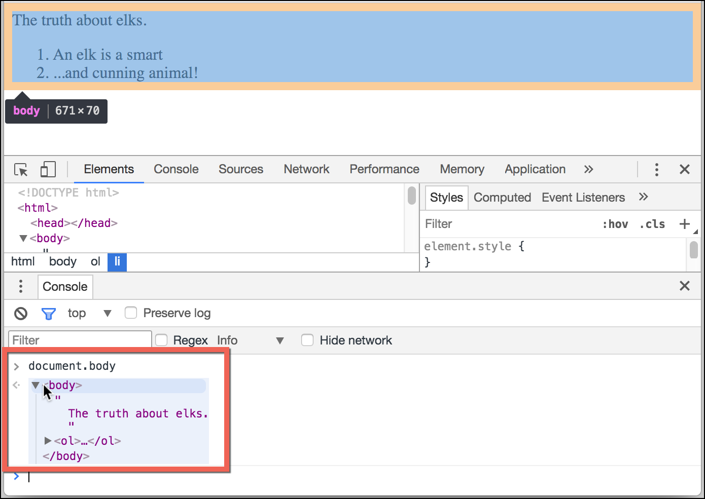

# ?DOM tree

_DOM_ – это представление HTML-документа в виде дерева тегов.

Каждый узел этого дерева – это объект.

Теги являются узлами-элементами (или просто элементами). Они образуют структуру дерева: `<html>` – это корневой узел, `<head>` и `<body>` его дочерние узлы и т.д.

Текст внутри элементов образует текстовые узлы, обозначенные как `#text`. Текстовый узел содержит в себе только строку текста. У него не может быть потомков, т.е. он находится всегда на самом нижнем уровне.

В текстовых узлах есть специальные символы:

* перевод строки: `↵` (в JavaScript он обозначается как `\n`)
* пробел: `␣`

Пробелы и переводы строки – это полноправные символы, как буквы и цифры. Они образуют текстовые узлы и становятся частью дерева DOM.

Существует всего два исключения из этого правила:

1. По историческим причинам пробелы и перевод строки перед тегом `<head>` игнорируются
2. Если мы записываем что-либо после закрывающего тега `</body>`, браузер автоматически перемещает эту запись в конец `body`, поскольку спецификация HTML требует, чтобы всё содержимое было внутри `<body>`. Поэтому после закрывающего тега `</body>` не может быть никаких пробелов.

Здесь пробельных текстовых узлов нет:

~~~
<!DOCTYPE HTML>
<html><head><title>About</title></head><body>Our team</body></html>
~~~

##### Пробелы по краям строк и пробельные текстовые узлы скрыты в инструментах разработки.

### Автоисправление

Если браузер сталкивается с некорректно написанным HTML-кодом, он автоматически корректирует его при построении DOM.

Например, в начале документа всегда должен быть тег `<html>`. Даже если его нет в документе – он будет в дереве DOM, браузер его создаст. То же самое касается и тега `<body>`.

При генерации DOM браузер самостоятельно обрабатывает ошибки в документе, закрывает теги и так далее.

Важный «особый случай» – работа с таблицами. По стандарту DOM у них должен быть `<tbody>`, но в HTML их можно написать (официально) без него. В этом случае браузер добавляет `<tbody>` в DOM самостоятельно.

### Другие типы узлов

Есть и некоторые другие типы узлов, кроме элементов и текстовых узлов.

Например, узел-комментарий. Все, что есть в HTML, даже комментарии, является частью DOM.

Даже директива `<!DOCTYPE...>`, которую мы ставим в начале HTML, тоже является DOM-узлом. Она находится в дереве DOM прямо перед `<html>`.

Даже объект `document`, представляющий весь документ, формально является DOM-узлом.

Существует 12 типов узлов:

1. `Document`
2. `DocumentType`
3. `DocumentFragment`
4. `ProcessingInstruction`
5. `EntityReference`
6. `Element`
7. `Attr`
8. `Text`
9. `CDATASection`
10. `Comment`
11. `Entity`
12. `Notation`

Чтобы посмотреть структуру DOM в реальном времени, попробуйте [Live DOM Viewer](http://software.hixie.ch/utilities/js/live-dom-viewer/).

Другой способ исследовать DOM – это использовать инструменты разработчика браузера. Это то, что мы каждый день делаем при разработке.

В правой части инструментов разработчика находятся следующие подразделы:

* `Styles` – здесь мы видим CSS, применённый к текущему элементу: правило за правилом, включая встроенные стили (выделены серым). Почти всё можно отредактировать на месте, включая размеры, внешние и внутренние отступы.
* `Computed` – здесь мы видим итоговые CSS-свойства элемента, которые он приобрёл в результате применения всего каскада стилей (в том числе унаследованные свойства и т.д.).
* `Event Listeners` – в этом разделе мы видим обработчики событий, привязанные к DOM-элементам (мы поговорим о них в следующей части учебника).
* … и т.д.

### Взаимодействие с консолью

При работе с DOM нам часто требуется применить к нему JavaScript. Например: получить узел и запустить какой-нибудь код для его изменения, чтобы посмотреть результат. Вот несколько подсказок, как перемещаться между вкладками `Elements` и `Console`.

Для начала:

* На вкладке `Elements` выберите элемент.
* Нажмите `Esc` – прямо под вкладкой `Elements` откроется `Console`.

Последний элемент, выбранный во вкладке `Elements`, доступен в консоли как `$0`; предыдущий, выбранный до него, как `$1` и т.д.

Теперь мы можем запускать на них команды. Например `$0.style.background = 'red'` сделает выбранный элемент красным.

Есть и обратный путь: если есть переменная `node`, ссылающаяся на DOM-узел, можно использовать в консоли команду `inspect(node)`, чтобы увидеть этот элемент во вкладке `Elements`.

Или мы можем просто вывести DOM-узел в консоль и исследовать «на месте», как `document.body` ниже:

