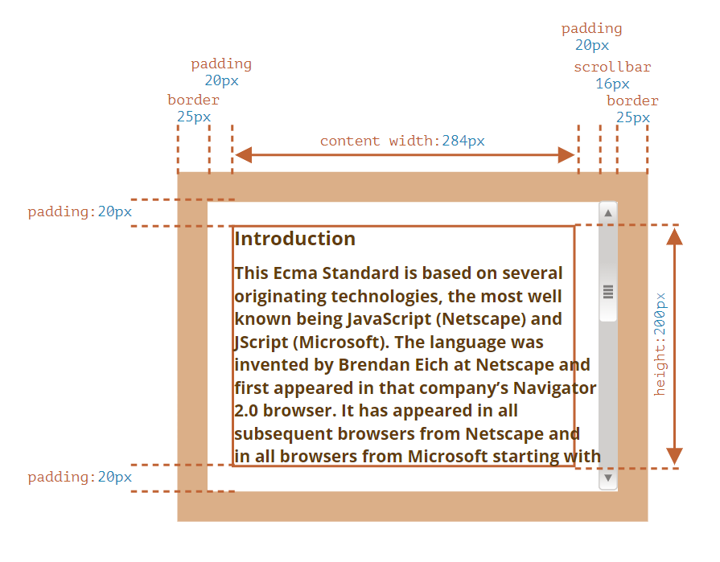
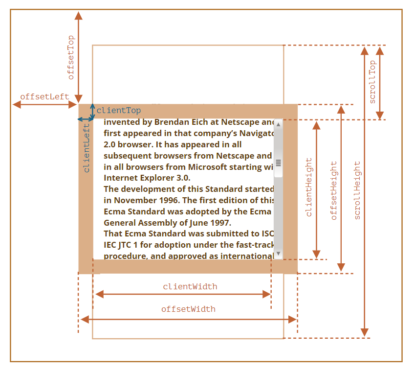
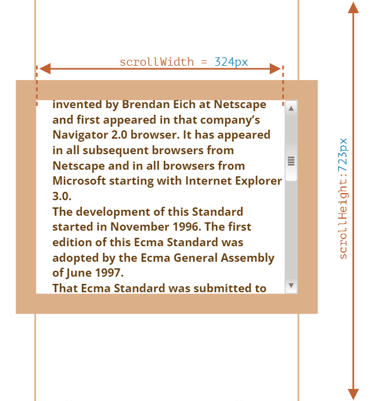

# ?Element size and scrolling

Существует множество JavaScript-свойств, которые позволяют считывать информацию об элементе: ширину, высоту и другие геометрические характеристики.

Они часто требуются, когда нам нужно передвигать или позиционировать элементы с помощью JavaScript.

В качестве простого примера демонстрации свойств мы будем использовать следующий элемент:

У элемента есть рамка (`border`), внутренний отступ (`padding`) и прокрутка. Полный набор характеристик. Обратите внимание, тут нет внешних отступов (`margin`), потому что они не являются частью элемента, для них нет особых JavaScript-свойств.

В иллюстрации выше намеренно продемонстрирован самый сложный и полный случай, когда у элемента есть ещё и полоса прокрутки. Некоторые браузеры (не все) отбирают место для неё, забирая его у области, отведённой для содержимого (помечена как `content width` выше).

Таким образом, без учёта полосы прокрутки ширина области содержимого (`content width`) будет `300px`, но если предположить, что ширина полосы прокрутки равна `16px` (её точное значение зависит от устройства и браузера), тогда остаётся только `284px`, и мы должны это учитывать.

Область `padding-bottom` (нижний внутренний отступ) может быть заполнена текстом.

Нижние внутренние отступы `padding-bottom` изображены пустыми на наших иллюстрациях, но если элемент содержит много текста, то он будет перекрывать `padding-bottom`, это нормально.

### Метрики

Вот общая картина с геометрическими свойствами:

Значениями свойств являются числа, подразумевается, что они в пикселях.

### `offsetParent`, `offsetLeft`/`Top`

В свойстве `offsetParent` находится предок элемента, который используется внутри браузера для вычисления координат при рендеринге.

То есть, ближайший предок, который является CSS-позиционированным (CSS-свойство `position` равно `absolute`, `relative`, `fixed` или `sticky`) или `<td>`, `<th>`, `<table>` или `<body>`.

Свойства `offsetLeft`/`offsetTop` содержат координаты `x`/`y` относительно верхнего левого угла `offsetParent`.

В примере ниже внутренний `
` имеет элемент `<main>` в качестве `offsetParent`, а свойства `offsetLeft`/`offsetTop` являются сдвигами относительно верхнего левого угла (`180`):

~~~
<main style="position: relative" id="main">
  <article>
    
...

  </article>
</main>

~~~

Существует несколько ситуаций, когда `offsetParent` равно `null`:

* Для скрытых элементов (с CSS-свойством `display: none` или когда его нет в документе).
* Для элементов `<body>` и `<html>`.
* Для элементов с `position: fixed`.

### `offsetWidth`/`Height`

Теперь переходим к самому элементу.

Эти два свойства – самые простые. Они содержат «внешнюю» ширину/высоту элемента, то есть его полный размер, включая рамки.

##### Метрики для не показываемых элементов равны нулю.

Координаты и размеры в JavaScript устанавливаются только для видимых элементов.

Если элемент (или любой его родитель) имеет `display: none` или отсутствует в документе, то все его метрики равны нулю (или `null`, если это `offsetParent`).

Например, свойство `offsetParent` равно `null`, а `offsetWidth` и `offsetHeight` равны `0`, когда мы создали элемент, но ещё не вставили его в документ, или если у элемента (или у его родителя) `display: none`.

Мы можем использовать это, чтобы делать проверку на видимость:

~~~
function isHidden(elem) {
  return !elem.offsetWidth && !elem.offsetHeight;
}
~~~

Заметим, что функция `isHidden` также вернёт `true` для элементов, которые в принципе показываются, но их размеры равны нулю (например, пустые `
`).

### `clientTop`/`Left`

Внутри элемента у нас рамки (`border`).

Для них есть свойства-метрики `clientTop` и `clientLeft`.

…Но на самом деле эти свойства – вовсе не ширины рамок, а отступы внутренней части элемента от внешней.

В чём же разница?

Она возникает, когда документ располагается справа налево (операционная система на арабском языке или иврите). Полоса прокрутки в этом случае находится слева, и тогда свойство `clientLeft` включает в себя ещё и ширину полосы прокрутки.

### `clientWidth`/`Height`

Эти свойства – размер области внутри рамок элемента.

Они включают в себя ширину области содержимого вместе с внутренними отступами `padding`, но без прокрутки.

### `scrollWidth`/`Height`

Эти свойства – как clientWidth/clientHeight, но также включают в себя прокрученную (которую не видно) часть элемента.

Таким кодом можно распахнуть элемент на всю высоту:

~~~
element.style.height = `${element.scrollHeight}px`;
~~~

### `scrollLeft`/`scrollTop`

Свойства `scrollLeft`/`scrollTop` – ширина/высота невидимой, прокрученной в данный момент, части элемента слева и сверху.

Другими словами, свойство `scrollTop` – это «сколько уже прокручено вверх».

Свойства `scrollLeft`/`scrollTop` можно изменять.

В отличие от большинства свойств, которые доступны только для чтения, значения `scrollLeft`/`scrollTop` можно изменять, и браузер выполнит прокрутку элемента.

~~~

  The picture above demonstrates the most complex case when the element has a scrollbar. Some browsers (not all)
  reserve the space for it by taking it from the content (labeled as “content width” above).

~~~

Установка значения `scrollTop` на `0` или на большое значение, такое как `1e9`, прокрутит элемент в самый верх/низ соответственно.

### Не стоит брать `width`/`height` из CSS

CSS-высоту и ширину можно извлечь, используя `getComputedStyle`.

Так почему бы не получать, к примеру, ширину элемента при помощи `getComputedStyle`?

Почему мы должны использовать свойства-метрики вместо этого? На то есть две причины:

1. Во-первых, CSS-свойства `width`/`height` зависят от другого свойства – `box-sizing`, которое определяет, «что такое», собственно, эти CSS-ширина и высота. Получается, что изменение `box-sizing`, к примеру, для более удобной вёрстки, сломает такой JavaScript.

2. Во-вторых, CSS свойства `width`/`height` могут быть равны `auto`, например, для инлайнового элемента:

~~~
Привет!

~~~

Конечно, с точки зрения CSS `width: auto` – совершенно нормально, но нам-то в JavaScript нужен конкретный размер в `px`, который мы могли бы использовать для вычислений. Получается, что в данном случае ширина из CSS вообще бесполезна.

Есть и ещё одна причина: полоса прокрутки. Бывает, без полосы прокрутки код работает прекрасно, но стоит ей появиться, как начинают проявляться баги. Так происходит потому, что полоса прокрутки «отъедает» место от области внутреннего содержимого в некоторых браузерах. Таким образом, реальная ширина содержимого меньше CSS-ширины. Как раз это и учитывают свойства `clientWidth`/`clientHeight`.

…Но с `getComputedStyle(elem).width` ситуация иная. Некоторые браузеры (например, Chrome) возвращают реальную внутреннюю ширину с вычетом ширины полосы прокрутки, а некоторые (например, Firefox) – именно CSS-свойство (игнорируя полосу прокрутки). Эти кроссбраузерные отличия – ещё один повод не использовать `getComputedStyle`, а использовать свойства-метрики.

~~~

  The picture above demonstrates the most complex case when the element has a scrollbar. Some browsers (not all)
  reserve the space for it by taking it from the content (labeled as “content width” above).

~~~

Описанные различия касаются только чтения свойства `getComputedStyle(...).width` из JavaScript, визуальное отображение корректно в обоих случаях.
