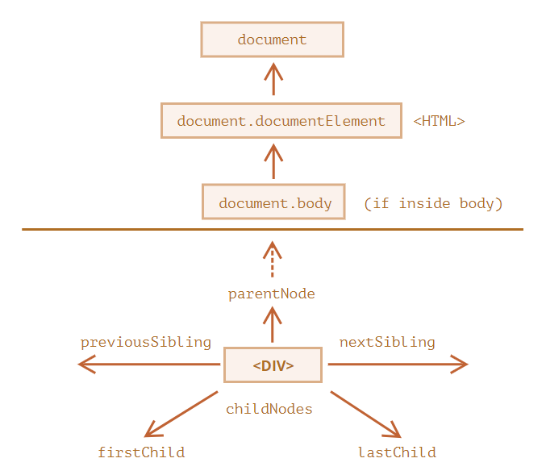
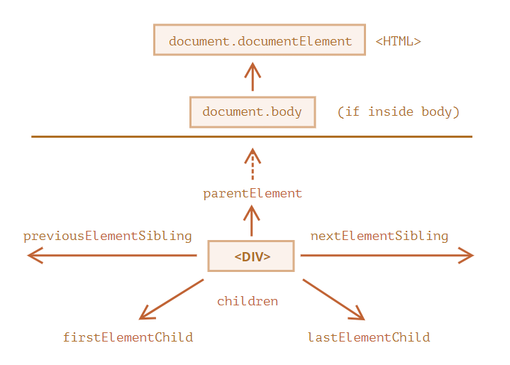

# ?Navigating the DOM

Все операции с DOM начинаются с объекта `document`. Это главная «точка входа» в DOM. Из него мы можем получить доступ к любому узлу.

Так выглядят основные ссылки, по которым можно переходить между узлами DOM:

Самые верхние элементы дерева доступны как свойства объекта `document`:

* `<html> = document.documentElement`
Самый верхний узел документа: `document.documentElement`. В DOM он соответствует тегу `<html>`.
* `<body> = document.body`
Другой часто используемый DOM-узел – узел тега `<body>`: `document.body`.
* `<head> = document.head`
Тег `<head>` доступен как `document.head`

> Есть одна тонкость: `document.body` может быть равен `null`. Нельзя получить доступ к элементу, которого ещё не существует в момент выполнения скрипта.

Здесь и далее мы будем использовать два принципиально разных термина:

* __Дочерние узлы (или дети)__ – элементы, которые являются непосредственными детьми узла. Другими словами, элементы, которые лежат непосредственно внутри данного. Например, `<head>` и `<body>` являются детьми элемента `<html>`.
* __Потомки__ – все элементы, которые лежат внутри данного, включая детей, их детей и т.д.

Коллекция `childNodes` содержит список всех детей, включая текстовые узлы.

`childNodes` похож на массив. На самом деле это не массив, а коллекция – особый перебираемый объект-псевдомассив. Для перебора коллекции мы можем использовать `for..of`.

Свойства `firstChild` и `lastChild` обеспечивают быстрый доступ к первому и последнему дочернему элементу.

~~~
console.log(elem.childNodes[0] === elem.firstChild); // true
console.log(elem.childNodes[elem.childNodes.length - 1] === elem.lastChild); // true
~~~

Для проверки наличия дочерних узлов существует также специальная функция `elem.hasChildNodes()`.

##### DOM-коллекции, и даже более – все навигационные свойства, доступны только для чтения.

Почти все DOM-коллекции, за небольшим исключением, живые. Другими словами, они отражают текущее состояние DOM.

Если мы сохраним ссылку на `elem.childNodes` и добавим/удалим узлы в DOM, то они появятся в сохранённой коллекции автоматически.

~~~
const nodes = elem.childNodes;
const div = document.createElement("div");
elem.append(div);
console.log(nodes); // [text, p, text, div]
~~~

Соседи – это узлы, у которых один и тот же родитель:

~~~
console.log(document.head.nextSibling === document.body); // true
~~~

Родитель доступен через `parentNode`:

~~~
console.log(document.body.parentNode === document.documentElement); // выведет true
~~~

### Навигация только по элементам

Навигационные свойства, описанные выше, относятся ко всем узлам в документе. В частности, в `childNodes` находятся и текстовые узлы и узлы-элементы и узлы-комментарии, если они есть.

Поэтому давайте рассмотрим дополнительный набор ссылок, которые учитывают только узлы-элементы:

Эти ссылки похожи на те, что раньше, только в ряде мест стоит слово `Element`.

Зачем нужен `parentElement`? Разве может родитель быть не элементом?

Свойство `parentElement` возвращает родитель-элемент, а `parentNode` возвращает «любого родителя». Обычно эти свойства одинаковы: они оба получают родителя.

За исключением `document.documentElement`:

~~~
console.log(document.documentElement.parentNode); // document
console.log(document.documentElement.parentElement); // null
~~~

`document` – это не узел-элемент, так что `parentNode` вернёт его, а `parentElement` нет.

### Ещё немного ссылок: таблицы

Некоторые типы DOM-элементов предоставляют для удобства дополнительные свойства, специфичные для их типа.

Таблицы – отличный пример таких элементов.

`table.rows` – коллекция строк `<tr>` таблицы.
`table.caption`/`tHead`/`tFoot` – ссылки на элементы таблицы `<caption>`, `<thead>`, `<tfoot>`.
`table.tBodies` – коллекция элементов таблицы `<tbody>` (по спецификации их может быть больше одного).

`thead.rows` – коллекция строк `<tr>` секции.
`tbody.rows` – коллекция строк `<tr>` секции.
`tfoot.rows` – коллекция строк `<tr>` секции.

`tr.cells` – коллекция `<td>` и `<th>` ячеек, находящихся внутри строки `<tr>`.
`tr.sectionRowIndex` – номер строки `<tr>` в текущей секции `<thead>`/`<tbody>`/`<tfoot>`.
`tr.rowIndex` – номер строки `<tr>` в таблице (включая все строки таблицы).

`td.cellIndex` – номер ячейки в строке `<tr>`.
`th.cellIndex` – номер ячейки в строке `<tr>`.

index.html
~~~
<table id="table">
  <tr>
    <th id="th">one</th>
    <th>two</th>
  </tr>
  <tr id="tr">
    <td>three</td>
    <td>four</td>
  </tr>
</table>
~~~

script.js
~~~
console.log(table.rows); // [tr, tr#tr, tr: tr#tr]
console.log(table.caption); // null
console.log(table.tHead); // null
console.log(table.tFood); // undefined
console.log(table.tBodies); // [tbody]

console.log(tr.cells); // [td, td]
console.log(tr.sectionRowIndex); // 1
console.log(tr.rowIndex); // 1

console.log(th.cellIndex); // 0
~~~
