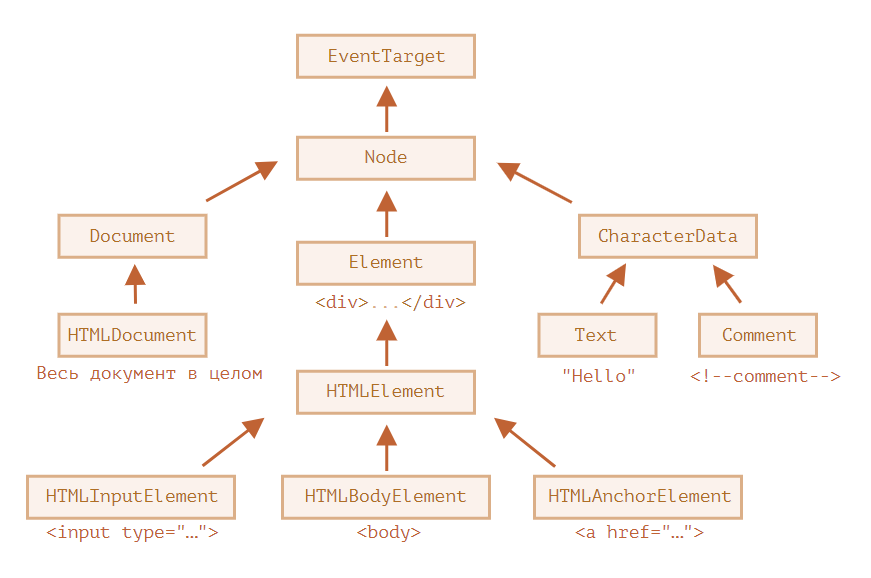

# ?Node properties: type, tag and contents

### Классы DOM-узлов

Каждый DOM-узел принадлежит определённому классу. Классы формируют иерархию. Весь набор свойств и методов является результатом наследования.

Корнем иерархии является `EventTarget`, от него наследует `Node` и остальные DOM-узлы.

Существуют следующие классы:

* `EventTarget` – это корневой «абстрактный» класс для всего.

Объекты этого класса никогда не создаются. Он служит основой, благодаря которой все DOM-узлы поддерживают «события».

* `Node` – также является «абстрактным» классом, и служит основой для DOM-узлов.

Он обеспечивает базовую функциональность: `parentNode`, `nextSibling`, `childNodes` и т.д. (это геттеры). Объекты класса `Node` никогда не создаются. Но есть определённые классы узлов, которые наследуются от него (и следовательно наследуют функционал `Node`).

* `Document`, по историческим причинам часто наследуется `HTMLDocument` (хотя последняя спецификация этого не навязывает) – это документ в целом.

Глобальный объект `document` принадлежит именно к этому классу. Он служит точкой входа в DOM.

* `CharacterData` – «абстрактный» класс. Вот, кем он наследуется:
  * `Text` – класс, соответствующий тексту внутри элементов. Например, `Hello` в `
Hello
`.
  * `Comment` – класс для комментариев. Они не отображаются, но каждый комментарий становится членом DOM.

* `Element` – это базовый класс для DOM-элементов.

Он обеспечивает навигацию на уровне элементов: `nextElementSibling`, `children`. А также и методы поиска элементов: `getElementsByTagName`, `querySelector`.

От него наследуются конкретные элементы (`HTMLInputElement`, `HTMLBodyElement`, `HTMLAnchorElement` и т.д.).

Для того, чтобы узнать имя класса DOM-узла, вспомним, что обычно у объекта есть свойство constructor. Оно ссылается на конструктор класса, и в свойстве constructor.name содержится его имя:

~~~
console.log(document.body.constructor.name); // HTMLBodyElement
~~~

Проверить наследование можно также при помощи `instanceof`:

~~~
console.log(document.body instanceof HTMLBodyElement); // true
console.log(document.body instanceof HTMLElement); // true
console.log(document.body instanceof Element); // true
console.log(document.body instanceof Node); // true
console.log(document.body instanceof EventTarget); // true
~~~

Как видно, DOM-узлы – это обычные JavaScript объекты. Для наследования они используют классы, основанные на прототипах.

В этом легко убедиться, если вывести в консоли браузера любой элемент через `console.dir(elem)`.

> `console.dir(elem)` выводит элемент в виде DOM-объекта, что удобно для анализа его свойств.

### Свойство `nodeType`

Свойство `nodeType` предоставляет ещё один, «старомодный» способ узнать «тип» DOM-узла.

Его значением является цифра:

* `elem.nodeType == 1` для узлов-элементов
* `elem.nodeType == 3` для текстовых узлов
* `elem.nodeType == 9` для объектов документа

~~~
console.log(document.body.nodeType); // 1
~~~

#### Тег: `nodeName` и `tagName`

Получив DOM-узел, мы можем узнать имя его тега из свойств `nodeName` и `tagName`:

~~~
console.log(document.body.nodeName); // BODY
console.log(document.body.tagName); // BODY
~~~

Свойство `tagName` есть только у узлов-элементов (поскольку они происходят от класса `Element`), а `nodeName` может что-то сказать о других типах узлов.

~~~
console.log(document.body.firstChild.tagName); // undefined (не элемент)
console.log(document.body.firstChild.nodeName); // #text

console.log(document.tagName); // undefined (не элемент)
console.log(document.nodeName); // #document
~~~

> В HTML-режиме значения `tagName`/`nodeName` всегда записаны в верхнем регистре. Будет выведено `BODY` вне зависимости от того, как записан тег в HTML `<body>` или `<BoDy>`.

### `innerHTML`: содержимое элемента

Свойство `innerHTML` позволяет получить HTML-содержимое элемента в виде строки.

Мы также можем изменять его.

~~~

Параграф

~~~

Если `innerHTML` вставляет в документ тег `
~~~

На практике этим следует пользоваться с большой осторожностью, так как фактически происходит не добавление, а перезапись.

Так как содержимое «обнуляется» и переписывается заново, все изображения и другие ресурсы будут перезагружены.

Например, если существующий текст выделен мышкой, то при переписывании `innerHTML` большинство браузеров снимут выделение.

### `outerHTML`: HTML элемента целиком

Свойство `outerHTML` содержит HTML элемента целиком. Это как `innerHTML` плюс сам элемент.

Будьте осторожны: в отличие от `innerHTML`, запись в `outerHTML` не изменяет элемент. Вместо этого элемент заменяется целиком во внешнем контексте.

~~~

Привет, мир!

~~~

При `div.outerHTML=...` произошло следующее:

* `div` был удалён из документа.
* Вместо него был вставлен другой HTML `
Новый элемент
`.
* В переменной `div` осталось старое значение. Новый HTML не сохранён ни в какой переменной.

### `nodeValue`/`data`: содержимое текстового узла

Свойство `innerHTML` есть только у узлов-элементов.

У других типов узлов, в частности, у текстовых, есть свои аналоги: свойства `nodeValue` и `data`.

~~~
Привет
<!-- Комментарий -->

~~~

### `textContent`: просто текст

Свойство `textContent` предоставляет доступ к тексту внутри элемента за вычетом всех <тегов>.

Представим, что у нас есть произвольная строка, введённая пользователем, и мы хотим показать её.

* С `innerHTML` вставка происходит «как HTML», со всеми HTML-тегами.
* С `textContent` вставка получается «как текст», все символы трактуются буквально.

Сравним два тега `div`:

~~~

~~~

В большинстве случаев мы рассчитываем получить от пользователя текст и хотим, чтобы он интерпретировался как текст. Мы не хотим, чтобы на сайте появлялся произвольный HTML-код. Присваивание через `textContent` – один из способов от этого защититься.

### Свойство `hidden`

Атрибут и DOM-свойство `hidden` указывает на то, видим ли мы элемент или нет.

Технически, `hidden` работает так же, как `style="display:none"`. Но его применение проще.

Мигающий элемент:

~~~

Мигающий элемент

~~~

### Другие свойства

У DOM-элементов есть дополнительные свойства, в частности, зависящие от класса:

* `value` – значение для `<input>`, `<select>` и `<textarea>` (`HTMLInputElement`, `HTMLSelectElement`…).
* `href` – адрес ссылки `href` для `<a href="...">` (`HTMLAnchorElement`).
* `id` – значение атрибута `id` для всех элементов (`HTMLElement`).
* …и многие другие…

~~~
<label>Text
  <input type="text" id="elem" value="значение">
</label>

~~~

Большинство стандартных HTML-атрибутов имеют соответствующее DOM-свойство, и мы можем получить к нему доступ.
