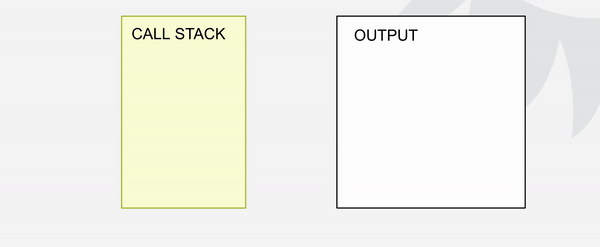

# ?Event loop

### Как выполняется код JavaScript?

JavaScript это однопоточный язык программирования, но также он является одновременно компилируемым и интерпретируемым языком.

> Интерпретатор сразу начинает выполнение кода, но не выполняет оптимизацию. Компилятору требуется время для компиляции кода, однако он выдает более оптимизированный код.

Как так?

Дело в том, что JavaScript компилируется JavaScript-движком за несколько микросекунд до исполнения. Это называется _JIT_ (_Just in time compilation_). 

> JIT представляет собой комбинацию интерпретатора и компилятора, и большинство браузеров теперь реализуют эту функцию для повышения эффективности. Движок V8 также использует эту функцию.

> JIT использует лучшие качества интерпретатора и компилятора. Интерпретатор выполняет код, в то время как профайлер ищет оптимизацию, а компилятор создает оптимизированный код. Затем байт-код заменяется оптимизированным кодом, который является кодом более низкого уровня, таким как машинный код.

И да, JavaScript код компилируется не браузером, а JS-движком, который в каждом браузере свой. Самым популярным движком является V8, который есть в Google Chrome и Node.js, также есть и другие — например, SpiderMonkey в Firefox, JavaScriptCore в Safari.

Поскольку V8 (Google Chrome) самый популярный, то на его примере мы дальше и рассмотрим выполнение кода JavaScript.

Движок V8 содержит 2 основные части:

1. Глобальная память (её ещё называют "куча") (Memory Heap)
2. Стек вызовов (Call Stack)

_Глобальная память_ — это большая неструктурированная область памяти, в которой движок хранит наши переменные и объявленные функции. Короче говоря, это просто большая "куча" с разными данными без какой-либо структуры.

_Стек вызовов_ — это место, где JS — код считывается и выполняется строка за строкой.

Давайте теперь перейдем к простому примеру и посмотрим на следующий код:

~~~
let value = 5;

function sum(num) {
  return num + num;
}
~~~

Как обрабатывается этот код?

__Фаза создания__: наш код считывается движком, и как только он определяет первую строку, то кладёт ссылки в глобальную память, т.е. он создаёт в глобальной памяти разделы для нашей функции и переменной. И когда он прочитает приведённый выше код, то в глобальной памяти появятся соответствующие части.

> Так как JS исполняется в некой среде — браузере или Node.js. В таких средах есть много заранее существующих функций и переменных, которые называются глобальными. Поэтому глобальная память будет содержать гораздо больше данных, чем просто переменную `value` и `sum`.

А теперь вызовем функцию. Что произойдет?

~~~
let value = 5;

function sum(num) {
  return num + num;
}

sum(value);
~~~

__Фаза выполнения:__

Движок добавляет функцию в call stack и исполняет код в ней.

В call stack элементы могут добавляться сверху. В call stack при исполнении добавляются наши функции и они не могут покинуть стек, пока над ними есть другие функции. (First In Last Out — первый пришел, последний ушел).

Давайте посмотри ещё вот на такой пример:

~~~
console.log("Print 1");
console.log("Print 2");
console.log("Print 3");
~~~

Что будет происходить тут?

1. Движок читает первую строку, первая функция попадает в стек и начинается её выполнение.
2. Когда функция выполнится, то в консоль будет выведена строка `"Print 1"`.
3. Затем функция покинет стек (т.к. в стеке над ней больше не было других функций и она выполнила всё что должна).

Далее, все предыдущие 3 шага будут повторяться для других функций.

Это подтверждает то, что JavaScript является однопоточным, потому что наши функции обрабатывает лишь один стек вызовов.

Давайте посмотрим на пример посложнее:

~~~
function third(str) {
  return str + " Morgan";
}

function second() {
  return third("Dexter");
}

function first() {
  const name = second();
  console.log("My name is " + name);
}

first();
// My name is Dexter Morgan
~~~

Как будет обрабатываться этот пример?

На данном примере хорошо видно как функция после попадания в call stack (стек вызовов) не может его покинуть, пока исполнения ожидают другие функции.

Потому что стек организован по принципу First In Last Out — первый пришел, последний ушел (или можно сформулировать наоборот — Last in First out (LIFO) последний пришел, первый ушел).

Отлично, теперь мы знаем как выполняется синхронный код в JavaScript и как работает call stack. И убедились на примерах, что JavaScript — это однопоточный язык, т.к. одновременно может выполняться только одна задача.

### Асинхронность и Event Loop

Теперь представьте, что вы запускаете задачу, которая занимает 30 секунд…

Да. Во время этой задачи мы ждем 30 секунд, прежде чем что-либо еще может произойти (по умолчанию JavaScript запускается в главном потоке браузера, поэтому весь пользовательский интерфейс будет ждать).

Например, наш пользователь может выполнять какие-то действия на странице, т.е. он видит элементы управления, кнопки и т. д. — может на них нажимать. И если у нас программа не выполняется, то соответственно он ничего сделать не может и ничего не происходит.

К счастью, браузер предоставляет нам некоторые функции, которые сам механизм (движок) JavaScript не предоставляет — это Web API. Коллекция удобных инструментов, которая включает в себя DOM API, `setTimeout`, HTTP-запросы и так далее. Это помогает нам создать асинхронное неблокирующее поведение.

И поэтому наш полный комплект выглядит вот так:

"Кучу" и call stack мы уже знаем; тут добавилось к нам Web API браузера и ещё 2 важных элемента — callback queue (очередь обратных вызовов) и event loop (цикл событий).

Что каждый из них делает и зачем они нам нужны мы сейчас с вами разберем вот на таком примере:

~~~
let value = 2;

function sum(num) {
  return num + num;
}

sum(value);

setTimeout(callback, 10000);

function callback() {
  console.log("Hello, timer!");
}
~~~

По сути, `setTimeout` является частью Web API — коллекции удобных инструментов, которые нам предоставляет браузер.

Чудесно! Но что это означает на практике?

Поскольку `setTimeout` относится к браузерным API (Web API), эта функция исполняется самим браузером (на мгновение она появляется в стеке вызовов, но сразу оттуда удаляется).

Поэтому в нашем примере, когда браузер дойдет до функции `setTimeout`, она сразу покинет стек и будет выполняться самим браузером.

И после 10 секунд (10 000 миллисекунд) браузер возьмёт `callback` функцию которую мы ему передали и передаст в очередь обратных вызовов (callback queue).

_Callback queue_ — это структура данных в виде очереди, и, как видно из названия, представляет собой упорядоченную очередь из функций (callbacks).

Каждая асинхронная функция должна пройти через очередь обратных вызовов, прежде чем попасть в стек вызовов.

Но кто отправляет функции дальше? Это делает компонент под названием цикл событий (event loop).

Пока что цикл событий занимается только одним: проверяет, пуст ли стек вызовов. Если в очереди обратных вызовов есть какая-нибудь функция и если стек вызовов свободен, тогда пора отправлять callback в стек вызовов.

Пример выше можно продемонстрировать вот таким образом:

1. На первом этапе наш код считывается движком и все объявленные функции и переменные помещаются в глобальную память. (Фаза создания)
2. Далее, начинается выполнение кода (Фаза выполнения) — первый вызов функции `sum(val)`, тут синхронная операция — простое сложение 2-х чисел.
3. Затем обрабатывается вызов `setTimeout`. Callback который мы передали в `setTimeout` добавляется в Web API, функция `setTimeout` извлекается из стека вызовов.
4. Таймер запускается. Когда отсчёт завершится — пройдет 10 секунд и функция `callback` добавится в очередь.
5. Цикл обработки событий видит, что call stack пуст, после чего колбэк добавляется в стек вызовов.
6. Callback вызывает `console.log` и выполнение кода завершается.

### Макротаски

Неужели всё так просто?

Да, но в реальных условиях обстоит немного иначе.

Сама идея цикла событий очень проста. Есть бесконечный цикл, в котором движок JavaScript ожидает задачи, исполняет их и снова ожидает появления новых.

Но что касается самих задач, то они бывают разные:

Примеры задач:

* Когда загружается внешний скрипт` <script src="…">`, то задача — это выполнение этого скрипта.
* Когда пользователь двигает мышь, задача — сгенерировать событие `mousemove` и выполнить его обработчики.
* Когда истечёт таймер, установленный с помощью `setTimeout(func, …)`, задача — это выполнение функции `func`.
* И так далее.

Задачи поступают на выполнение — движок выполняет их — затем ожидает новые задачи (во время ожидания практически не нагружая процессор компьютера).

Может так случиться, что задача поступает, когда движок занят чем-то другим, тогда она ставится в очередь.

Очередь, которую формируют такие задачи, называют «очередью макрозадач» (macrotask queue, термин v8).

И как мы знаем, задачи из очереди исполняются по правилу «первым пришёл — первым ушёл». Когда браузер заканчивает выполнение скрипта, он обрабатывает событие mousemove, затем выполняет обработчик, заданный `setTimeout`, и так далее.

Пока что всё просто, не правда ли?

Отметим две детали:

1. Рендеринг (отрисовка страницы) никогда не происходит во время выполнения задачи движком. Не имеет значения, сколь долго выполняется задача. Изменения в DOM отрисовываются только после того, как задача выполнена.
2. Если задача выполняется очень долго, то браузер не может выполнять другие задачи, обрабатывать пользовательские события, поэтому спустя некоторое время браузер предлагает «убить» долго выполняющуюся задачу. Такое возможно, когда в скрипте много сложных вычислений или ошибка, ведущая к бесконечному циклу.

Давайте посмотрим вот на этот пример:

~~~
function main() {
  console.log("A");
  setTimeout(function exec() {
    console.log("B");
  }, 0);
  console.log("C");
}

main();
~~~

Здесь мы видим функцию `main`, включающую в себя два `console.log`, выводящих в консоль `A` и `C`. Между ними находится `setTimeout`, вызов которого выведет в консоль `B` после ожидания в `0` секунд.

Вот что происходит внутри во время исполнения (знакомая уже нам схема):

После выполнения последнего выражения функции `main`, элемент `main` удаляется из стека вызовов (call stack), оставляя его пустым. Стек вызовов должен быть пустым, для того чтобы браузер поместил в него элемент из callback queue. Именно по этой причине даже если в `setTimeout` указано время ожидания в `0` секунд, функция `exec()` не выполняется, пока не закончится выполнение всех элементов в стеке вызовов.

Таким образом аргумент `delay` в `setTimeout(function, delayTime)` не означает точное время задержки, после которого функция выполнится. Он означает минимальное время ожидания, после которого в какой-нибудь момент времени, функция будет вызвана.

### Микротаски

Помимо макрозадач, существуют микрозадачи.

Микрозадачи приходят только из кода. Обычно они создаются промисами: выполнение обработчика `.then`/`.catch`/`.finally` становится микрозадачей. Микрозадачи также используются «под капотом» `await`, т.к. это форма обработки промиса.

Обработчики промисов `.then`/`.catch`/`.finally` всегда асинхронны.

Даже когда промис сразу же выполнен, код в строках ниже `.then`/`.catch`/`.finally` будет запущен до этих обработчиков.

~~~
const promise = Promise.resolve();
promise.then(() => console.log("Promise"));

console.log("Code");
// Code
// Promise
~~~

Асинхронные задачи требуют правильного управления. Для этого стандарт предусматривает внутреннюю очередь, известную как «очередь микрозадач (microtask queue)» (термин V8).

Как сказано в спецификации:

* Очередь определяется как первым-пришёл-первым-ушёл (FIFO): задачи, попавшие в очередь первыми, выполняются тоже первыми.
* Выполнение задачи происходит только в том случае, если ничего больше не запущено.

Или, проще говоря, когда промис выполнен, его обработчики `.then`/`.catch`/`.finally` попадают в очередь. Они пока не выполняются. Движок JavaScript берёт задачу из очереди и выполняет её, когда он освободится от выполнения текущего кода.

Вот почему сообщение «код выполнен» в примере выше будет показано первым.

Обработчики промисов всегда проходят через эту внутреннюю очередь.

Если есть цепочка с несколькими `.then`/`.catch`/`.finally`, то каждый из них выполняется асинхронно. То есть сначала ставится в очередь, а потом выполняется, когда выполнение текущего кода завершено и добавленные ранее в очередь обработчики выполнены.

Но что если порядок имеет значение для нас? Как мы можем вывести `"Code"` после `"Promise"`?

Легко, используя `.then`:

~~~
Promise.resolve()
  .then(() => console.log("Promise"))
  .then(() => console.log("Code"));

// Promise
// Code
~~~

Теперь мы можем описать, как именно JavaScript понимает, что ошибка не обработана.

"Необработанная ошибка" возникает в случае, если ошибка промиса не обрабатывается в конце очереди микрозадач.

Обычно, если мы ожидаем ошибку, мы добавляем `.catch` в конец цепочки промисов, чтобы обработать её:

~~~
const promise = Promise.reject(new Error("Ошибка в промисе!"));
promise.catch((err) => console.log("Поймана!"));

// не запустится, ошибка обработана
window.addEventListener("unhandledrejection", (event) => {
  console.log(event.reason);
});
~~~

…Но если мы забудем добавить `.catch`, то, когда очередь микрозадач опустеет, движок сгенерирует событие:

~~~
const promise = Promise.reject(new Error("Ошибка в промисе!"));

// Ошибка в промисе!
window.addEventListener("unhandledrejection", (event) =>
  console.log(event.reason)
);
~~~

А что, если мы поймаем ошибку, но позже? Вот так:

~~~
const promise = Promise.reject(new Error("Ошибка в промисе!"));

setTimeout(() => promise.catch((err) => console.log("Поймана")), 1000);

// Ошибка в промисе!
window.addEventListener("unhandledrejection", (event) =>
  console.log(event.reason)
);
~~~

Теперь, при запуске, мы сначала увидим `"Ошибка в промисе!"`, а затем `"Поймана"`.

Если бы мы не знали про очередь микрозадач, то могли бы удивиться: «Почему сработал обработчик `unhandledrejection`? Мы же поймали ошибку!».

Но теперь мы понимаем, что событие `unhandledrejection` возникает, когда очередь микрозадач завершена: движок проверяет все промисы и, если какой-либо из них в состоянии `rejected`, то генерируется это событие.

В примере выше `.catch`, добавленный в `setTimeout`, также срабатывает, но позже, уже после возникновения `unhandledrejection`.

##### Сразу после каждой макрозадачи движок исполняет все задачи из очереди микрозадач перед тем, как выполнить следующую макрозадачу или отобразить изменения на странице, или сделать что-то ещё.

Давайте рассмотрим вот этот пример:

~~~
setTimeout(() => console.log(1), 0);

const promise = Promise.resolve()
  .then(() => console.log(2))
  .finally(() => console.log(3));

console.log(4);

promise.then(() => console.log(5));
~~~

Какой здесь будет порядок?

1. Цифра `4` появляется первой, т.к. это обычный синхронный вызов `console.log`.
2. Цифра `2` появляется второй, потому что `.then` проходит через очередь микрозадач и выполняется после текущего синхронного кода.
3. Затем цифра `3`, а потом уже цифра `5`, потому что второй `.then` появился в очереди позже.
4. И цифра `1` появляется последней, потому что это макрозадача.

##### Все микрозадачи завершаются до обработки каких-либо событий или рендеринга, или перехода к другой макрозадаче.

Это важно, так как гарантирует, что общее окружение остаётся одним и тем же между микрозадачами – не изменены координаты мыши, не получены новые данные по сети и т.п.

Если мы хотим запустить функцию асинхронно (после текущего кода), но до отображения изменений и до новых событий, то можем запланировать это через `queueMicrotask`.

Специальная функция `queueMicrotask(func)` помещает `func` в очередь микрозадач.

`queueMicrotask()`:

* Принимает функцию, которая будет передана в очередь микрозадач.
* Возвращает `undefined`.

~~~
setTimeout(() => {
  console.log("Хэй, я выполнюсь асинхронно благодаря setTimeout");
}, 0);

queueMicrotask(() => {
  console.log("Хэй, я выполнюсь асинхронно!");
});

console.log("Хэй");
// Хэй
// Хэй, я выполнюсь асинхронно!
// Хэй, я выполнюсь асинхронно благодаря setTimeout
~~~

> Предупреждение: поскольку микрозадачи сами по себе могут ставить в очередь новые микрозадачи, а цикл событий продолжает обрабатывать микрозадачи до тех пор, пока очередь не опустеет, существует реальный риск того, что цикл событий будет бесконечно обрабатывать микрозадачи. Будьте осторожны с рекурсивным добавлением микрозадач.

### Рендеринг

_Рендеринг_ является частью цикла событий. Рендеринг происходит в конце текущей итерации цикла событий (каждая итерация цикла событий также называется тактом цикла событий).

И это происходит только тогда, когда это необходимо, т.е. когда пришло время отрисовать новый кадр - после интервала ~16 мс для дисплея с частотой 60 герц.

Хотя браузеру, возможно, придется пропустить рендеринг некоторых кадров, если фазы перед рендерингом занимают много времени.

Если мы хотим запустить что-то непосредственно перед рендерингом кадра, мы можем использовать `requestAnimationFrame`. 

Если мы вызываем `requestAnimationFrame` несколько раз перед рендерингом кадра, то все переданные обратные вызовы ставятся в очередь, и все они выполняются до рендеринга кадра.

Важно отметить, что новые обратные вызовы `requestAnimationFrame`, поставленные в очередь, не запускаются в этом такте цикла событий (потому что мы зациклились только на текущих задачах и не используем новые). Новые ставятся в очередь на следующий раз, когда нам нужно отрендерить следующий кадр.

~~~
function logTimeout(number, callback) {
  setTimeout(function () {
    callback(`Timeout ${number}`);
  }, 0);
}

function logPromise(number) {
  return Promise.resolve(`Promise ${number}`);
}

logPromise(1).then(console.log);
logPromise(2).then(console.log);

logTimeout(1, console.log);

requestAnimationFrame(function () {
  console.log("RequestAnimationFrame 1");
  requestAnimationFrame(function () {
    console.log("RequestAnimationFrame 3");
  });
});

requestAnimationFrame(function () {
  console.log("RequestAnimationFrame 2");
});

console.log("The end");

Вариант вывода в консоль:
// The end
// Promise 1
// Promise 2
// RequestAnimationFrame 1
// RequestAnimationFrame 2
// Timeout 1
// RequestAnimationFrame 3
~~~

Следующая важная вещь: __микрозадача также может выполняться между колбэками `requestAnimationFrame` для текущего кадра, аналогично нескольким колбэкам в макрозадаче.__

~~~
requestAnimationFrame(function () {
  console.log("RequestAnimationFrame 1");
  Promise.resolve(`Promise in rAF`).then(console.log);
});

requestAnimationFrame(function () {
  console.log("RequestAnimationFrame 2");
});

// RequestAnimationFrame 1
// Promise in rAF
// RequestAnimationFrame 2
~~~

JavaScript Visualizer 9000: https://www.jsv9000.app/
