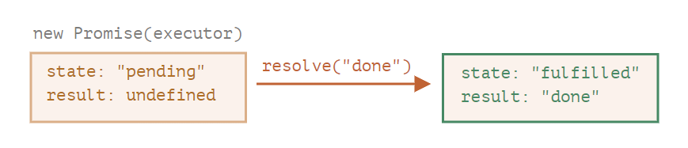
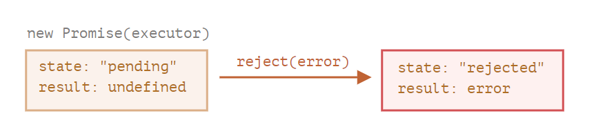

# ?Promises

Синтаксис создания `Promise`:

~~~
const promise = new Promise(function(resolve, reject) {
  // функция-исполнитель (executor)
});
~~~

Функция, переданная в конструкцию `new Promise`, называется исполнитель (`executor`). Когда `Promise` создаётся, она запускается автоматически. Она должна содержать «создающий» код, который когда-нибудь создаст результат.

Её аргументы `resolve` и `reject` – это колбэки, которые предоставляет сам JavaScript. Наш код – только внутри исполнителя.

Когда он получает результат, сейчас или позже – не важно, он должен вызвать один из этих колбэков:

* `resolve(value)` — если работа завершилась успешно, с результатом `value`.
* `reject(error)` — если произошла ошибка, `error` – объект ошибки.

У объекта `promise`, возвращаемого конструктором `new Promise`, есть внутренние свойства:

* `state` («состояние») — вначале `pending` («ожидание»), потом меняется на `fulfilled` («выполнено успешно») при вызове `resolve` или на `rejected` («выполнено с ошибкой») при вызове `reject`.
* `result` («результат») — вначале `undefined`, далее изменяется на `value` при вызове `resolve(value)` или на `error` при вызове `reject(error)`.

Ниже пример конструктора `Promise` и простого исполнителя с кодом, дающим результат с задержкой (через `setTimeout`):

~~~
const promise = new Promise(function(resolve, reject) {
  // эта функция выполнится автоматически, при вызове new Promise

  // через 1 секунду сигнализировать, что задача выполнена с результатом "done"
  setTimeout(() => resolve("done"), 1000);
});
~~~

Мы можем наблюдать две вещи, запустив код выше:

1. Функция-исполнитель запускается сразу же при вызове `new Promise`.
2. Исполнитель получает два аргумента: `resolve` и `reject` — это функции, встроенные в JavaScript, поэтому нам не нужно их писать. Нам нужно лишь позаботиться, чтобы исполнитель вызвал одну из них по готовности.

Спустя одну секунду «обработки» исполнитель вызовет `resolve("done")`, чтобы передать результат:

Это был пример успешно выполненной задачи, в результате мы получили «успешно выполненный» промис.

А теперь пример, в котором исполнитель сообщит, что задача выполнена с ошибкой:

~~~
const promise = new Promise(function (resolve, reject) {
  // спустя одну секунду будет сообщено, что задача выполнена с ошибкой
  setTimeout(() => reject(new Error("Whoops!")), 1000);
});
~~~

Подведём промежуточные итоги: исполнитель выполняет задачу (что-то, что обычно требует времени), затем вызывает `resolve` или `reject`, чтобы изменить состояние соответствующего `Promise`.

Промис – и успешный, и отклонённый будем называть «завершённым», в отличие от изначального промиса «в ожидании».

__Исполнитель должен вызвать что-то одно: `resolve` или `reject`.__ Состояние промиса может быть изменено только один раз.

Все последующие вызовы `resolve` и `reject` будут проигнорированы:

~~~
const promise = new Promise(function (resolve, reject) {
  resolve("done", "done again"); // второй аргумент игнорируется

  reject(new Error("…")); // игнорируется
  setTimeout(() => resolve("…")); // игнорируется
});
~~~

Идея в том, что задача, выполняемая исполнителем, может иметь только один итог: результат или ошибку.

Также заметим, что функция `resolve`/`reject` ожидает только один аргумент (или ни одного). Все дополнительные аргументы будут проигнорированы.

##### Вызывайте `reject` с объектом `Error`.

В случае, если что-то пошло не так, мы должны вызвать `reject`. Это можно сделать с аргументом любого типа (как и `resolve`), но рекомендуется использовать объект `Error` (или унаследованный от него).

> Обычно исполнитель делает что-то асинхронное и после этого вызывает `resolve`/`reject`, то есть через какое-то время. Но это не обязательно, `resolve` или `reject` могут быть вызваны сразу. Это может случиться, например, когда мы начали выполнять какую-то задачу, но тут же увидели, что ранее её уже выполняли, и результат закеширован. Такая ситуация нормальна. Мы сразу получим успешно завершённый `Promise`.

__Свойства `state` и `result` – это внутренние свойства объекта `Promise` и мы не имеем к ним прямого доступа.__ Для обработки результата следует использовать методы `.then`/`.catch`/`.finally`, про них речь пойдёт дальше.

### `then`, `catch`

Объект `Promise` служит связующим звеном между исполнителем и функциями-потребителями, которые получат либо результат, либо ошибку. Функции-потребители могут быть зарегистрированы с помощью методов `.then` и `.catch`.

#### `then`

Наиболее важный и фундаментальный метод – `.then`.

Синтаксис:

~~~
promise.then(
  function(result) { /* обработает успешное выполнение */ },
  function(error) { /* обработает ошибку */ }
);
~~~

Первый аргумент метода `.then` – функция, которая выполняется, когда промис переходит в состояние «выполнен успешно», и получает результат.

Второй аргумент `.then` – функция, которая выполняется, когда промис переходит в состояние «выполнен с ошибкой», и получает ошибку.

Например, вот реакция на успешно выполненный промис:

~~~
const promise = new Promise(function (resolve, reject) {
  setTimeout(() => resolve("done!"), 1000);
});

// resolve запустит первую функцию, переданную в .then
promise.then(
  (result) => console.log(result), // выведет "done!" через одну секунду
  (error) => console.log(error) // не будет запущена
);
~~~

Выполнилась первая функция.

А в случае ошибки в промисе – выполнится вторая:

~~~
const promise = new Promise(function (resolve, reject) {
  setTimeout(() => reject(new Error("Whoops!")), 1000);
});

// reject запустит вторую функцию, переданную в .then
promise.then(
  (result) => console.log(result), // не будет запущена
  (error) => console.log(error) // выведет "Error: Whoops!" спустя одну секунду
);
~~~

Если мы заинтересованы только в результате успешного выполнения задачи, то в `then` можно передать только одну функцию:

~~~
const promise = new Promise(resolve => {
  setTimeout(() => resolve("done!"), 1000);
});

promise.then(console.log); // выведет "done!" спустя одну секунду
~~~

#### `catch`

Если мы хотели бы только обработать ошибку, то можно использовать `null` в качестве первого аргумента: `.then(null, errorHandlingFunction)`. Или можно воспользоваться методом `.catch(errorHandlingFunction)`, который сделает то же самое:

~~~
const promise = new Promise((resolve, reject) => {
  setTimeout(() => reject(new Error("Ошибка!")), 1000);
});

// .catch(f) это то же самое, что promise.then(null, f)
promise.catch(console.log); // выведет "Error: Ошибка!" спустя одну секунду
~~~

Вызов `.catch(f)` – это сокращённый, «укороченный» вариант `.then(null, f)`.

#### `finally`

По аналогии с блоком `finally` из обычного `try {...} catch {...}`, у промисов также есть метод `finally`.

Вызов `.finally(f)` похож на `.then(f, f)`, в том смысле, что `f` выполнится в любом случае, когда промис завершится: успешно или с ошибкой.

Идея `finally` состоит в том, чтобы настроить обработчик для выполнения очистки/доведения после завершения предыдущих операций.

Например, остановка индикаторов загрузки, закрытие больше не нужных соединений и т.д.

Код может выглядеть следующим образом:

~~~
new Promise((resolve, reject) => {
  /* сделать что-то, что займёт время, и после вызвать resolve или может reject */
})
  // выполнится, когда промис завершится, независимо от того, успешно или нет
  .finally(() => остановить индикатор загрузки)
  // таким образом, индикатор загрузки всегда останавливается, прежде чем мы продолжим
  .then(result => показать результат, err => показать ошибку)
~~~

Обратите внимание, что `finally(f)` – это не совсем псевдоним `then(f,f)`, как можно было подумать.

Есть важные различия:

1. Обработчик, вызываемый из `finally`, не имеет аргументов. В `finally` мы не знаем, как был завершён промис. И это нормально, потому что обычно наша задача – выполнить «общие» завершающие процедуры.

Пожалуйста, взгляните на приведенный выше пример: как вы можете видеть, обработчик `finally` не имеет аргументов, а результат `promise` обрабатывается в следующем обработчике.

2. Обработчик `finally` «пропускает» результат или ошибку дальше, к последующим обработчикам.

Например, здесь результат проходит через `finally` к `then`:

~~~
new Promise((resolve, reject) => {
  setTimeout(() => resolve("value"), 2000);
})
  .finally(() => console.log("Промис завершён")) // срабатывает первым
  .then((result) => console.log(result)); // <-- .then показывает "value"
~~~

Как вы можете видеть, значение возвращаемое первым промисом, передается через `finally` к следующему `then`.

Это очень удобно, потому что `finally` не предназначен для обработки результата промиса. Как уже было сказано, это место для проведения общей очистки, независимо от того, каков был результат.

А здесь ошибка из промиса проходит через `finally` к `catch`:

~~~
new Promise((resolve, reject) => {
  throw new Error("error");
})
  .finally(() => console.log("Промис завершён")) // срабатывает первым
  .catch((err) => console.log(err)); // <-- .catch показывает ошибку
~~~

3. Обработчик `finally` также не должен ничего возвращать. Если это так, то возвращаемое значение молча игнорируется.

Единственным исключением из этого правила является случай, когда обработчик `finally` выдает ошибку. Затем эта ошибка передается следующему обработчику вместо любого предыдущего результата.

Подведем итог:

* Обработчик `finally` не получает результат предыдущего обработчика (у него нет аргументов). Вместо этого этот результат передается следующему подходящему обработчику.
* Если обработчик `finally` возвращает что-то, это игнорируется.
* Когда `finally` выдает ошибку, выполнение переходит к ближайшему обработчику ошибок.

Эти функции полезны и заставляют все работать правильно, если мы используем `finally` так, как предполагается: для общих процедур очистки.

##### На завершённых промисах обработчики запускаются сразу

Если промис в состоянии ожидания, обработчики в `then`/`catch`/`finally` будут ждать его.

Иногда может случиться так, что промис уже выполнен, когда мы добавляем к нему обработчик.

В таком случае эти обработчики просто запускаются немедленно:

~~~
// при создании промиса он сразу переводится в состояние "успешно завершён"
const promise = new Promise(resolve => resolve("готово!"));

promise.then(console.log); // готово! (выведется сразу)
~~~

### Callback vs Promise

Теперь рассмотрим несколько практических примеров того, как промисы могут облегчить нам написание асинхронного кода.

У нас есть функция `loadScript` для загрузки скрипта.

Давайте посмотрим, как выглядел бы вариант с колбэками. Эта функция загружает на страницу новый скрипт:

~~~
function loadScript(src, callback) {
  const script = document.createElement("script");
  script.src = src;

  script.onload = () => callback(null, script);
  script.onerror = () => callback(new Error(`Ошибка загрузки скрипта ${src}`));

  document.head.append(script);
}
~~~

Мы вызываем `callback(null, script)` в случае успешной загрузки и `callback(error)`, если загрузить скрипт не удалось.

Такой подход распространён и называется «колбэк с первым аргументом-ошибкой» («error-first callback»).

Для нескольких асинхронных действий, которые нужно выполнить друг за другом, код выглядит вот так:

~~~
loadScript("1.js", function (error, script) {
  if (error) {
    handleError(error);
  } else {
    // ...
    loadScript("2.js", function (error, script) {
      if (error) {
        handleError(error);
      } else {
        // ...
        loadScript("3.js", function (error, script) {
          if (error) {
            handleError(error);
          } else {
            // ...и так далее, пока все скрипты не будут загружены (*)
          }
        });
      }
    });
  }
});
~~~

Иногда это называют «адом колбэков» или «адской пирамидой колбэков».

Мы можем попытаться решить эту проблему, изолируя каждое действие в отдельную функцию, вот так:

~~~
loadScript("1.js", step1);

function step1(error, script) {
  if (error) {
    handleError(error);
  } else {
    // ...
    loadScript("2.js", step2);
  }
}

function step2(error, script) {
  if (error) {
    handleError(error);
  } else {
    // ...
    loadScript("3.js", step3);
  }
}

function step3(error, script) {
  if (error) {
    handleError(error);
  } else {
    // ...и так далее, пока все скрипты не будут загружены (*)
  }
}
~~~

Код трудно читать. Приходится прыгать глазами между кусками кода, когда пытаешься его прочесть.

Кроме того, все функции `step*` одноразовые, и созданы лишь только, чтобы избавиться от «адской пирамиды вызовов». Никто не будет их переиспользовать где-либо ещё. Таким образом, мы, кроме всего прочего, засоряем пространство имён.

Нужно найти способ получше.

К счастью, такие способы существуют. Один из лучших — использовать промисы.

Теперь перепишем её, используя `Promise`.

Новой функции `loadScript` более не нужен аргумент `callback`. Вместо этого она будет создавать и возвращать объект `Promise`, который перейдет в состояние «успешно завершён», когда загрузка закончится. Внешний код может добавлять обработчики («подписчиков»), используя `.then`:

~~~
function loadScript(src) {
  return new Promise(function (resolve, reject) {
    const script = document.createElement("script");
    script.src = src;

    script.onload = () => resolve(script);
    script.onerror = () => reject(new Error(`Ошибка загрузки скрипта ${src}`));

    document.head.append(script);
  });
}
~~~

Применение:

~~~
const promise = loadScript(
  "https://cdnjs.cloudflare.com/ajax/libs/lodash.js/4.17.11/lodash.js"
);

promise.then(
  (script) => console.log(`${script.src} загружен!`),
  (error) => console.log(`Ошибка: ${error.message}`)
);

promise.then((script) => console.log("Ещё один обработчик..."));
// https://cdnjs.cloudflare.com/ajax/libs/lodash.js/4.17.11/lodash.js загружен!
// Ещё один обработчик...
~~~

Сразу заметно несколько преимуществ перед подходом с использованием колбэков:

| Промисы |	Колбэки |
|---|---|
| Промисы позволяют делать вещи в естественном порядке. Сперва мы запускаем `loadScript(script)`, и затем ( в `.then`) мы пишем, что делать с результатом. |	У нас должна быть функция `callback` на момент вызова `loadScript(script, callback)`. Другими словами, нам нужно знать что делать с результатом до того, как вызовется `loadScript`. |
| Мы можем вызывать `.then` у `Promise` столько раз, сколько захотим. Каждый раз мы добавляем нового «фаната», новую функцию-подписчика в «список подписок». |	Колбэк может быть только один. |

Таким образом, промисы позволяют улучшить порядок кода и дают нам гибкость.
