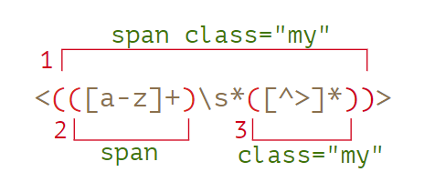

# ?Capturing groups

Часть шаблона можно заключить в скобки `(...)`. Это называется «скобочная группа».

У такого выделения есть два эффекта:

1. Позволяет поместить часть совпадения в отдельный массив.
2. Если установить квантификатор после скобок, то он будет применяться ко всему содержимому скобки, а не к одному символу.

### Пример: gogogo

Без скобок шаблон `go+` означает символ `g` и идущий после него символ `o`, который повторяется один или более раз. Например, `goooo` или `gooooooooo`.

Скобки группируют символы вместе. Так что `(go)+` означает `go`, `gogo`, `gogogo` и т.п.

~~~
console.log("Gogogo now!".match(/(go)+/gi)); // ['Gogogo']
~~~

### Пример: домен

Домен состоит из повторяющихся слов, причём после каждого, кроме последнего, стоит точка.

~~~
const regexp = /([\w-]+\.)+\w+/g;

console.log("my-site.com my.site.com".match(regexp)); // ['my-site.com', 'my.site.com']
~~~

### Пример: email

Формат email: `имя@домен`. В качестве имени может быть любое слово, разрешены дефисы и точки. На языке регулярных выражений это `[-.\w]+`.

~~~
const regexp = /[-.\w]+@([\w-]+\.)+[\w-]+/g;

console.log("my@mail.com @ his@site.com.uk".match(regexp)); // ['my@mail.com', 'his@site.com.uk']
~~~

Это регулярное выражение не идеальное, но, как правило, работает и помогает исправлять опечатки. Окончательную проверку правильности email, в любом случае, можно осуществить, лишь послав на него письмо.

### Содержимое скобок в `match`

Например, мы хотим найти HTML теги `<.*?>` и обработать их. Было бы удобно иметь содержимое тега (то, что внутри уголков) в отдельной переменной.

Давайте заключим внутреннее содержимое в круглые скобки: `<(.*?)>`.

Теперь получим как тег целиком `<h1>`, так и его содержимое `h1` в виде массива:

~~~
const str = "<h1>Hello, world!</h1>";

const tag = str.match(/<(.*?)>/);

console.log(tag[0]); // <h1>
console.log(tag[1]); // h1
~~~

### Вложенные группы

Скобки могут быть и вложенными.

Например, при поиске тега в  нас может интересовать:

* Содержимое тега целиком: `span class="my"`.
* Название тега: `span`.
* Атрибуты тега: `class="my"`.

Заключим их в скобки в шаблоне: `<(([a-z]+)\s*([^>]*))>`.

Вот их номера (слева направо, по открывающей скобке):

~~~
const str = '';

const regexp = /<(([a-z]+)\s*([^>]*))>/;

const result = str.match(regexp);
console.log(result[0]); // 
console.log(result[1]); // span class="my"
console.log(result[2]); // span
console.log(result[3]); // class="my"
~~~

По нулевому индексу в `result` всегда идёт полное совпадение.

### Необязательные группы

Даже если скобочная группа необязательна (например, стоит квантификатор `(...)?`), соответствующий элемент массива `result` существует и равен `undefined`.

Например, рассмотрим регулярное выражение `a(z)?(c)?`. Оно ищет букву `"a"`, за которой идёт необязательная буква `"z"`, за которой, в свою очередь, идёт необязательная буква `"c"`.

~~~
const match = "ac".match(/a(z)?(c)?/);

console.log(match.length); // 3
console.log(match[0]); // ac (всё совпадение)
console.log(match[1]); // undefined, потому что для (z)? ничего нет
console.log(match[2]); // c
~~~

### Поиск всех совпадений с группами: `matchAll`

При поиске всех совпадений (флаг `g`) метод `match` не возвращает скобочные группы.

~~~
const str = "<h1> <h2>";

const tags = str.match(/<(.*?)>/g);

console.log(tags); // ['<h1>', '<h2>']
~~~

Результат – массив совпадений, но без деталей о каждом. Но на практике скобочные группы тоже часто нужны.

Для того, чтобы их получать, мы можем использовать метод `str.matchAll(regexp)`.

Он, как и `str.match(regexp)`, ищет совпадения, но у него есть три отличия:

1. Он возвращает не массив, а перебираемый объект.
2. При поиске с флагом `g`, он возвращает каждое совпадение в виде массива со скобочными группами.
3. Если совпадений нет, он возвращает не `null`, а просто пустой перебираемый объект.

~~~
let results = "<h1> <h2>".matchAll(/<(.*?)>/gi);

// results - не массив, а перебираемый объект
console.log(results); // RegExpStringIterator

console.log(results[0]); // undefined (*)

results = Array.from(results); // превращаем в массив

console.log(results[0]); // ['<h1>', 'h1', index: 0, input: '<h1> <h2>', groups: undefined]
console.log(results[1]); // ['<h2>', 'h2', index: 5, input: '<h1> <h2>', groups: undefined]
~~~

Первое отличие – очень важное, это демонстрирует строка `(*)`. Мы не можем получить совпадение как `results[0]`, так как этот объект не является псевдомассивом.

Каждое совпадение, возвращаемое `matchAll`, имеет тот же вид, что и при `match` без флага `g`: это массив с дополнительными свойствами `index` (позиция совпадения) и `input` (исходный текст).

### Именованные группы

Запоминать группы по номерам не очень удобно. Для простых шаблонов это допустимо, но в сложных регулярных выражениях считать скобки затруднительно. Гораздо лучше – давать скобкам имена.

Это делается добавлением `?<name>` непосредственно после открытия скобки.

~~~
const dateRegexp = /(?<year>[0-9]{4})-(?<month>[0-9]{2})-(?<day>[0-9]{2})/;
const str = "2019-04-30";

const groups = str.match(dateRegexp).groups;

console.log(groups.year); // 2019
console.log(groups.month); // 04
console.log(groups.day); // 30
~~~

Чтобы найти не только первую дату, используем флаг `g`.

Также нам понадобится `matchAll`, чтобы получить скобочные группы:

~~~
const dateRegexp = /(?<year>[0-9]{4})-(?<month>[0-9]{2})-(?<day>[0-9]{2})/g;

const str = "2019-10-30 2020-01-01";

const results = str.matchAll(dateRegexp);

for (const result of results) {
  const { year, month, day } = result.groups;

  console.log(`${day}.${month}.${year}`);
  // первый вывод: 30.10.2019
  // второй: 01.01.2020
}
~~~

### Скобочные группы при замене

Метод `str.replace(regexp, replacement)`, осуществляющий замену совпадений с `regexp` в строке `str`, позволяет использовать в строке замены содержимое скобок. Это делается при помощи обозначений вида `$n`, где `n` – номер скобочной группы.

~~~
const str = "John Bull";
const regexp = /(\w+) (\w+)/;

console.log(str.replace(regexp, "$2, $1")); // Bull, John
~~~

Для именованных скобок ссылка будет выглядеть как `$<имя>`.

Например, заменим даты в формате «год-месяц-день» на «день.месяц.год»:

~~~
const regexp = /(?<year>[0-9]{4})-(?<month>[0-9]{2})-(?<day>[0-9]{2})/g;

const str = "2019-10-30, 2020-01-01";

console.log(str.replace(regexp, "$<day>.$<month>.$<year>"));
// 30.10.2019, 01.01.2020
~~~

### Исключение из запоминания через `?`:

Бывает так, что скобки нужны, чтобы квантификатор правильно применился, но мы не хотим, чтобы их содержимое было выделено в результате.

Скобочную группу можно исключить из запоминаемых и нумеруемых, добавив в её начало `?:`.

Например, если мы хотим найти `(go)+`, но не хотим иметь в массиве-результате отдельным элементом содержимое скобок `(go)`, то можем написать `(?:go)+`.

~~~
const str = "Gogogo John!";

// ?: исключает go из запоминания
const regexp = /(?:go)+ (\w+)/i;

const result = str.match(regexp);

console.log(result[0]); // Gogogo John (полное совпадение)
console.log(result[1]); // John
console.log(result.length); // 2 (больше в массиве элементов нет)
~~~
