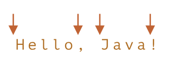

# ?Word boundary: \b

`\b` проверяет, что позиция в строке является границей слова.

Есть три вида позиций, которые являются границами слова:

1. Начало текста, если его первый символ `\w`.
2. Позиция внутри текста, если слева находится `\w`, а справа – не `\w`, или наоборот.
3. Конец текста, если его последний символ `\w`.

~~~
console.log("Hello, Java!".match(/\bJava\b/)); // ['Java', index: 7, input: 'Hello, Java!', groups: undefined]
console.log("Hello, JavaScript!".match(/\bJava\b/)); // null
~~~

В строке `Hello, Java!` следующие позиции соответствуют `\b`:

Мы можем использовать `\b` не только со словами, но и с цифрами.

Например, регулярное выражение `\b\d\d\b` ищет отдельно стоящие двузначные числа. Другими словами, оно требует, чтобы и до и после `\d\d` были символы, отличные от `\w`, такие как пробелы или пунктуация (или начало/конец текста).

~~~
console.log("1 23 456 78".match(/\b\d\d\b/g)); // ['23', '78']
console.log("12,34,56".match(/\b\d\d\b/g)); // ['12', '34', '56']
~~~

##### Граница слова `\b` не работает для алфавитов, не основанных на латинице.
