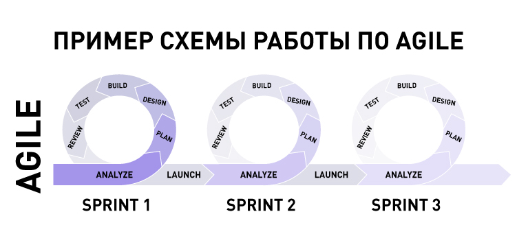

# ?Agile

### Agile – гибкое управление проектом

_Agile_ – это система ценностей, помогающая создавать новые продукты.

Agile появился, когда стало понятно, что традиционное управление неэффективно в проектах с постоянно меняющимися условиями: для разработки новых технологий, тестирования новых продуктов, выхода на новый рынок. 

Сам по себе Agile – это не модель управления, а философия, помогающая сформировать отношение к работе. Философия состоит из четырех ценностей и 12 принципов. Они закреплены в Agile-манифесте разработки программного обеспечения.

Сначала о ценностях Agile:

1. Люди и взаимодействия важнее процессов и инструментов.
2. Работающий продукт важнее исчерпывающей документации.
3. Сотрудничество с заказчиком важнее согласования условий контракта.
4. Готовность к изменениям важнее следования первоначальному плану.

12 принципов Agile:

1. Наивысшим приоритетом для нас является удовлетворение потребностей заказчика, благодаря регулярной и ранней поставке ценного программного обеспечения

Главное для Agile-команды — удовлетворенность клиентов, поэтому они обязательно представляют результаты своей работы через регулярные промежутки времени, а не заставляют заказчиков ждать финального результата в конце проекта.

2. Изменение требований приветствуется даже на поздних стадиях разработки. Agile-процессы позволяют использовать изменения для обеспечения конкурентного преимущества заказчика

В этом их преимущество перед традиционными командами, которым обычно не так легко управлять изменениями.

3. Работающий продукт следует выпускать как можно чаще, с периодичностью от двух недель до двух месяцев

Вспомним, что Agile-команды ценят постоянное общение, а не жестко распланированный выпуск обновлений, которые могут слишком далеко стоять друг от друга по времени, что может оказаться неприемлемым для клиентов. Команды Scrum, которые тоже работают по методологии Agile, разбивают свою работу на периоды от одной до четырех недель, известные, как спринты.

4. На протяжении всего проекта разработчики и представители бизнеса должны ежедневно работать вместе

Сотрудничество — краеугольный камень Agile, причем имеется в виду не только сотрудничество между членами команды, но и сотрудничество с заинтересованными сторонами, разработчиками, клиентами и другими партнерами.

5. Над проектом должны работать мотивированные профессионалы. Чтобы работа была сделана, создайте им условия, обеспечьте поддержку — и полностью им доверьтесь

Agile-команды успешны, потому что в них работают только те люди, которые необходимы для проекта. Если участники Agile-команды получат поддержку, возможность работать вместе и инструменты, необходимые для работы, все остальное приложится.

6. Непосредственное общение — наиболее практичный и эффективный способ обмена информацией как с самой командой, так и внутри команды

Все мы знаем, что главное в управлении проектами — личное сотрудничество. Этот принцип применим и во времена «новой нормы», при гибридных и удаленных моделях работы. Zoom и Teams — отличная альтернатива телефонным звонкам и электронной почте, а в ключевых точках проекта возможны и личные встречи команд.

7. Работающий продукт — основной показатель прогресса

Смысл принципа, который называет работающий продукт основным показателем прогресса, в том, что главная цель команды всегда остается одна — предоставить клиенту как можно более высококачественный результат. Когда клиент доволен, это и есть главный показатель успеха проекта.

8. Agile помогает наладить устойчивый процесс разработки. Инвесторы, разработчики и пользователи должны иметь возможность бесконечно поддерживать постоянный ритм

Многие команды поначалу показывают бурный прогресс, который не получается сохранить до конца проекта.

9. Постоянное внимание к техническому совершенству и качеству проектирования повышает гибкость проекта

Agile не работает по принципу «раз — и готово». Каждый новый проект — это возможность для инноваций, а не для повтора одних и тех же идей.

10. Простота как искусство сократить до минимума лишнюю работу крайне необходима

Команды Agile не занимаются переусложнением — они просто соблюдают проектные требования и хорошо выполняют свою работу, а затем переходят к следующему проекту.

11. Самые лучшие требования, архитектурные и технические решения рождаются у самоорганизующихся команд

Лучшие команды — это те команды, у которых есть лидер, предоставляющий им свободу самовыражения. Микроменеджмент редко делает команды лучше или продуктивнее, и Agile-команды — отличный пример того, чего можно добиться без микроменеджмента.

> В бизнесе микроменеджмент — это стиль управления персоналом, при котором руководство использует чрезмерный и постоянный контроль над сотрудниками, не допуская никакой самостоятельности в принятии решений.

12. Команда должна систематически анализировать возможные способы улучшения эффективности и соответственно корректировать стиль своей работы

Непрерывное совершенствование — сама суть Agile, и регулярные проверки эффективности команды в целом могут помочь избавиться от вредных привычек и добиваться бо́льшего.

> Легко заметить, что многие принципы Agile непосредственно относятся к разработке ПО. Именно из этого исходили многие участники исходного Agile Alliance, именно на этом делается акцент в манифесте Agile. Однако принципы Agile применимы и к проектам в других областях и отраслях.

Создатели воспринимали Agile как философию, которую можно адаптировать под конкретные задачи. Современные модели проектного менеджмента, например, Scrum и Kanban, основаны на философии Agile.

### Особенности и ограничения Agile

#### Особенности Agile

* Полностью самоорганизующаяся команда.

Команда Agile – это небольшая работающая над одним проектом группа людей, в составе которой уже есть все необходимые для этого специалисты. В команде нет руководителей и подчиненных и роли за участниками не закреплены: разработчик может тестировать, аналитик предлагать идеи для дизайна.

* Разработка небольшими итерациями.

Продукт или проект разбивается на ценные части, каждая из которых разрабатывается в отдельный временной промежуток –  итерацию . За один такой интервал времени разрабатывают новую версию продукта или перерабатывают уже существующий. В итоге после итерации получается новый продукт или новая версия, готовая к выпуску. Продукт выпускают, собирают обратную связь и в следующую итерацию улучшают и дорабатывают. Иногда итерации называют agile-спринтами, но это не совсем верно. Спринт – термин из Scrum-подхода.

* Можно менять проект в процессе.

И заказчик, и команда оценивают результат по ходу проекта и решают, как действовать дальше.

* Результат важнее документации.

От плана можно отступать, если это принесет пользу проекту. 

#### Ограничения Agile

* Нет четких инструкций.

Agile – это философия, ее создатели не дают четких инструкций, как внедрять принципы Agile в работу компании. 

* Больше времени и энергии.

Тестировщики, клиенты и разработчики должны быть постоянно на связи и тесно сотрудничать. Все этапы происходят одновременно, поэтому клиенты должны быть готовы в любой момент протестировать и утвердить работы, чтобы команда могла двигаться дальше. В результате получается работоспособный продукт, но он требует времени и энергии всех участников.

* Многое зависит от клиента.

Принципы аджайла требуют сотрудничества и участия клиента. Клиенту нужно пройти обучение и перестроить свои процессы, чтобы помогать в разработке продукта. Если клиент не разделяет ценности Agile, работать с ним не получится.

* Легко сбиться с пути.

Суть аджайла – в гибкости и возможности подстраиваться под постоянно меняющиеся условия. Иногда если обратная связь заказчика не ясна, разработчик может сфокусироваться на работе в неправильном направлении. Есть опасность впустую тратить деньги, постоянно меняя продукт. 

Гибкий подход подойдет, если:

* Вы разрабатываете принципиально новый продукт: страхование домашних животных, инновационную технологию в ракетостроении, новую модель автомобиля.
* Вы делаете продукт, который можно выпускать частями: блог, программное обеспечение, стриминговый сервис.
* Запросы пользователей и ситуация на рынке постоянно меняются.

Нет смысла использовать методы аджайла, когда клиент должен работать по четкому бюджету или графику. Следует также избегать гибкого подхода, если клиенты не смогут изменить объем и содержание проекта, как только он стартовал.

Компании, которые работают по Agile: Spotify, Microsoft, Google, Netflix, Ericsson, Dell, Adobe, Accenture, WordPress, Riot Games, CH Robinson, Magna International, Scrum Alliance, Intronis, General Electric, John Deere.
