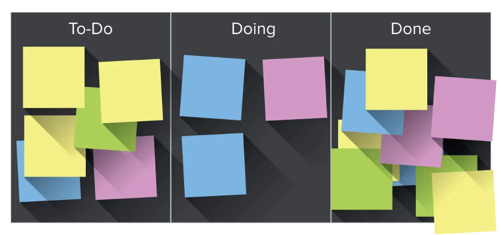
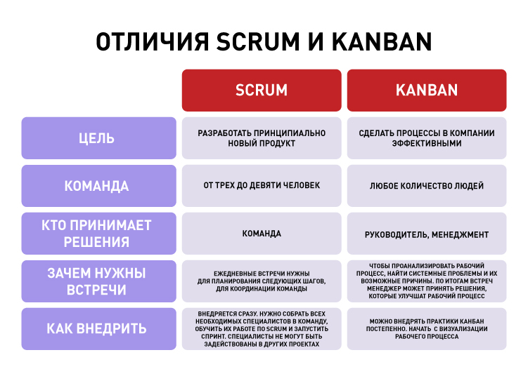

# ?Kanban

### Kanban – инструменты для улучшения рабочих процессов

_Kanban_ – это метод для построения внутренних процессов в компании. Он тоже входит в семейство гибких методологий. Канбан – это также один из инструментов бережливого производства. Но мы рассматриваем канбан не как часть бережливого производства, а как метод гибкого управления.

Канбан помогает визуализировать процесс работы. Все задачи, которые команда делает или планирует сделать, вывешиваются на доску.

Доска может быть как физической, так и виртуальной, например, Trello. Важно, чтобы задачи не были слишком маленькими – так их будет много и учет будет отнимать время. Также важно, чтобы задачи не были слишком большими, чтобы карточки не застревали на доске.

Чем дальше задача продвигается по доске, тем ценнее она становится – на нее уже потратили время и деньги.

Поэтому в канбане есть принцип «перестаньте начинать новые задачи, начните завершать задачи, которые уже в работе».

Задача визуализации – сбалансировать разных специалистов внутри команды и избежать ситуации, когда разработчики работают сутками, а тестировщики жалуются на отсутствие новых задач.

Доска – это лишь один из инструментов, который помогает увидеть проблемы. Чтобы оптимизировать работу, существуют другие инструменты: ограничение количества задач в работе, управление потоком и так далее.

### Особенности и ограничения канбана

#### Особенности канбана

* Канбан предлагает оценивать эффективность с точки зрения сервиса.

Например, насколько заказчик остался доволен, с какими задачами обычно обращаются клиенты, сколько они готовы ждать.

* Главный показатель эффективности в Kanban – это среднее время прохождения задачи по доске.

Если задача прошла быстро – все хорошо. Если время выполнения затянулось, нужно думать, где и почему возникли проблемы.

* Чтобы повысить эффективность, в канбане ограничивают количество задач, находящихся в работе.

Например, дизайнер может работать над тремя задачами. Пока он не закончит одну из задач, он не может взять новую. Это помогает работать спокойнее и быстрее заканчивать текущие задачи. 

* Вся команда едина – нет ролей владельца продукта и scrum-мастера.

Бизнес-процесс делится не на универсальные спринты, а на стадии выполнения конкретных задач: «Сделать», «В процессе», «Тестирование», «Согласование» и др.

#### Ограничения канбана

* У канбана широкая область применения.

Можно сравнить его с ящиком инструментов. Для каждой задачи можно что-то подобрать. При этом каждый будет пользоваться инструментами по-своему. Поэтому канбан можно применить везде, где у вас есть поток задач. Однако, метод будет неэффективен, если нужно разработать новый сложный продукт, для этого лучше подойдет скрам.

Канбан подойдет:

* Если у команды много задач и заказов: канбан поможет выявить проблемы и оптимизировать работу.
* Для отделов, которые поддерживают операционную деятельность: бухгалтерия, финансовый отдел.
* Для визуализации процессов и выявления проблем: доску по канбан-методу можно вести даже для личных дел – чтобы видеть приоритетные задачи и заметить дело, которое уже давно висит. 

Компании, которые используют канбан: «Альфа-Банк», «Хоум Кредит Банк», «Почта Банк», «Додо Пицца», HeadHunter, Wargaming, Microsoft, Siemens и другие.

### Отличия Scrum и Kanban

Scrum и Kanban не конкурируют и не исключают друг друга. Скрам поможет решить большую сложную задачу, а канбан – оптимизировать работу с потоком задач.

Scrum и Kanban являются разновидностями Agile, но у них есть отличия. Вот некоторые из них:

* Scrum требует определенных ролей, тогда как Kanban не имеет обязательных ролей.
* Скрам-доска сбрасывается после каждого спринта. Канбан-доска используется постоянно.
* Scrum-команда является кросс-функциональной. В Канбане командам не обязательно быть кросс-функциональными.
* Scrum-команды требуют оценки, а Kanban — нет.

