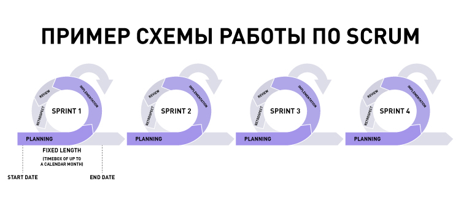

# ?Scrum

### Scrum – инструкция по запуску нового продукта

_Scrum_ – это способ организации рабочего процесса. Скрам помогает проверять идеи, тестировать новые решения, выпускать инновационные продукты.

В методологиях, моделях, системах управления проектами легко запутаться. Может показаться, что скрам и аджайл – это одно и то же, но это не так.

Можно сказать, что аджайл – это конституция с основными принципами, а скрам – это кодекс с конкретными инструкциями. У скрама узкая область применения, к нему обращаются, когда классические техники управления проектами неэффективны. Принципы гибкой методологии разработки Scrum основаны на философии Agile.

Scrum предназначен для быстрой разработки сложных, принципиально новых продуктов, которых нет на рынке. Например, для разработки онлайн-страхования для квартир или банковского приложения для новой услуги. Команда обучается на практике, получая обратную связь от пользователей. 

По скраму, продукт разрабатывают небольшими готовыми к релизу частями. Работу над каждой из них завершают за спринт, дополнительные функции откладывают на следующий. Спринты одинаковы по времени и длятся не больше четырех недель. 

Обычно в команде от трех до девяти человек. Все они полностью погружены в проект и не занимаются другими задачами. 

В команде есть три роли:

1. Владелец продукта

__Владелец продукта__, или __Product Owner__ — несет ответственность за получение максимальной ценности продукта. Он следит за ситуацией на рынке и в компании, общается с заказчиками и другими командами. На основании этого он корректирует процесс разработки таким образом, чтобы продукт получился максимально ценным. Владелец продукта создает  бэклог  и управляет им, исключая неактуальные задачи или добавляя новые. Он также отвечает за доступность и понятность бэклога для команды — все задачи должны быть описаны понятно для всех участников процесса. В больших продуктах владельцев продуктов может быть несколько.

2. Скрам-мастер

__Скрам-мастер__, или __Scrum Master__ — следит за тем, чтобы процесс разработки проиcходил согласно требованиям Scrum: спринты должны вовремя запускаться, команда разработки должна иметь необходимые ресурсы, собрания должны проводится вовремя. Скрам-мастер также может быть коучем как для команды разработки, так и  для владельца продукта. В некотором смысле скрам-мастера можно назвать евангелистом подхода.

3. Скрам-команда

__Скрам-команда__, или __Scrum Team__ — состоит из кроссфункциональных специалистов, например, дизайнеров, программистов, бизнес-аналитиков, юристов, маркетологов, инженеров и т.д. Руководство по скраму рекомендует включать в команду от 3 до 9 человек.

### Шаги в процессе Scrum

В Scrum-потоке есть определенный неизменный набор шагов. Они включают:

* Product backlog

Владелец продукта и Скрам-команда встречаются, чтобы расставить приоритеты в бэклоге продукта (работа над бэклогом продукта происходит из пользовательских историй и требований). Бэклог продукта — это не список того, что нужно сделать, а скорее список всех желаемых функций продукта. Затем команда разработчиков берет работу из бэклога продукта и выполняет ее в течение каждого спринта.
 
* Sprint planning

Перед каждым спринтом владелец продукта представляет команде основные элементы невыполненной работы на совещании по планированию спринта. Затем команда выбирает, какую работу они могут выполнить в течение спринта, и перемещает работу из журнала невыполненной работы по продукту в журнал спринта (который представляет собой список задач, которые необходимо выполнить в спринте).
 
* Backlog refinement/grooming

В конце одного спринта команда и владелец продукта встречаются, чтобы убедиться, что бэклог готов к следующему спринту. Команда может удалить пользовательские истории, которые не имеют отношения к делу, создать новые истории, переоценить приоритет историй или разделить пользовательские истории на более мелкие задачи. Цель этого «обрабатывающего» совещания — убедиться, что в списке невыполненных работ есть только актуальные и подробные элементы, отвечающие целям проекта.
 
* Daily Scrum meetings

Ежедневная встреча Scrum — это 15-минутное собрание, на котором каждый член команды рассказывает о своих целях и любых возникших проблемах. Ежедневный скрам проводится каждый день во время спринта и помогает команде не сбиться с пути.
 
* Sprint review meeting

В конце каждого спринта команда представляет проделанную работу на обзорном совещании по спринту. На этой встрече должна быть живая демонстрация, а не отчет или презентация в PowerPoint. 
 
* Sprint retrospective meeting

Также в конце каждого спринта команда размышляет о том, насколько хорошо Scrum работает на них, и рассказывает о любых изменениях, которые необходимо внести в следующем спринте. Команда может говорить о том, что было хорошо во время спринта, что пошло не так и что они могли бы сделать по-другому.

### Некоторые инструменты, артефакты и методы в Scrum

* Scrum board

Вы можете визуализировать невыполненную работу спринта с помощью Scrum-доски задач. Доска может иметь разную форму; это традиционно включает учетные карточки, заметки Post-It или доску. Скрам-доска обычно делится на три категории: «сделать», «в процессе» и «сделано». Скрам-команде необходимо обновлять доску на протяжении всего спринта. Например, если кто-то придумает новую задачу, она напишет новую карточку и поместит ее в соответствующую колонку. 
 
* User stories

Пользовательская история описывает функцию программного обеспечения с точки зрения клиента. Он включает в себя тип пользователя, чего он хочет и почему он этого хочет. Эти рассказы имеют схожую структуру: как <тип пользователя> я хочу <выполнить какую-то задачу>, чтобы я мог <достичь какой-то цели.> Команда разработчиков использует эти рассказы для создания кода, который будет соответствовать требованиям истории.
 
* Burndown chart

Диаграмма выгорания представляет всю незавершенную работу. Отставание обычно откладывается по вертикальной оси, а время — по горизонтальной оси. Оставшаяся работа может быть представлена ​​в баллах, идеальных днях, командных днях или других показателях. Диаграмма выгорания может предупредить команду, если что-то идет не по плану, и помогает показать влияние решений. 
 
* Timeboxing

Ограничение времени — это установленный период времени, в течение которого команда работает над достижением цели. Вместо того, чтобы позволить команде работать до тех пор, пока цель не будет достигнута, подход временных рамок останавливает работу, когда достигается лимит времени. Ограниченные по времени итерации часто используются в Scrum и экстремальном программировании.

### Особенности и ограничения Scrum-подхода

#### Особенности Scrum-подхода

* Возможность разработать новый продукт.

Скрам хорошо подходит, когда неизвестно, нужен ли пользователям такой продукт. Вы выпускаете пробный вариант, обучаетесь с помощью обратной связи и делаете следующую версию.

* Фокусировка на пользе для потребителя.

Методология Scrum и agile-принципы заточены на то, чтобы изучать потребности пользователей, улучшать их опыт использования продукта. А не на то, чтобы сделать продукт в срок и согласовать его с заказчиком. 

* Возможность менять продукт.

Работая короткими циклами, можно предлагать пользователям продукты почти по требованию и быстро адаптироваться к новым условиям.

* Снижение риска за счет тестирования.

Скрам позволяет быстро выпустить тестовый вариант продукта, оценить его работоспособность и затем приступить к доработке. Это снижает риски провала по сравнению с подходом, когда продукт бесконечно шлифуется до запуска.

* Вовлеченные сотрудники.

Команда вовлекается в работу, потому что она работает только над одним проектом и видит результат от своих усилий.

#### Ограничения Scrum 

* Не подходит для случаев, когда у команды много задач и много заказчиков.

Скажем, есть маркетинговый отдел, в который приходят с задачами из разных подразделений. Скрам тут не подойдет, потому что отдел не сможет посвятить две-три недели работе над одной задачей, они делают много задач одновременно.

* Меньше предсказуемости.

В каскадной методологии работа начинается с разработки подробного ТЗ, в Scrum такого нет. Клиенту бывает сложно решиться на проект с большим количеством неизвестных.

* Необходимо обучение команды.

Когда сотрудники впервые знакомятся со скрам-подходом, нужен специальный человек – скрам-мастер, который поможет перейти на этот способ работы.

Скрам подойдет, если:

* Вы разрабатываете новый продукт, аналогов которого нет на рынке.
* У вас есть возможность собрать команду сотрудников, которые будут заниматься только этим проектом. 

Компании, которые используют Scrum: Google, Apple, Facebook, Spotify, AirBnB, Salesforce, «Промсвязьбанк».
