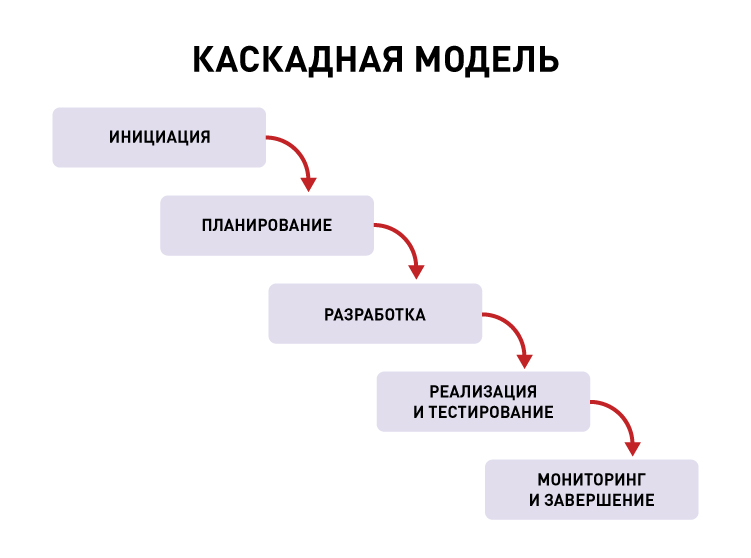

# ?Waterfall

### Waterfall – каскадная модель

_Каскадная модель_ или модель _Waterfall_, – это вариант классического поэтапного планирования. 

Проект состоит из последовательных этапов: инициация, планирование, разработка, реализация и тестирование, мониторинг и завершение. 

1. Инициация.

Руководитель проекта и команда определяют требования к проекту: проводят совещания, мозговые штурмы, интервью. На них обозначают, какой результат хотят получить в итоге. 

2. Планирование.

Команда уточняет и детализирует цели проекта и состав работ по нему. Затем формирует календарный план и бюджет, оценивает риски.

3. Разработка.

Участники определяют конфигурацию будущего проекта и технические способы ее достижения.

4. Реализация и тестирование. На этой фазе происходит основная работа. 

5. Мониторинг и завершение проекта. Руководитель передает проект клиенту, оценивает результат и составляет план по улучшению на будущее.

Разным проектам нужны различные этапы реализации – некоторым достаточно и трех фаз, другим нужно больше пяти. Но суть waterfall-модели одна – проект разбит на этапы, которые заранее запланированы и выполняются один за другим.

### Ограничения Waterfall-модели

* Проект сложно адаптировать под изменения среды.

Проект начинается с плана, в котором пытаются учесть все события. Но заранее предугадать проблемы невозможно, а менять план нельзя.

* Проект может растянуться.

Исполнители на следующих этапах не могут начать работу, пока на предыдущем не выполнят все задачи. Задержка на одном этапе останавливает весь проект.

* Поздно находят проблемы.

Классический проектный подход в менеджменте опасен поздним обнаружением проблем. Тестирование – один из последних этапов, на котором ищут все ошибки проекта. Часто на их исправление не хватит времени и бюджета.

* Клиент поздно дает обратную связь.

Клиент видит результат в конце проекта, и если у него изменились требования или условия, то исполнители поздно об этом узнают. Учесть новые требования уже нет времени, клиент может остаться недовольным.

Чтобы раньше находить проблемы и адаптировать проект под изменения, изобретают новые варианты каскадного управления проектами – гибридные методологии. Например, в каскадной модели с обратными связями тестирование проводят на каждом этапе, не дожидаясь завершения. Это позволяет находить и исправлять ошибки. 

Вам подойдет каскадная модель, если:

* Известно, какой продукт необходимо получить в итоге.
* Нужна детальная документация по всем процессам разработки.
* Проект делается по этапам: начать следующий этап можно после завершения предыдущего.
