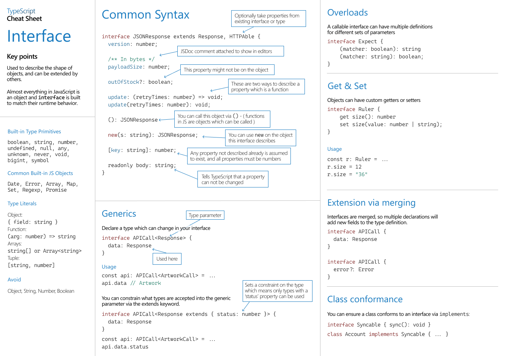

# ?Interfaces

Объявление интерфейса — это еще один способ назвать тип объекта:

~~~
interface Point {
  x: number;
  y: number;
}

function printCoord(pt: Point) {
  console.log("The coordinate's x value is " + pt.x);
  console.log("The coordinate's y value is " + pt.y);
}

printCoord({ x: 100, y: 100 });
~~~

TypeScript заботится только о структуре значения, которому мы передали `printCoord`. Он заботится только о том, чтобы оно имело ожидаемые свойства.

### Различия между псевдонимами типов и интерфейсами

Псевдонимы типов и интерфейсы очень похожи, и во многих случаях вы можете свободно выбирать между ними. Почти все функции `interface` доступны в `type`, ключевое отличие состоит в том, что тип нельзя открыть повторно для добавления новых свойств по сравнению с интерфейсом, который всегда расширяем.

Расширение интерфейса:

~~~
interface Animal {
  name: string;
}

interface Bear extends Animal {
  honey: boolean;
}
~~~

Расширение типа через `intersections`:

~~~
type Animal = {
  name: string;
};

type Bear = Animal & {
  honey: boolean;
};
~~~

Добавление новых полей в существующий интерфейс:

~~~
interface Animal {
  name: string;
}

interface Animal {
  honey: boolean;
}

const bear: Animal = { name: "Bear", honey: false };
~~~

Тип нельзя изменить после создания:

~~~
type Animal = {
  name: string;
}

type Animal = {
  honey: boolean;
}

// Error: Duplicate identifier 'Animal'
~~~

Интерфейсы могут использоваться только для объявления форм объектов, а не для переименования примитивов.

~~~
interface AnObject1 {
  value: string;
}

type AnObject2 = {
  value: string;
};

// Using type we can create custom names
// for existing primitives:
type SanitizedString = string;
type EvenNumber = number;
~~~

По большей части вы можете выбирать на основе личных предпочтений, и TypeScript сообщит вам, нужно ли ему что-то, что может быть другим типом объявления. Если вам нужна эвристика используйте `interface` пока вам не понадобятся функции из `type`.

### `readonly`

Свойства могут быть помечены как `readonly` для TypeScript.

~~~
interface SomeType {
  readonly prop: string;
}

function doSomething(obj: SomeType) {
  // We can read from 'obj.prop'.
  console.log(`prop has the value '${obj.prop}'.`);

  // But we can't re-assign it.
  obj.prop = "hello";
  // Cannot assign to 'prop' because it is a read-only property.
}
~~~

Использование `readonly` не обязательно означает, что значение является полностью неизменным или, другими словами, что его внутреннее содержимое не может быть изменено. Это просто означает, что само свойство не может быть перезаписано.

~~~
interface Home {
  readonly resident: { name: string; age: number };
}

function visitForBirthday(home: Home) {
  // We can update properties from 'home.resident'.
  home.resident.age++;
}

function evict(home: Home) {
  // But we can't write to the 'resident' property itself on a 'Home'.
  home.resident = {
    // Cannot assign to 'resident' because it is a read-only property.
    name: "Victor the Evictor",
    age: 42,
  };
}
~~~

### Необязательные свойства

В этом примере оба xPosи yPosсчитаются необязательными:

~~~
interface PaintOptions {
  shape: string;
  xPos?: number;
  yPos?: number;
}

function paintShape(opts: PaintOptions) {
  // ...
}

paintShape({ shape: "Circle" });
paintShape({ shape: "Circle", xPos: 100 });
paintShape({ shape: "Circle", yPos: 100 });
paintShape({ shape: "Circle", xPos: 100, yPos: 100 });
~~~

### Подписи индекса

Иногда вы не знаете заранее всех имен свойств типа, но знаете форму значений.

В этих случаях вы можете использовать сигнатуру индекса для описания типов возможных значений, например:

~~~
interface Name {
  [index: string]: string;
}

const fullName: Name = { firstName: "Alex", lastName: "Smith" };
const firstName = fullName.firstName;

console.log(firstName); // Alex
~~~

Для свойств подписи индекса разрешены только некоторые типы: `string`, `number`, `symbol`, образцы строки шаблона и `union`, состоящие только из них.

Хотя сигнатуры строковых индексов являются мощным способом описания шаблона «словарь», они также обеспечивают соответствие всех свойств возвращаемому типу.

В следующем примере проверка типов выдает ошибку:

~~~
interface Name {
  [index: string]: string;
  length: number; // Property 'length' of type 'number' is not assignable to 'string' index type 'string'.
}
~~~

### Intersection Types

TypeScript предоставляет конструкцию, называемую типами пересечения , которая в основном используется для объединения существующих типов объектов.

Тип пересечения определяется с помощью оператора `&`.

~~~
interface Colorful {
  color: string;
}

interface Circle {
  radius: number;
}

type ColorfulCircle = Colorful & Circle;

const colorfulCircle: ColorfulCircle = { color: "white", radius: 7 };
~~~

Здесь мы пересеклись `Colorful` и `Circle` создали новый тип, который имеет все члены `Colorful` и `Circle`.

### Generic Object Types

~~~
interface Box<Type> {
  contents: Type;
}

const boxA: Box<string> = { contents: "hello" };
~~~

Когда TypeScript увидит `Box<string>`, он заменит каждый экземпляр `Type` в `Box<Type>` на `string`, и в конечном итоге будет работать с чем-то вроде `{ contents: string }`.

### Краткий справочник

