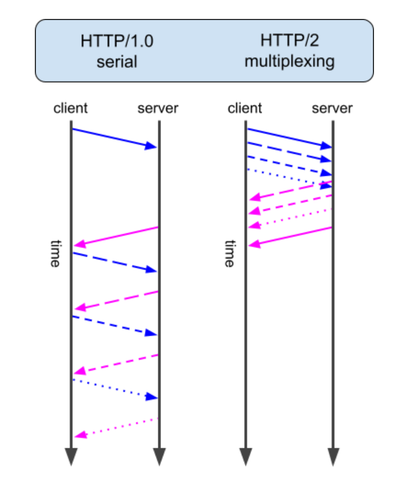

# ?Evolution of HTTP

### HTTP/1.x

HTTP/1.1, представленный в 1997 году как модификация оригинального HTTP/1.0, быстро стал стандартным протоколом для Интернета. Многие функции, знакомые современным разработчикам, были представлены в HTTP/1.1. Некоторые ключевые улучшения и функции HTTP/1.1 включают в себя:

1. __Постоянные соединения__: в отличие от HTTP/1.0, который закрывал соединение после каждого цикла запрос-ответ, в HTTP/1.1 были введены постоянные соединения, которые позволяли отправлять несколько запросов и ответов по одному соединению, уменьшая задержку и повышая производительность.

2. __Конвейерная обработка__: HTTP/1.1 также представил концепцию конвейерной обработки, которая позволяет отправлять несколько запросов по одному соединению, не дожидаясь ответа на предыдущий запрос. Это повысило эффективность, но по-прежнему страдало от проблемы «блокировки начала строки», когда обработка последующих запросов задерживается, если выполнение первого запроса занимает слишком много времени.

3. __Кодирование передачи по частям__: эта функция позволяет серверу отправлять ответ небольшими порциями, а не ждать, пока будет сгенерирован весь ответ, прежде чем отправить его клиенту. Это улучшает воспринимаемую производительность веб-приложения.

4. __Механизмы управления кешем__: HTTP/1.1 представил различные заголовки управления кешем для управления тем, как клиенты кэшируют и перепроверяют ресурсы, повышая производительность сети за счет уменьшения необходимости в избыточной передаче данных.

HTTP 1.1 ведет себя так, как ожидает большинство веб-разработчиков в отношении передачи файлов, ресурсов и данных.

HTTP 1.1 — это простая модель запросов и ответов. Браузер запрашивает документ, и сервер отвечает им. Когда вы рассматриваете обычную веб-страницу, которая может иметь десятки ресурсов (изображения, таблицы стилей, скрипты и т. д.), это приводит к большому количеству запросов и ответов в цепочке.

### HTTP/2

HTTP/2 , выпущенный в 2015 году, был направлен на устранение некоторых ограничений производительности HTTP/1.1 при сохранении совместимости с существующими приложениями. Основные улучшения и функции HTTP/2 включают в себя:

1. __Двоичный уровень кадрирования__. В отличие от текстового HTTP/1.1, HTTP/2 использует двоичный уровень кадрирования, который обеспечивает более эффективный синтаксический анализ, уменьшает задержку и уменьшает накладные расходы с точки зрения передачи данных.

2. __Мультиплексирование__: в HTTP/2 несколько запросов и ответов могут быть отправлены одновременно по одному соединению благодаря новому уровню двоичного кадрирования. Это устраняет проблему блокировки очереди, присутствующую в HTTP/1.1, что позволяет более эффективно использовать сетевые ресурсы.

С HTTP/2 браузер и сервер взаимодействуют более эффективно, запрашивая документы, ресурсы, изображения, таблицы стилей, скрипты и т. д. в одном запросе, а затем получая их все в одном ответе от сервера.

3. __Сжатие заголовков__: HTTP/2 использует HPACK, алгоритм сжатия, специально разработанный для заголовков HTTP, чтобы уменьшить объем данных, которые необходимо отправить по сети. Это уменьшает задержку и повышает производительность Интернета, особенно для пользователей с более медленным соединением.

4. __Серверная отправка__: эта функция позволяет серверу отправлять ресурсы клиенту до того, как они будут явно запрошены, что потенциально снижает количество циклов, необходимых для загрузки веб-страницы.

5. __Приоритизация потоков__: HTTP/2 позволяет клиентам назначать уровни приоритета различным запросам, позволяя серверу более эффективно распределять ресурсы и быстрее доставлять высокоприоритетный контент.

### HTTP/3

HTTP/3, последняя версия протокола, в настоящее время находится в процессе стандартизации и принятия. Он вносит значительные изменения для устранения ограничений HTTP/2 и дальнейшего повышения производительности сети. Наиболее заметным изменением в HTTP/3 является замена протокола управления передачей (__TCP__) новым протоколом __QUIC__. QUIC, расшифровывается как Quick UDP Internet Connections, представляет собой протокол транспортного уровня, целью которого является обеспечение меньшей задержки и лучшей производительности, чем TCP.

Основные улучшения и функции HTTP/3 включают в себя:

1. __Протокол QUIC__: QUIC является более эффективным протоколом транспортного уровня, чем TCP, обеспечивая более быстрое установление соединения, встроенное шифрование и лучший контроль перегрузки. Это также устраняет блокировку очереди на транспортном уровне, что еще больше повышает производительность сети.

2. __Транспорт на основе UDP__: в отличие от HTTP/1.1 и HTTP/2, которые используют TCP, HTTP/3 использует протокол пользовательских дейтаграмм (UDP). UDP — это протокол без установления соединения, который обеспечивает более быструю передачу данных и меньшую задержку. Однако это не гарантирует надежной доставки, поэтому QUIC использует собственные механизмы обеспечения надежности.

3. __Миграция подключения__: QUIC поддерживает миграцию подключения, позволяя клиентам переключаться между сетевыми интерфейсами (например, с Wi-Fi на мобильные данные) без прерывания текущих подключений. Это особенно полезно для мобильных устройств, которые могут часто переключаться между разными сетями.

4. __Улучшенная безопасность__: QUIC включает встроенное шифрование на основе Transport Layer Security (TLS) 1.3, обеспечивающее безопасную связь между клиентами и серверами. Протокол также предлагает дополнительные функции безопасности, такие как защита от подделки соединения и несанкционированного доступа.

### Сравнение

Хотя HTTP/1.1 хорошо служил в Интернете в течение многих лет, улучшения производительности, предлагаемые HTTP/2 и HTTP/3, значительны. И HTTP/2, и HTTP/3 устраняют ограничения HTTP/1.1 и предоставляют функции, необходимые для современных веб-приложений, такие как мультиплексирование, сжатие заголовков и повышенная безопасность.

HTTP/2 уже получил широкое распространение, и его поддерживает большинство современных браузеров и веб-серверов. HTTP/3, с другой стороны, все еще находится на ранних стадиях принятия, но поддержка растет по мере того, как протокол совершенствуется и доказывает свою ценность.

Важно отметить, что HTTP/2 и HTTP/3 предназначены для обратной совместимости с HTTP/1.1, поэтому веб-разработчики могут постепенно внедрять эти новые протоколы, не нарушая работу существующих приложений. Реализация HTTP/2 и HTTP/3 обычно включает обновление веб-серверов и браузеров, в то время как код приложения практически не меняется.

Переход от HTTP 1.1 к HTTP/2 был относительно безболезненным, поскольку оба они использовали одни и те же базовые технологии и протокол: TCP. Переход с HTTP/2 на HTTP/3 требует принятия QUIC и UDP, а также эксклюзивной поддержки TLS 1.3 — технологии, используемой для шифрования трафика, которая еще не полностью принята.
