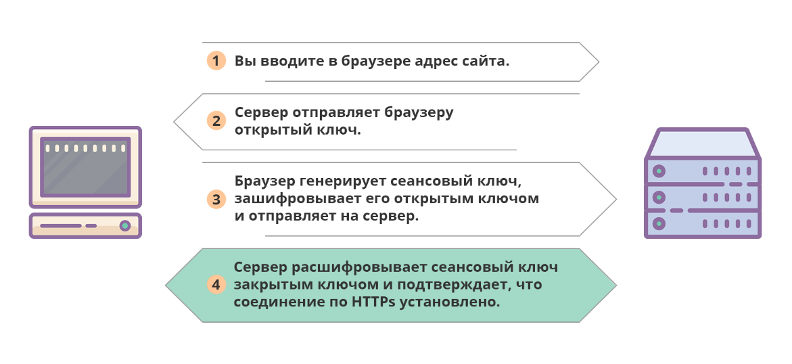

# ?HTTP / HTTPS

### HTTP

_HTTP_ — это протокол передачи данных, на основе которого работает всемирная паутина. Благодаря этому протоколу, мы можем заходить на сайты в браузере и взаимодействовать с ними: переходить с одной страницы на другую, скачивать файлы и просматривать изображения, обмениваться сообщениями и оплачивать покупки.

Аббревиатура HTTP расшифровывается как _HyperText Transfer Protocol_ — протокол передачи гипертекста (то есть текстовых документов, который содержат ссылки на другие документы). Сейчас с его помощью передают любые форматы данных.

### Как работает HTTP

Протокол HTTP использует в работе технологию «клиент-сервер»: клиент отправляет на сервер запрос, где специальная программа его обрабатывает, формирует ответ и возвращает клиенту. 

В роли клиента как правило выступает браузер, но его функции может выполнять и другая программа. Например, поисковой робот, который путешествует по сайтам и сканирует их для индексации в поисковиках. В роли сервера выступает веб-сервер — специальная программа на физическом сервере, где хранится сайт.

Например, чтобы отобразить любую страницу, ваш браузер отправляет серверу запрос на получение HTML-документа с её содержимым. Дальше браузер изучает документ и запрашивает дополнительные файлы, необходимые для отображения страницы: стили элементов, изображения, скрипты. Затем браузер собирает всё это вместе, как указано в HTML-документе, и выводит на экран компьютера результат.

Другой пример — когда браузер отправляет какие-то данные серверу. Скажем, логин и пароль для входа в аккаунт. Чтобы сформировать HTML-документ с главной страницей аккаунта, сервер проверяет детали входа в специальной таблице внутри базы данных, в которой хранятся данные всех пользователей. Если в таблице есть пользователь с указанными данными, сервер формирует HTML-документ и отправляет браузеру, как в примере выше. Если такого пользователя нет или детали входа неверны, в движке сайта прописан специальный сценарий на этот случай — отправить сообщение с ошибкой, которое браузер выведет на экран.

На разные случаи жизни в протоколе HTTP предусмотрены десятки разных ошибок.

### HTTPS

_HTTPS_ — это расширение для протокола HTTP, которое делает его безопасным. Это тот же протокол HTTP, но защищенный SSL-сертификатом. Дело в том, что данные передаются по HTTP в открытом виде. Это создаёт риск раскрыть конфиденциальную информацию, если кто-то перехватит трафик. HTTPS решает эту проблему, добавляя в изначальный протокол возможность шифрования данных.

Аббревиатура HTTPS расшифровывается как _HyperText Transfer Protocol Secure_ — безопасный протокол передачи гипертекста. Безопасность достигается за счёт объединения протокола HTTP с криптографическим протоколом TLS.

### Как работает HTTPS

Протокол HTTPs предусматривает, что при установке соединения клиент и сервер договариваются об использовании временного ключа, при помощи которого будут зашифровывать и расшифровывать сообщения. Этот ключ называется «сеансовый», потому что действует только в течение текущего сеанса на сайте. Для каждого нового сеанса генерируется новый ключ.

Метод, в котором для зашифровки и для расшифровки сообщений используется один ключ, называется __«симметричное шифрование»__. Главная его сложность — безопасно передать ключ от одной стороны другой. В работе HTTPs протокола для этого используется ещё одни метод  — __«асимметричное шифрование»__.

Суть асимметричного шифрования в том, что используются два ключа: один умеет только зашифровывать сообщения (открытый ключ), другой — только расшифровывать (закрытый ключ). Обоими ключами владеет одна сторона, в нашем случае сервер. Закрытый ключ хранится в секрете, а открытый можно свободно передавать клиентам, чтобы они с его помощью зашифровывали сообщения и присылали их на сервер.

Если отбросить технические нюансы и упростить, схематически процесс установки безопасного соединения выглядит так:

Закономерный вопрос — почему не использовать только асимметричное шифрование, зачем задействовать сразу два метода? Дело в скорости: симметричное шифрование быстрее асимметричного, на расшифровку и зашифровку сообщений требуется меньше вычислительных ресурсов.

### HTTP vs HTTPS

HTTP использует в работе порт `80`, а HTTPS — порт `443`. Но главное отличие этих двух протоколов в том, что по HTTPS безопасно передавать личные данные, а по HTTP — нет.

Если злоумышленник перехватит трафик, отправленный по протоколу HTTP, он сможет увидеть всё, что вы ввели на сайте: контактную информацию, логин и пароль, детали банковской карты. Чтобы не раскрыть конфиденциальные данные, нужно вводить их только на тех сайтах, которые работают по HTTPS. Используемый протокол всегда можно посмотреть в адресной строке браузера.

Если перехватят трафик, отправленный по протоколу HTTPS, сообщение будет выглядеть как набор случайных символов. Чтобы его прочитать, нужен ключ. Но их специально делают такими длинными, что даже у самого мощного компьютера ушли бы годы непрерывной работы, чтобы их подобрать.

В результате зашифрованные детали банковской карты будуть выглядеть примерно так:

~~~
ed1e1176bf04218beb8ae742ff708a201a9d1cb57dd5f2e70dc3239208d23705f7a3aae3e315c4df6d73c871b66c4995cce5f19738f731cd580e4c65358bb9e351c801c3b3c8e6089863deaa39b887eaea4c200b21fa86a24021c317bb5c9d8b3f76bdf9f3a7d26781a22402f0e4f41ca831b6d2da9e1e6878c34c79ddc7959af3ae9fc2ba0cfff1c0180a7e0f637f1aa3988a03c78f850098df1d4ba006edaec9025b24507d552d5dfe7625e7b81d817b5882b2b19bb95f05d54b27ed4ac70ed75cdd01732755d21ed92612c44197f875cddf3f7aa1d60e435ce1492679b9d60c4b8538f52408f321711ac1d2daa6dbbc33dc655abca10e2f5fd3ff27823995b9dcdb62c0bafc1963ab539ccb466f1c140479df34b0005f578f72fcdd76b17391332037b801f74f733a08
~~~

### Как перевести сайт с HTTP на HTTPS

Это стоит сделать владельцам сайтов, где посетители вводят личные данные. Потому что браузеры помечают сайты, которые принимают данные по протоколу HTTP, как небезопасные. Такая отметка может повлиять на желание посетителей взаимодействовать с сайтом.

Ещё один фактор — HTTPS влияет на позицию в поисковой выдаче Google. При прочих равных сайт, который работает по HTTP будет ранжироваться ниже, чем сайт, который работает по HTTPS.

Чтобы перевести сайт с HTTP на HTTPS, нужно установить SSL-сертификат на хостинге. Это что-то вроде цифрового удостоверения сайта. Его можно купить отдельно или получить в подарок при покупке хостинга.
