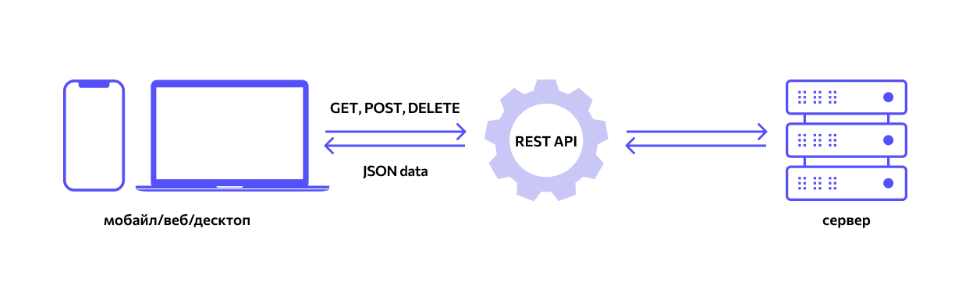

# ?REST API

_REST API_ — это способ взаимодействия сайтов и веб-приложений с сервером. Его также называют _RESTful_.

Термин состоит из двух аббревиатур, которые расшифровываются следующим образом.

_API_ (Application Programming Interface) — это код, который позволяет двум приложениям обмениваться данными с сервера. На русском языке его принято называть программным интерфейсом приложения.

_REST_ (Representational State Transfer) — это способ создания API с помощью протокола HTTP. На русском его называют «передачей состояния представления».

Технологию REST API применяют везде, где пользователю сайта или веб-приложения нужно предоставить данные с сервера. Например, при нажатии иконки с видео на видеохостинге REST API проводит операции и запускает ролик с сервера в браузере.

В настоящее время это самый распространенный способ организации API. Он вытеснил ранее популярные способы SOAP и WSDL.

У RESTful нет единого стандарта работы: его называют «архитектурным стилем» для операций по работе с сервером. Такой подход предложил в 2000 году в своей диссертации программист и исследователь Рой Филдинг, один из создателей протокола HTTP.

### Принципы REST API

У RESTful есть 7 принципов написания кода интерфейсов.

1. __Отделение клиента от сервера (Client-Server).__ Клиент — это пользовательский интерфейс сайта или приложения, например, поисковая строка видеохостинга. В REST API код запросов остается на стороне клиента, а код для доступа к данным — на стороне сервера. Это упрощает организацию API, позволяет легко переносить пользовательский интерфейс на другую платформу и дает возможность лучше масштабировать серверное хранение данных.

2. __Отсутствие записи состояния клиента (Stateless).__ Сервер не должен хранить информацию о состоянии (проведенных операций) клиента. Каждый запрос от клиента должен содержать только ту информацию, которая нужна для получения данных от сервера.

3. __Кэшируемость (Casheable).__ В данных запроса должно быть указано, нужно ли кэшировать данные (сохранять в специальном буфере для частых запросов). Если такое указание есть, клиент получит право обращаться к этому буферу при необходимости.

4. __Единство интерфейса (Uniform Interface).__ Все данные должны запрашиваться через один URL-адрес стандартными протоколами, например, HTTP. Это упрощает архитектуру сайта или приложения и делает взаимодействие с сервером понятнее.

5. __Многоуровневость системы (Layered System).__ В RESTful сервера могут располагаться на разных уровнях, при этом каждый сервер взаимодействует только с ближайшими уровнями и не связан запросами с другими.

6. __Предоставление кода по запросу (Code on Demand).__ Серверы могут отправлять клиенту код (например, скрипт для запуска видео). Так общий код приложения или сайта становится сложнее только при необходимости.

7. __Начало от нуля (Starting with the Null Style).__ Клиент знает только одну точку входа на сервер. Дальнейшие возможности по взаимодействию обеспечиваются сервером.

### Стандарты

Сам по себе RESTful не является стандартом или протоколом. Разработчики руководствуются принципами REST API для создания эффективной работы серверов для своих сайтов и приложений.

Несмотря на отсутствие стандартов, при создании REST API есть общепринятые лучшие практики, например:

* Использование защищенного протокола HTTPS.
* Использование инструментов для разработки API Blueprint и Swagger.
* Применение приложения для тестирования Get Postman.
* Применение как можно большего количества HTTP-кодов.
* Архивирование больших блоков данных.

### Архитектура

REST API основывается на протоколе передачи гипертекста HTTP (Hypertext Transfer Protocol). Это стандартный протокол в интернете, созданный для передачи гипертекста. Сейчас с помощью HTTP отправляют любые другие типы данных.

Каждый объект на сервере в HTTP имеет свой уникальный URL-адрес в строгом последовательном формате.

В REST API есть 4 метода HTTP, которые используют для действий с объектами на серверах:

1. `GET` (получение информации о данных или списка объектов)
2. `DELETE` (удаление данных)
3. `POST` (добавление или замена данных)
4. `PUT` (регулярное обновление данных)

Такие запросы еще называют идентификаторами CRUD: create (создать), read (прочесть), update (обновить) delete (удалить). Это стандартный набор действий для работы с данными.

### Как работает RESTful

Например, на сайте отеля есть система бронирования номеров трех типов: эконом, стандарт и люкс. В REST API каждому типу будет присвоен свой URL на странице бронирования:

`http://hotel.ru/booking/econom`

`http://hotel.ru/booking/standart`

`http://hotel.ru/booking/lux`

Такие URL однозначно определяют ресурс на сервисе — данные о доступных номерах каждого класса. Чтобы взаимодействовать с этими ресурсам REST API применяет CRUD-команды протокола HTTP. Например, `GET` econom для передачи клиенту информации о номерах класса эконом. В RESTful такие запросы будут кэшироваться — клиенту не нужно обращаться к серверу снова при повторном запросе.

Также такая архитектура позволяет расставить приоритеты в обслуживании. Например, использование более производительных серверов для запросов на номера класса люкс.

Такую архитектуру легко масштабировать: при появлении новых классов номеров, система будет обращаться напрямую к ресурсам по новым URL.

### Где применяют

REST API рекомендуют использовать в следующих случаях:

* Ограниченная пропускная способность соединения с сервером.
* Есть необходимость кэшировать запросы.
* Приложение или сайт будет значительно масштабироваться.
* Приложение или сайт использует AJAX (метод фонового обмена данными с сервером).

> _Сайты_ создаются для быстрой и удобной демонстрации продуктов, продвижения бренда, развития бизнеса, наибольшей доступности для клиентов. _Веб-приложение_ - полноценная программа, доступ к которой осуществляется через браузер. Другими словами, это сайт с обширным функционалом и множеством интерактивных элементов.

> _AJAX_ — это аббревиатура, которая означает Asynchronous Javascript and XML.

REST API используют чаще альтернативных методов, например SOAP. Помимо сайтов и веб-приложений RESTful используют для облачных вычислений.

Например, REST API используется в социальной сети Twitter. Запросы отправляются в формате JSON. Разработчики сторонних приложений могут использовать данные Twitter с помощью REST-запросов. Например:

`GET geo/id/:place_id`

Возвращает информацию о местоположении пользователей.

`GET geo/reverse_geocode`

Возвращает до 20 возможных местоположений по заданным координатам.
Возвращает местоположения, которые могут быть прикреплены к твитам.
