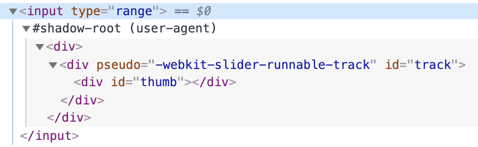

# ?Shadow DOM

_Теневой DOM_ («Shadow DOM») используется для инкапсуляции. Благодаря ему в компоненте есть собственное «теневое» DOM-дерево, к которому нельзя просто так обратиться из главного документа, у него могут быть изолированные CSS-правила и т.д.

#### Встроенный теневой DOM

Задумывались ли вы о том, как устроены и стилизованы сложные браузерные элементы управления?

Например, `<input type="range">`:

Браузер рисует их своими силами и по своему усмотрению. Их DOM-структура обычно нам не видна, но в инструментах разработчика можно её посмотреть. К примеру, в Chrome для этого нужно активировать пункт «Show user agent shadow DOM».

То, что находится под `#shadow-root` – и называется «Shadow DOM» (теневой DOM).

Мы не можем получить доступ к теневому DOM встроенных элементов с помощью обычных JavaScript-вызовов или с помощью селекторов. Это не просто обычные потомки, это мощное средство инкапсуляции.

В примере выше можно увидеть полезный атрибут `pseudo`. Он нестандартный и существует по историческим причинам. С его помощью можно стилизовать подэлементы через CSS, например, так:

~~~

<input type="range" title="range">
~~~

Ещё раз заметим, что `pseudo` – нестандартный атрибут. Если говорить хронологически, то сначала браузеры начали экспериментировать с инкапсуляцией внутренних DOM-структур для элементов, а уже потом, через некоторое время, появился стандарт Shadow DOM, который позволяет делать то же самое нам, разработчикам.

Далее мы воспользуемся современным стандартом Shadow DOM, описанным в спецификации DOM spec и других спецификациях.

#### Теневое дерево

Каждый DOM-элемент может иметь 2 типа поддеревьев DOM:

1. Light tree – обычное, «светлое», DOM-поддерево, состоящее из HTML-потомков.
2. Shadow tree – скрытое, «теневое», DOM-поддерево, не отражённое в HTML, скрытое от посторонних глаз.

Если у элемента имеются оба поддерева, браузер отрисовывает только теневое дерево. Также мы всё же можем задать «композицию» теневого и обычного деревьев.

Теневое дерево можно использовать в пользовательских элементах `Custom Elements`, чтобы спрятать внутренности компонента и применить к ним локальные стили.

Например, этот `<show-hello>` элемент прячет свой внутренний DOM в теневом дереве:

~~~

<show-hello name="John"></show-hello>
~~~

Итак, вызов `elem.attachShadow({ mode: … })` создаёт теневое дерево.

Есть два ограничения:

1. Для каждого элемента мы можем создать только один `shadow root`.
2. В качестве `elem` может быть использован пользовательский элемент `Custom Element`, либо один из следующих элементов: `article`, `aside`, `blockquote`, `body`, `div`, `footer`, `h1`…`h6`, `header`, `main`, `nav`, `p`, `section` или `span`. Остальные, например, `img`, не могут содержать теневое дерево.

Свойство `mode` задаёт уровень инкапсуляции. У него может быть только два значения:

* `"open"` – корень теневого дерева («shadow root») доступен как `elem.shadowRoot`.

Любой код может получить теневое дерево `elem`.

* `"closed"` – `elem.shadowRoot` всегда возвращает `null`.

~~~
<body>
  

  <show-hello id="showHello" name="John"></show-hello>

  
</body>
~~~

До теневого DOM в таком случае мы сможем добраться только по ссылке, которую возвращает `attachShadow` (и, скорее всего, она будет спрятана внутри класса). Встроенные браузерные теневые деревья, такие как у `<input type="range">`, закрыты. До них не добраться.

С возвращаемым методом `attachShadow` объектом корнем теневого дерева, можно работать как с обычным DOM-элементом: менять его `innerHTML` или использовать методы DOM, такие как `append`, чтобы заполнить его.

Элемент с корнем теневого дерева называется – «хозяин» `host` теневого дерева, и он доступен в качестве свойства `host` у `shadow root`:

~~~
// при условии, что { mode: "open" }, иначе elem.shadowRoot равен null
console.log(elem.shadowRoot.host === elem); // true
~~~

#### Инкапсуляция

Теневой DOM отделён от главного документа:

1. Элементы теневого DOM не видны из обычного DOM через `querySelector`. В частности, элементы теневого DOM могут иметь такие же идентификаторы, как у элементов в обычном DOM (light DOM). Они должны быть уникальными только внутри теневого дерева.
2. У теневого DOM свои стили. Стили из внешнего DOM не применятся.

Например:

~~~
<body>
  

  

  
</body>
~~~

1. Стили главного документа не влияют на теневое дерево.
2. …Но свои внутренние стили работают.
3. Чтобы добраться до элементов в теневом дереве, нам нужно искать их изнутри самого дерева.

### Слоты теневого DOM, композиция

Многим типам компонентов, таким как вкладки, меню, галереи изображений и другие, нужно какое-то содержимое для отображения.

Так же, как встроенный в браузер `<select>` ожидает получить контент пунктов `<option>`, компонент `<custom-tabs>` может ожидать, что будет передано фактическое содержимое вкладок, а `<custom-menu>` – пунктов меню.

Код, использующий меню `<custom-menu>`, может выглядеть так:

~~~
<custom-menu>
  <title>Сладости</title>
  <item>Леденцы</item>
  <item>Фруктовые тосты</item>
  <item>Кексы</item>
</custom-menu>
~~~

…Затем компонент должен правильно его отобразить – как обычное меню с заданным названием и пунктами, обрабатывать события меню и т.д.

Как это реализовать?

Можно попробовать проанализировать содержимое элемента и динамически скопировать и переставить DOM-узлы. Это возможно, но если мы будем перемещать элементы в теневой DOM, CSS-стили документа не будут применяться, и мы потеряем визуальное оформление. Кроме того, нужно будет писать дополнительный код.

К счастью, нам этого делать не нужно. Теневой DOM поддерживает элементы `<slot>`, которые автоматически наполняются контентом из обычного, «светлого» DOM-дерева.

#### Именованные слоты

Давайте рассмотрим работу слотов на простом примере.

Теневой DOM `<user-card>` имеет два слота, заполняемых из обычного DOM:

~~~
<body>
  

  <user-card>
    Иван Иванов
    01.01.2001
  </user-card>
</body>

// На экране:
Имя: Иван Иванов
Дата рождения: 01.01.2001
~~~

В теневом DOM `<slot name="X">` определяет «точку вставки» – место, где отображаются элементы с `slot="X"`.

Затем браузер выполняет «композицию»: берёт элементы из обычного DOM-дерева и отображает их в соответствующих слотах теневого DOM-дерева. В результате мы получаем именно то, что хотели – компонент, который можно наполнить данными.

Мы создали теневой DOM, он изображён под `#shadow-root`. Теперь у элемента есть два DOM-дерева: обычное («светлое») и теневое.

В результате выстраивается так называемое «развёрнутое» (flattened) DOM-дерево:

~~~
<user-card>
  #shadow-root
    
Имя:
      <slot name="username">
        <!-- элемент слота вставляется в слот -->
        Иван Иванов
      </slot>
    

    
Дата рождения:
      <slot name="birthday">
        01.01.2001
      </slot>
    

</user-card>
~~~

…Но развёрнутое DOM-дерево существует только для целей отображения и обработки событий. Это то, что мы видим на экране. Оно, в некотором плане, «виртуальное». Фактически в документе расположение узлов не меняется.

Это можно легко проверить, запустив `querySelectorAll`: все узлы находятся на своих местах.

~~~
// узлы светлого DOM находятся в том же месте, в <user-card>
console.log(document.querySelectorAll('user-card span').length); // 2
~~~

Так что развёрнутый DOM составляется из теневого вставкой в слоты. Браузер использует его для рендеринга и при всплытии событий (об этом позже). Но JavaScript видит документ «как есть» – до построения развёрнутого DOM-дерева.

##### Атрибут `slot="…"` могут иметь только дети первого уровня

Атрибут `slot="..."` работает только на непосредственных детях элемента-хозяина теневого дерева (в нашем примере это элемент `<user-card>`). Для вложенных элементов он игнорируется.

Например, здесь второй `` игнорируется (так как он не является потомком верхнего уровня элемента `<user-card>`):

~~~
<user-card>
  Иван Иванов
  

    01.01.2001
  

</user-card>
~~~

Если в светлом DOM есть несколько элементов с одинаковым именем слота, они добавляются в слот один за другим.

Например, этот код:

~~~
<user-card>
  Иван
  Иванов
</user-card>
~~~

Даст такой развёрнутый DOM с двумя элементами в `<slot name="username">`:

~~~
<user-card>
  #shadow-root
    
Имя:
      <slot name="username">
        Иван
        Иванов
      </slot>
    

    
Дата рождения:
      <slot name="birthday"></slot>
    

</user-card>
~~~

#### Содержимое слота «по умолчанию»

Если мы добавляем данные в `<slot>`, это становится содержимым «по умолчанию». Браузер отображает его, если в светлом DOM-дереве отсутствуют данные для заполнения слота.

Например, в этой части теневого дерева текст Аноним отображается, если в светлом дереве нет значения `slot="username"`.

~~~
<body>
  

  <user-card>
    01.01.2001
  </user-card>
</body>

// На экране
Имя: Аноним
Дата рождения: 01.01.2001
~~~

#### Слот по умолчанию (первый без имени)

Первый `<slot>` в теневом дереве без атрибута `name` является слотом по умолчанию. Он будет отображать данные со всех узлов светлого дерева, не добавленные в другие слоты.

Например, давайте добавим слот по умолчанию в наш элемент `<user-card>`; он будет собирать всю информацию о пользователе, не занесённую в другие слоты:

~~~
<body>
  

  <user-card>
    
Я люблю плавать.

    Иван Иванов
    01.01.2001
    
...И играть в волейбол!

  </user-card>
</body>

// На экране
Имя: Иван Иванов
Дата рождения: 01.01.2001
Другая информация
Я люблю плавать.
...И играть в волейбол!
~~~

Всё содержимое обычного дерева, не добавленное в слоты, попало в `<fieldset>` «Другая информация».

Элементы добавляются в слот по очереди, один за другим, поэтому оба элемента данных, которые не были добавлены в слоты, попадают в слот по умолчанию.

#### Пример меню

Мы можем использовать слоты для распределения элементов.

~~~
<body>
  // шаблон теневого DOM-дерева с правильными слотами
  <template id="tmpl">
    

    

      <slot name="title"></slot>
      <ul>
        <slot name="item"></slot>
      </ul>
    

  </template>

  

  // разметка для меню <custom-menu>
  <custom-menu>
    Сладости
    <li slot="item">Леденцы</li>
    <li slot="item">Фруктовые тосты</li>
    <li slot="item">Кексы</li>
  </custom-menu>
</body>
~~~

1. `` попадает в `<slot name="title">`.
2. В шаблоне много элементов `<li slot="item">`, но только один слот `<slot name="item">`. Поэтому все такие `<li slot="item">` добавляются в `<slot name="item">` один за другим, формируя список.

Можно заметить, что в валидном DOM-дереве тег `<li>` должен быть прямым потомком тега `<ul>`. Но это развёрнутый DOM, который описывает то, как компонент отображается, в нём такая ситуация нормальна.

Конечно, мы можем расширить функциональность меню, добавив события, методы и т.д.

#### Обновление слотов

Что если внешний код хочет динамически добавить или удалить пункты меню?

Браузер наблюдает за слотами и обновляет отображение при добавлении и удалении элементов в слотах.

Также, поскольку узлы светлого DOM-дерева не копируются, а только отображаются в слотах, изменения внутри них сразу же становятся видны.

Таким образом, нам ничего не нужно делать для обновления отображения. Но если код компонента хочет узнать об изменениях в слотах, можно использовать событие `slotchange`.

Например, здесь пункт меню вставляется динамически через 1 секунду, и заголовок меняется через 2 секунды:

~~~
<body>
  <custom-menu id="menu">
    Сладости
  </custom-menu>

  
</body>
~~~

Отображение меню обновляется каждый раз без нашего вмешательства.

Здесь есть два события `slotchange`:

1. При инициализации:

`slotchange: title` запускается сразу же, как только `slot="title"` из обычного дерева попадает в соответствующий слот.

2. Через 1 секунду:

`slotchange: item` запускается, когда добавляется новый элемент `<li slot="item">`.

Обратите внимание, что событие `slotchange` не запускается через 2 секунды, когда меняется контент `slot="title"`. Это происходит потому, что сам слот не меняется. Мы изменяем содержимое элемента, который находится в слоте, а это совсем другое.

> Если мы хотим отслеживать внутренние изменения обычного DOM-дерева из JavaScript, можно также использовать более обобщённый механизм: `MutationObserver`.

#### API слотов

И, наконец, давайте поговорим о методах JavaScript, связанных со слотами.

Как мы видели раньше, JavaScript смотрит на «реальный», а не на развёрнутый DOM. Но если у теневого дерева стоит `{ mode: 'open' }`, то мы можем выяснить, какие элементы находятся в слоте, и, наоборот, определить слот по элементу, который в нём находится:

* `node.assignedSlot` – возвращает элемент `<slot>`, в котором находится `node`.
* `slot.assignedNodes({ flatten: true/false })` – DOM-узлы, которые находятся в слоте. Опция `flatten` имеет значение по умолчанию `false`. Если явно изменить значение на `true`, она просматривает развёрнутый DOM глубже и возвращает вложенные слоты, если есть вложенные компоненты, и резервный контент, если в слоте нет узлов.
* `slot.assignedElements({ flatten: true/false })` – DOM-элементы, которые находятся в слоте (то же самое, что выше, но только узлы-элементы).

Эти методы можно использовать не только для отображения содержимого, которое находится в слотах, но и для его отслеживания в JavaScript.

Например, если компонент `<custom-menu>` хочет знать, что он показывает, он может отследить событие `slotchange` и получить пункты меню из `slot.assignedElements`:

~~~
<body>
  <custom-menu id="menu">
    Сладости
    <li slot="item">Леденцы</li>
    <li slot="item">Фруктовые тосты</li>
  </custom-menu>
  
</body>
~~~

### Настройка стилей теневого DOM

Теневой DOM может содержать теги `
    <slot></slot>
  </template>

  

  <custom-dialog>
    Hello!
  </custom-dialog>
</body>
~~~

#### Каскадирование

Элемент-хозяин (элемент `<custom-dialog>`) находится в светлом DOM, поэтому к нему применяются CSS-стили документа.

Если есть некоторое свойство, стилизованное как в `:host` локально, так и в документе, то стиль документа будет приоритетным.

Например, если в документе из примера поставить:

~~~

~~~

…то `<custom-dialog>` будет без `padding`.

Это очень удобно, поскольку мы можем задать стили «по умолчанию» в компоненте в его правиле `:host`, а затем, при желании, легко переопределить их в документе.

> Исключение составляет тот случай, когда локальное свойство помечено как `!important`, для таких свойств приоритет имеют локальные стили.

#### `:host(selector)`

То же, что и `:host`, но применяется только в случае, если элемент-хозяин подходит под селектор `selector`.

Например, мы бы хотели выровнять по центру `<custom-dialog>`, только если он содержит атрибут `centered`:

~~~
<body>
  <template id="tmpl">
    
    <slot></slot>
  </template>

  

  <custom-dialog centered>
    Centered!
  </custom-dialog>

  <custom-dialog>
    Not centered.
  </custom-dialog>
</body>
~~~

Теперь дополнительные стили для выравнивания по центру применяются только к первому элементу: `<custom-dialog centered>`.

Подводя итог, мы можем использовать семейство селекторов `:host` для стилизации основного элемента компонента. Эти стили (если только не стоит `!important`) могут быть переопределены документом.

#### Применение стилей к содержимому слотов

Теперь давайте рассмотрим ситуацию со слотами.

Элементы слотов происходят из светлого DOM, поэтому они используют стили документа. Локальные стили не влияют на содержимое слотов.

В примере ниже текст в `` жирный в соответствии со стилями документа, но не берёт `background` из локальных стилей:

~~~
<body>
  

  <user-card>
    
John Smith

  </user-card>

  
</body>
~~~

В результате текст жирный, но не красный.

Если мы хотим стилизовать слотовые элементы в нашем компоненте, то есть два варианта:

1. Можно стилизовать сам `<slot>` и полагаться на наследование CSS:

~~~
<body>
  <user-card>
    
John Smith

  </user-card>

  
</body>
~~~

Здесь `John Smith` выделяется жирным шрифтом, потому что наследование CSS действует между `<slot>` и его содержимым. Но в CSS как таковом не все свойства наследуются.

2. Использовать псевдокласс `::slotted(селектор)`. Соответствует элементам, если выполняются два условия:

* Это слотовый элемент, пришедший из светлого DOM. Имя слота не имеет значения. Просто любой элемент, вставленный в `<slot>`, но только сам элемент, а не его потомки.
* Элемент соответствует селектору.

В нашем примере `::slotted(div)` выбирает в точности `
`, но не его дочерние элементы:

~~~
<body>
  <user-card>
    

      John Smith
    

  </user-card>

  
</body>
~~~

Обратите внимание, что селектор `::slotted` не может спускаться дальше в слот. Эти селекторы недействительны:

~~~
::slotted(div span) {
  /* наш слот 
 не соответствует этому */
}

::slotted(span) {}
~~~

Кроме того, `::slotted` можно использовать только в CSS. Мы не можем использовать его в `querySelector`.

#### CSS-хуки с пользовательскими свойствами

Как можно стилизовать внутренние элементы компонента из основного документа?

Селекторы типа `:host` применяют правила к элементу `<custom-dialog>` или `<user-card>`, но как стилизовать элементы теневого DOM внутри них? Например, в `<user-card>` мы хотели бы разрешить внешнему документу изменять внешний вид пользовательских полей.

Аналогично тому, как мы предусматриваем у компонента методы, чтобы взаимодействовать с ним, мы можем использовать переменные CSS (пользовательские свойства CSS) для его стилизации.

##### Пользовательские свойства CSS существуют одновременно на всех уровнях, как светлом, так и в тёмном DOM.

Например, в теневом DOM мы можем использовать CSS-переменную `--user-card-field-color` для стилизации полей, а документ будет её устанавливать. 

Затем мы можем объявить это свойство во внешнем документе для <user-card>.

Пользовательские CSS свойства проникают через теневой DOM, они видны повсюду, поэтому внутреннее правило `.field` будет использовать его.

~~~
<body>
  

  <template id="tmpl">
    
    
Имя: <slot name="username"></slot>
    

    
Дата рождения: <slot name="birthday"></slot>
    

  </template>

  

  <user-card>
    John Smith
    01.01.2001
  </user-card>
</body>
~~~

### Теневой DOM и события

Смысл создания теневого DOM-дерева – это инкапсуляция внутренних деталей компонента.

Допустим, клик произошёл внутри теневого DOM на компоненте `<user-card>`. Но скрипты основного документа ничего не знают о внутреннем устройстве теневой DOM-структуры, в особенности, если компонент создан сторонней библиотекой.

Поэтому, чтобы не нарушать инкапсуляцию, браузер меняет у этого события целевой элемент.

##### События, которые произошли в теневом DOM, но пойманы снаружи этого DOM, имеют элемент-хозяин в качестве целевого элемента `event.target`.

Рассмотрим простой пример:

~~~
<body>
  <user-card></user-card>

  
</body>
~~~

Если нажать на кнопку, то выведется следующее:

1. Внутренний целевой элемент: `BUTTON` – внутренний обработчик событий получает правильный целевой элемент – элемент, находящийся внутри теневого DOM.
2. Внешний целевой элемент: `USER-CARD` – обработчик событий на уровне документа получает элемент-хозяин в качестве целевого.

Хорошо, что браузер подменяет целевые элементы событий. Потому что внешний документ ничего не знает о внутреннем устройстве компонента. С его (внешнего документа) точки зрения, событие происходит на `<user-card>`.

##### Подмена целевого элемента не происходит, если событие берёт начало на элементе из слота, который фактически находится в обычном, светлом DOM.

Например, если пользователь кликнет на `` в примере ниже – целевой элемент события будет именно этот `span` для обоих обработчиков – теневого и обычного (светлого):

~~~
<body>
  <user-card id="userCard">
    John Smith
  </user-card>

  
</body>
~~~

Если клик произойдёт на "John Smith", то для обоих обработчиков – внутреннего и внешнего – целевым элементом будет ``. Это элемент обычного (светлого) DOM, так что подмены не происходит.

С другой стороны, если клик произойдёт на элементе, который находится в теневом DOM, например, на `<b>Имя</b>`, то как только всплытие выйдет за пределы теневой DOM-структуры, его `event.target` станет `<user-card>`.

#### Всплытие и метод `event.composedPath()`

Для обеспечения всплытия событий используется развёрнутый DOM.

Таким образом, если у нас есть элемент в слоте, и событие происходит где-то внутри него, то оно всплывает до `<slot>` и выше.

Полный путь к изначальному целевому элементу, со всеми теневыми элементами, можно получить, воспользовавшись методом `event.composedPath()`. Как видно из названия, этот метод возвращает путь после композиции.

В примере выше развёрнутое DOM-дерево будет таким:

~~~
<user-card id="userCard">
  #shadow-root
    

      <b>Имя:</b>
      <slot name="username">
        John Smith
      </slot>
    

</user-card>
~~~

Так что, при клике по `` вызов метода `event.composedPath()` вернёт массив: `[span, slot, div, shadow-root, user-card, body, html, document, window]`. Что в точности отражает цепочку родителей от целевого элемента в развёрнутой DOM-структуре после композиции.

##### Детали теневого DOM-дерева доступны только для деревьев с `{ mode:'open' }`

Если теневое DOM-дерево было создано с `{ mode: 'closed' }`, то после композиции путь будет начинаться с элемента-хозяина: `user-card` и дальше вверх по дереву.

Этот метод следует тем же принципам, что и остальные. Внутреннее устройство закрытых DOM-деревьев совершенно скрыто.

~~~
<body>
  

  <show-hello id="showHello" name="John"></show-hello>
  
</body>
~~~

#### Свойство: `event.composed`

Большинство событий успешно всплывают сквозь границу теневого DOM. Но не все.

Это поведение регулируется с помощью свойства `composed` объекта события. Если оно `true`, то событие пересекает границу. Иначе, оно может быть поймано лишь внутри теневого DOM.

Если посмотреть в спецификацию UI Events, то большинство событий имеют `composed: true`:

* `blur`, `focus`, `focusin`, `focusout`
* `click`, `dblclick`
* `mousedown`, `mouseup`, `mousemove`, `mouseout`, `mouseover`
* `wheel`
* `beforeinput`, `input`, `keydown`, `keyup`

Все события курсора и сенсорные события также имеют `composed: true`.

Хотя есть и события, имеющие `composed: false`:

* `mouseenter`, `mouseleave` (они вообще не всплывают)
* `load`, `unload`, `abort`, `error`
* `select`
* `slotchange`

Эти события могут быть пойманы только на элементах того же DOM, в котором находится целевой элемент события.

#### Генерация событий

Когда мы генерируем своё событие, то, чтобы оно всплывало за пределы компонента, нужно установить оба свойства: `bubbles` и `composed` – в значение `true`.

Например, здесь мы создаём элемент `div#inner` в теневом DOM-дереве элемента `div#outer` и генерируем на нём два события. Только одно с флагом `composed: true` выйдет наружу, в документ:

~~~
<body>
  

  
</body>

// composed
~~~
